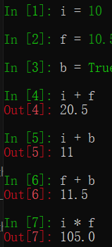
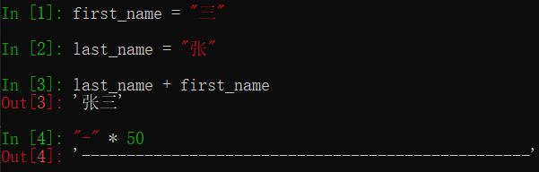

#python 2022/8/17

# 变量的基本使用

>程序就是用来处理数据的，而变量就是用来存储数据的

## 目标

- 变量的定义
- 变量的类型
- 变量的命名

## 01.变量定义

- 在Python中，每个变量 **在使用前都必须赋值**，变量 **赋值以后** 该变量 **才会被创建**
- 等号（`=`）用来给变量赋值

	- `=`左边是一个变量名
	- `=`右边是存储在变量中的值

```md
变量名 = 值
```

>变量定义之后，后续就可以直接使用了

1）变量演练1 -- iPython

```python
# 定义qq_number的变量用来保存 qq号码
In[1] : qq_number = "1234567"
# 输出 qq_number中保存的内容
In[2] : qq_number
Out[2] : '1234567'
```

>使用交互式方式，如果要查看变量内容，直接输入变量名即可，不需要使用`print`函数

2）变量演练2 -- PyCharm

```python
# 定义qq_number的变量用来保存 qq号码
qq_number = "1234567"
# 输出 qq_number中保存的内容
print(qq_number)
```

>使用解释器执行，如果要输出变量的内容，必须要使用`print`函数

3）超市卖苹果，只要买就返回5元钱

```python
# 定义苹果价格变量
price = 8.5
# 定义购买重量
weight = 7.5
# 计算金额
money = price * weight*
# 只要买苹果就返 5 元
money = money - 5
# 输出价格
print(money)
```

提问

- 上述代码，一共定义了几个变量？
	- 三个：`price/weight/money`
- `money = money - 5`是在定义新的变量还是在使用变量？
	- 直接使用之前已经定义的变量
	- **变量名 只有在第一次出现 才是 定义变量**
	- **变量名 再次出现，不是定义变量，而是直接使用之前定义过的变量**
- 在程序开发中，可以修改之前定义变量中保存的值吗？
	- 可以
	- 变量中存储的值，就是可以 **变** 的

## 02.变量的类型

- 在内存中创建一个变量，会包括

	1. 变量的名称
	2. 变量保存的数据
	3. 变量存储数据的类型
	4. 变量的地址(标示)

### 2.1 变量类型的演练 -- 个人信息

需求

- 定义变量保存小明的个人信息
- 姓名：小明
- 年龄：18岁
- 性别：男
- 身高：1.75米
- 体重：75.0公斤

>利用 **单步调试** 确认变量中保存数据的类型

提问

1. 在演练中，一共有几种数据类型？

	- 4种
	- `str`--字符串
	- `bool`--布尔型(真假)
	- `int`--整数
	- `float`--浮点数(小数)

2. 在`Python`中定义变量时需要指定数据类型吗？

	- 不需要
	- `Python`可以根据`=`等号右侧的值，自动推导出变量中存储数据的类型

### 2.2 变量的类型

- 在`Python`中定义变量是**不需要指定类型**(在其他很多高级语言中都需要)
- 数据类型可以分为 **数字型** 和 **非数字型**
- 数字型
	- 整型(`int`)
	- 浮点型(`flaot`)
	- 布尔型(`bool`)
		- 真`True` `非 0 数` --非零即真
		- 假`False` `0`
	- 复数型(`complex`)
		- 主要用于科学计算，例如：平面场问题、波动问题、电感电容等问题
- 非数字型
	- 字符串
	- 列表
	- 元组
	- 字典

>提示：在Python2.x中， **整数**根据保存数值的长度还分为：
>- `int`(整数)
>- `long`(长整数)

- 使用`type`函数可以查看一个变量的类型

```python
In [1]: type(name)
Out [1]: str
```

### 2.3 不同数据类型变量之间的计算

1) **数字型变量 之间可以直接计算**

	- 在 Python 中，两个数字型变量是可以直接进行 算数运算的
	- 如果变量是`bool`型，在计算时
		- `True`对应的数字是`1`
		- `False`对应的数字是`0`

**演练步骤**

1. 定义整数`i = 10`
2. 定义 浮点数`f = 10.5`
3. 定义布尔型`b = True`

-  在 iPython 中，使用上述三个变量相互进行算数运算



2) 字符串变量 之间使用 + 拼接字符串

	- 在 Python 中，字符串之间可以使用`+`拼接**生成新的字符串**

3) 字符串变量 可以和 整数 使用 `*`重复拼接相同的字符串



4) 数字型变量 和 字符串 之间 不能进行其他计算

### 2.4 变量的输入

- 所谓`输入`，就是 用代码获取 用户通过 键盘 输入的信息
- 例如：去银行取钱，在ATM上输入密码
- 在Python中，如果要获取用户在 键盘 上输入信息，需要使用到 `input` 函数

1) 关于函数

- 一个 提前准备号的功能(别人或者自己写的代码)，可以直接使用，而不用关心内部的细节
- 目前语句学过的函数

| 函数       | 说明            |
| ---------- | --------------- |
| `print(x)` | 将x输出到控制台 |
| `type(x)`  | 查看x的变量类型                |

2) input 函数实现键盘输入

- 在 Python 中可以使用`input`函数从键盘等待用户的输入
- **用户输入的任何内容 Python都认为是一个 字符串**
- 语法如下：

```md
字符串变量 = input("提示信息: ")
```

3) **类型转换函数**

| 函数       | 说明                  |
| ---------- | --------------------- |
| `int(x)`   | 将 x 转换为一个整数   |
| `float(x)` | 将 x 转换到一个浮点数 |

### 2.5 变量的格式化输出

>苹果单价`9.00`元/斤。购买了`5.00`斤，需支付`45.00`元

- 在 Python 中可以使用`print`函数将信息输出到控制台
- 如果希望输出文字信息的同时，**一起输出 数据**，就需要使用到 **格式化操作符**
- `%`被称为 **格式化操作符**，专门用于处理字符串中的格式
	- 包含`%`的字符串，被称为 **格式化字符串**
	- `%`和不同的 **字符** 连用，不同类型的数据 需要使用 **不同的格式化字符**

| 格式化字符 | 含义                                                                  |
| ---------- | --------------------------------------------------------------------- |
| `%s`       | 字符串                                                                |
| `%d`       | 有符号十进制整数，`%06d`表示输出的整数显示位数，不足的地方使用 0 补全 |
| `%f`       | 浮点数，`%.2f`表示小数点后只显示两位                                 |
| `%%`       | 输出`%`                                                                      |

- 语法格式如下：

```python
print("格式化字符串" % 变量1)
print("格式化字符串" % (变量1, 变量2...))
```

格式化输出演练-- 基本练习

1. 定义字符串变量`name`，输出 我的名字叫小明，请多多关照！
2. 定义整数 变量`student_no`，输出 我的学号是 000001
3. 定义小数`price`、`weight`、`money`输出 苹果单价 9.00元/斤，购买了5.00斤， 需要支付45.00元
4. 定义一个小数 `scale` ，输出 数据比例是 10.00%

```python
name = "小明"
print("我的名字叫 %s ，请多多关照！" % name)

student_no = 100
print("我的学号是 %06d" % student_no)

price = 9.00
weight = 5.00
money = price * weight
print("苹果单价 %.2f元/斤， 购买了%.3f斤， 需要支付%.4f元" % (price, weight, money))

# 输出10.00%
scale = 0.25
print("数据比例是 %.2f%%" % (scale * 100))
```