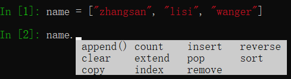
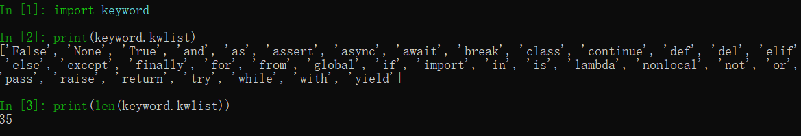

#python 2022/8/26

# 高级变量类型

## 目标

- 列表
- 元组
- 字典
- 字符串
- 公共方法
- 变量高级

## 知识点回顾

- Python 中数据类型可以分为 **数字型** 和 **非数字型**
- 数字型
	- 整型 (`int`)
	- 浮点型(`float`)
	- 布尔型(`bool`)
		- 真`True` `非0数` -- **非零即真**
		- 假 `False` `0`
	- 复数型(`complex`)
		- 主要用于科学计算，例如：平面场问题、波动问题、电感电容等问题
- 非数字型
	- 字符串
	- 列表
	- 元组
	- 字典
- 在 `Python` 中，所有 **非数字型变量** 都支持以下特点

	1. 都是一个**序列** `sequence`，也可以理解为 **容器**
	2. **取值** `[]`
	3. **遍历**  `for in `
	4. **计算长度、最大/最小值、比较、删除**
	5. **链接** `+` 和 **重复** `*`
	6. **切片**

## 01.列表

### 1.1 列表的定义

- `List` (列表) 是 `Python` 中使用 **最频繁** 的数据类型，在其他语言中通常叫作 **数组**
- 专门用于存储 **一串信息**
- 列表用 `[]` 定义，**数据**之间使用 `,` 分隔
- 列表的 **索引** 从 `0` 开始
	- **索引** 就是数据在 **列表** 中的位置编号，索引 又可以被称为 **下标**

>注意：从列表中取值时，如果 **超出索引范围**，程序会报错

```python
name_list = ["zhangsan", "lisi", "wangwu"]
```


### 1.2 列表常用操作

- 在 `ipython3` 中定义一个 **列表**，例如：`name_list = []`
- 输入 `name_list` 按下 `TAB` 键，`ipython` 会提示 **列表** 能够使用的 **方法** 如下：



| 序号 | 分类 | 关键字/函数/方法        | 说明                     |
| ---- | ---- | ----------------------- | ------------------------ |
| 1    | 增加 | `list.insert(索引,数据)`  | 在指定位置插入数据       |
|      |      | `list.append(数据) `      | 在末尾追加数据           |
|      |      | `list.extend(列表2)`      | 将列表2 的数据追加到列表 |
| 2    | 修改 | `list[索引] = 数据`      | 修改指定索引的数据       |
| 3    | 删除 | `del list[索引]`          | 删除指定索引的数据       |
|      |      | `list.remove[数据]`      | 删除第一个出现的指定数据 |
|      |      | `list.pop()`          | 删除末尾数据             |
|      |      | `list.pop(索引)`         | 删除指定索引数据         |
|      |      |` list.clear()`          | 清空列表                 |
| 4    | 统计 | `len(list)`              | 列表长度                 |
|      |      | `list.count(数据)`      | 数据在列表中出现的次数   |
| 5    | 排序 | `list.sort()`            | 升序排序                 |
|      |      | `list.sort(reverse=True)` | 降序排序                 |
|      |      | `list.reverse()`        | 逆序、反转                         |

- 使用 `del` 关键字(`delete`) 同样可以删除列表中元素
- `del` 关键字本质上是用来 **将一个变量从内存中删除的**
- 如果使用 `del` 关键字将变量从内存中删除出，后续代码就不能再使用这个变量了

```python
del name_list
```

- **关键字** 是 Python 内置的、具有特殊意义的标识符



>关键字后面不需要使用括号

- **函数** 封装了独立功能，可以直接调用

```
函数名(参数)
```

>函数明需要记忆

- **方法** 和函数类似，同样是封装了独立的功能
- **方法需要通过对象来调用，表示针对这个对象要做的的操作**

```
对象.方法名(参数)
```

>在变量后面输入 `.`，然后选择针对这个变量要执行的操作，基益起来比函数要简单很多

### 1.3 循环遍历

- **遍历**就是**从头到尾**依次从**列表**中获取数据
	- 在**循环内部**针对**每一个元素**，执行相同的操作
- 在 `Python` 中为了提高列表的遍历效率，专门提供的 **迭代 iteration 遍历**
- 使用 `for` 就能够实现迭代遍历

```python
name_list = ["小李广-花荣", "呼保义-宋江", "玉麒麟-卢俊义", "黑旋风-李逵"]

# 使用迭代遍历列表
"""
顺序从列表中依次获取数据，每一次循环过程中，数据都会保存在my_name 这个变量中，
在循环体内部可以访问当前这一次获取到的数据
"""
for my_name in name_list:
    print("我的名字是 %s" % my_name)
```

- 列表中**可以存储不同类型的数据**
- 在开发中，更多的应用场景是
	1. **列表**存储相同类型的数据
	2. 通过**迭代遍历**，在循环体内部，针对列表中的每一项元素，执行相同的操作
