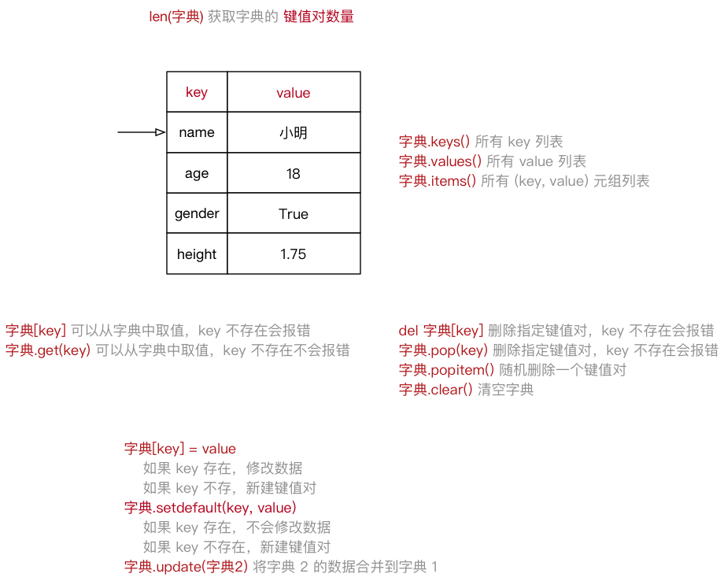
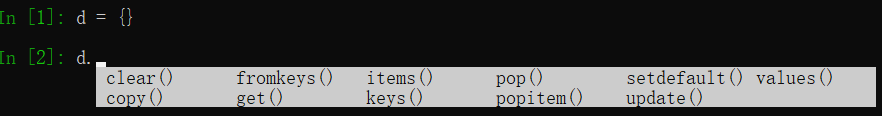

#python 2022/8/27

# 02.元组

## 2.1 元组的定义

- 元组(`tuple`) 与列表类似，不同之处在于元组的**元素不能修改**
	- 元组表示多个元素组成的序列
	- 元组在 `Python` 开发中，有特定的应用场景
- 用于存储一串信息，**数据之间使用 `,` 分隔**
- 元组用 `()` 定义
- 元组的**索引**从 `0` 开始
	- 索引就是数据在元素中的位置编号

```python
info_tuple = ("zhangsan", 18, 1.75)
```

**创建空元组**

```python
tuple = ()
```

**元组中只包含一个元素时，需要在元素后面添加逗号**

```python
single_tuple = ("zhangsan",)
```

## 2.2 元组常用操作

- 在 `ipython3` 中定义一个元组，例如：`info=()`
- 输入 `info.` 按下 `Tab` 键，`ipython` 会提示元组能够使用的函数

```python
info_tuple = ("zhangsan", 18, 1.75)

# 1. 取值和取索引
print(info_tuple[0])
# 已知数据的内容，想得到该数据在元组中的索引
print(info_tuple.index("zhangsan"))

# 2. 统计计数
print(info_tuple.count("zhangsan"))
# 统计元组中包含元素的个数
print(len(info_tuple))
```

## 2.3 循环遍历

- **取值**就是从元组中获取存储在指定位置的数据
- **遍历**就是从头到尾依次从元组中获取数据

```python
info_tuple = ("宋江", "及时雨", "天魁星")

# 使用迭代遍历元组
for my_info in info_tuple:
    # 使用格式化字符串拼接 my_info 这个变量不方便！
    # 因为元组中通常保存的数据类型是不同的！
    print(my_info)
```

>- 在 `Python` 中，可以使用 `for` 循环遍历所有非数字类型的变量：**列表、元组、字典以及字符串**
>- 提示：在实际开发中，除非能**够确认元组中的数据类型**，否则针对元组的循环遍历需求并不是很多

## 2.4 应用场景

- 尽管可以使用 `for in` 遍历元组
- 但是在开发中，更多的应用场景是：
	- **函数的参数和返回值**，一个函数可以**接受任意多个参数**，或者一次**返回多个数据**
	- **格式化字符串**，后面的 `()` **本质上就是一个元组**
	- **让列表不可以被修改**，以保护数据安全

```python
info = ("zhangsan", 18)
print("%s 的年龄是 %d" % info)
```

元组和列表之间的转换

- 使用 `list` 函数可以把元组转换成列表

```
list(元组)
```

- 使用 `tuple` 函数可以把列表转换成元组

```
tuple(列表)
```

# 03.字典

## 3.1 字典的定义

- `dictionary` (字典)是除**列表以外** `Python` 之中**最灵活**的数据类型
- 字典同样可以用来**存储多个数据**
	- 通常用来存储 **描述一个 `物体` 的相关信息**
- 和列表的区别
	- **列表是有序的对象集合**
	- **字典是无序的对象集合**
- 字典用 `{}` 定义
- 字典使用**键值对**存储数据，键值对之间使用 `,` 分隔
	- **键** `key` 是索引
	- **值** `value` 是数据
	- **键**和**值**之间使用 `:` 分隔
	- **键必须是唯一的**
	- **值**可以取任**何数据类型**，但**键**只能使用**字符串、数字或元组**

```python
xiaoming = {
    "name":"宋江",
    "绰号":"及时雨",
    "地位":"梁山统领三代目",
    "星宿":"天魁星"
}
```



## 3.2 字典常用操作

- 在 `ipython` 中定义一个字典，例如：`d={}`
- 输入 `d.` 按下 `Tab` 键，`ipython` 会提示字典能够使用的函数如下：



## 3.3 循环遍历

- 遍历就是依次从字典中获取所有键值对

```python
xiaoming_dict = {"name":"小明",
                "qq":"123456",
                "phone":"10086"}

# 迭代遍历字典
# 变量k是每一次循环中，获取到的键值对的key
for k in xiaoming_dict:
    print("%s - %s" % (k, xiaoming_dict[k]))
```

>提示：在实际开发中，由于字典中每一个键值对保存数据的类型是不同的，所以针对字典的循环遍历需求并不是很多

## 3.4 应用场景

- 尽管可以使用 `for in` 遍历字典
- 但是在开发中，更多的应用场景是：
	- 使用多个键值对，存储描述一个 `物体` 的相关信息--描述更复杂的数据信息
	- **将多个字典放在一个列表中，再进行遍历，在循环体内部针对每一个字典进行相同的处理**

```python
card_list = [
    {"name":"xiaoming",
    "qq":"123456",
    "phone":"10086"},
    {"name":"zhangsan",
    "qq":"456789",
    "phone":"10010"}
]

for card_info in card_list:
    print(card_info)
```

# 04.字符串

## 4.1 字符串的定义

- 字符串就是一串字符，是变成语言中表示文本的数据类型
- 在 Python 中可以使用**一对双引号** `""` 或者**一对单引号** `''` 定义一个字符串
	- 如果字符串内部需要使用双引号 `"` ，可以使用单引号 `''` 定义字符串
	- 如果字符串内部需要使用单引号 `'` ，可以使用双引号 `"` 定义字符串
- 可以使用**索引**获取一个字符串中指定位置的字符，索引计数从0开始
- 也可以使用 `for` **循环遍历**字符串中每一个字符

>大多数语言使用双引号 `""` 定义字符串

```python
string = "Hello Python"
for c in string:
	print(c)
```


## 4.2 字符串的常用操作


>提示：正是因为 python 内置提供的方法足够多，才使得在开发时，能够针对字符串进行更加灵活的操作！应对更多的开发需求

### 1）判断类型 - 9

| 方法          | 说明                                                                                  |
| ------------- | ------------------------------------------------------------------------------------- |
| `isspace()`   | 如果只包含**空格(空白字符)**，则返回 True                                                           |
| `isalnum()`   | 如果至少有一个字符并且所有字符都是字母或数字则返回 True                               |
| `isalpha()`   | 如果至少有一个字符并且所有字符都是字母则返回 True                                     |
| `isdecimal()` | 如果只包含数字则返回 True，全角数字                                                   |
| `isdigit()`   | 如果只包含数字则返回 True，全角数字,(1),`\u00b2`                                      |
| `isnumeric()` | 如果只包含数字则返回 True, 全角数字,汉字数字                                          |
| `istitle()`   | 如果是标题化的(**每个单词的首字母**大写)则返回 True                                       |
| `islower()`   | 如果包含至少一个区分大小写的字符，并且所有这些(区分大小写的)字符都是小写，则返回 True |
| `isupper()`   | 同上，大写返回 True                                                                                      |

### 2）查找和替换 - 7

| 方法                                                     | 说明                                                                                                                       |
| -------------------------------------------------------- | -------------------------------------------------------------------------------------------------------------------------- |
| `startswith(str)`                                        | 检查字符串是否是以 str 开头，是则返回 True                                                                                 |
| `endswith(str)`                                          | 同上，结尾                                                                                                                 |
| `string.find(str,start=0,end=len(string))`               | 检查 str 是否包含在 string 中，如果 start 和 end 指定范围，则检查是否包含在指定范围内，如果是返回开始的索引值，负责返回 -1 |
| `string.rfind(str,start=0,end=len(string))`              | 类似上，从右边开始查找                                                                                                     |
| `string.index(str,start=0,end=len(string))`              | 和 `find()` 类似，只不过如果 str 不在会报错                                                                                |
| `rindex()`                                               | 同上，从右边开始                                                                                                           |
| `string.replace(old_str, new_str, num=string.count(old)` | 把， string 中的 old_str 替换成 new_str，如果 num 指定，则替换不超过 num 次                                                                                                                           |

### 3）大小写转换 - 5

| 方法                  | 说明                             |
| --------------------- | -------------------------------- |
| `string.capitalize()` | 把字符串的第一个字符大写         |
| `string.title()`      | 把字符串的每个单词首字母大写     |
| `string.lower()`      | 转换 string 中所有大写字母为小写 |
| `string.upper()`      | 转换 string 中的小写字母为大写   |
| `string.swapcase(0`   | 翻转 string 中的大小写                                 |

### 4）文本对齐 - 3

| 方法                   | 说明                                                          |
| ---------------------- | ------------------------------------------------------------- |
| `string.ljust(width)`  | 返回一个原字符串左对齐，并使用空格填充至长度 width 的新字符串 |
| `string.rjust(width)`  | 右对齐                                                        |
| `string.center(width)` | 返回一个原字符串居中，并使用空格填充至长度 width 的新字符串                                                              |

### 5）去除空白字符串 - 3

| 方法              | 说明                             |
| ----------------- | -------------------------------- |
| `string.lstrip()` | 截掉 string 左边(开始)的空白字符 |
| `string.rstrip()` | 右边                             |
| `string.strip()`  | 截掉 string 左右两边的空白字符                                 |

### 6）拆分和连接 - 5

| 方法                       | 说明                                                                                            |
| -------------------------- | ----------------------------------------------------------------------------------------------- |
| `string.partition(str)`    | 把字符串 string 分成一个 3元素的元组(str前面，str，str后面)                                     |
| `string.rpartition(str)`   | 同上，不过是从右边开始查找                                                                      |
| `string.split(str="",num)` | 以 str 分隔符切片 string，如果 num 有指定值，则仅分隔 num+1个字符串，str默认包含`\r,\t,\n,空格` |
| `string.splitlines()`      | 按照行(`\r, \n`)分隔，返回一个包含各行作为元素的列表                                                                                                |
| `string.join(seq)`         | 以 string 作为分隔符，将 seq 中所有元素(的字符串表示)合并为一个新的字符串                       |

## 4.3 字符串的切片

- **切片**方法适用于**字符串、列表、元组**
	- 切片使用索引值来限定范围，从一个大的字符串中切出小的字符串
	- **列表**和**元组**都是有序的集合，都能够**通过索引值**获取到对应的数据
	- **字典**是一个**无序**的集合，是使用**键值对**保存数据

```
字符串[开始索引:结束索引:步长]
```

1. 指定的区间属于 **左闭右开** 型(`[开始索引,结束索引)`)
	- 从 `起始` 位开始，到 `结束` 位的前一位结束(**不包含结束位本身**)
2. 从头开始，**开始索引数字可以省略，冒号不能省略**
3. 到末尾结束，**结束索引数字可以省略，冒号不能省略**
4. 步长默认为1，**如果连续切片，数字和冒号都可以省略**

# 05.公共方法

## 5.1 Python 内置函数

Python 包含了以下内置函数：

| 函数                | 描述                 | 备注                        |
| ------------------- | -------------------- | --------------------------- |
| `len(item)`         | 计算容器中元素个数   |                             |
| `del(item)`         | 删除变量             | del 有两种方式-关键字或函数              |
| `max(item)`         | 返回容器中元素最大值 | 如果是字典，只针对 key 比较 |
| `min(item)`         | 返回容器中元素最小值 | 如果是字典，只针对 key 比较 |
| `cmp(item1, item2)` | 比较两个值           | python3.x中取消                            |

>注意：字符串的比较符合以下规则 `"0"<"A"<"a"`

## 5.2 切片

| 描述 | Python 表达式        | 结果    | 支持的数据类型 |
| ---- | -------------------- | ------- | -------------- |
| 切片 | `"0123456789"[::-2]` | "97531" | 字符串、列表、元组               |

- 切片使用索引值来限定范围，从一个大的字符串中切除小的字符串
- 列表和元组都是有序的集合，都能够通过索引值获取到对应的数据
- 字典是一个无序的集合，是使用键值对保存数据

## 5.3 运算符

| 运算符         | Python表达式       | 结果               | 描述           | 支持的数据类型           |
| -------------- | ------------------ | ------------------ | -------------- | ------------------------ |
| `+`            | `[1,2]+[3,4]`      | `[1,2,3,4]`        | 合并           | 字符串、列表、元组       |
| `*`            | `["Hi"]*3`         | `["Hi","Hi","Hi"]` | 重复           | 字符串、列表、元组       |
| `in`           | `3 in (1,2,3)`     | `True`             | 元素是否存在   | 字符串、列表、元组、字典 |
| `not in`       | `4 not in (1,2,3)` | `True`             | 元素是否不存在 | 字符串、列表、元组、字典 |
| `> >= == < <=` | `(1,2,3)<(2,2,3)`  | `True`             | 元素比较       | 字符串、列表、元组                         |

- `in` 在对**字典**操作时，判断的是**字典的键**
- `in` 和 `not in` 被称为**成员运算符**

- **成员运算符**用于**测试**序列中是否包含指定的成员

| 运算符   | 描述                                                | 实例                     |
| -------- | --------------------------------------------------- | ------------------------ |
| `in`     | 如果在指定的序列中找到值返回 True，否则返回 False   | `3 in (1,2,3)` 返回 True | 
| `not in` | 如果在指定的序列中没有找到值返回True，否则返回False | `3 not in (1,2,3)` 返回 False                         |

>注意：在对字典操作时，判断的是**字典的键**


## 5.4 完整的 for 循环语法

- 在 `Python` 中完整的 `for 循环` 的语法如下：

```
for 变量 in 集合:
	循环体代码
else:
	没有通过 break 退出循环，循环结束后，会执行的代码
```

**应用场景**

- 在**迭代遍历**嵌套的数据类型时，例如一个列表包含了多个字典
- 需求：要判断某一个自带你中是否存在指定的值
	- 如果存在，提示退出循环
	- 如果不存在，在循环整体结束后，希望得到一个统一的提示

```python
students = [
    {"name":"阿土"},
    {"name":"小李"}
]

# 在学员列表中搜索指定的姓名
find_name = "阿乐"

for stu_dict in students:
    print(stu_dict)
    if stu_dict["name"] == find_name:
        print("找到了 %s" % find_name)
        # 如果已经找到，就直接退出循环
        break
else:
    # 如果希望在搜索列表时，所有的字典检查之后，都没有发现需要搜索的目标
    # 还希望得到统一的提示
    print("没有找到 %s" % find_name)
print("循环结束")
```