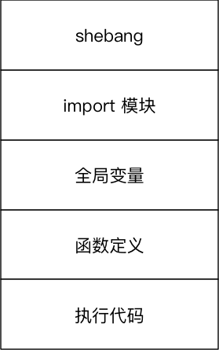

#python 2022/8/30

## 目标

- 变量的引用
- 可变和不可变类型
- 局部变量和全局变量

## 01.变量的引用

>- 变量和数据都是保存在内存中的
>- 在 `Python` 中**函数的参数传递**以及**返回值**都是靠**引用**传递的

### 1.1 引用的概念

- **变量和数据是分开存储的**
- 数据保存在内存中的一个位置
- 变量中保存着数据在内存中的地址
- **变量中记录数据的地址**，就叫做**引用**
- 使用 `id()` 函数可以查看变量中保存数据所在的**内存地址**

>注意：如果变量已经定义，当给一个变量赋值的时候，本质是**修改了数据的引用**
>- 变量不再对之前的数据引用
>- 变量改为对新赋值的数据引用

### 1.2  变量引用的示例

在 `Python` 中，变量的名字类似于便签纸贴在数据上

- 定义一个整数变量 `a` ，并且赋值为 `1`

| 代码  | 图示 |
| ----- | ---- |
| a = 1 |      |

- 将变量 `a` 赋值为 `2`

| 代码  | 图示 |
| ----- | ---- |
| a = 2 |      |

- 定义一个整数变量 `b` ，并且将变量 `a` 的值赋值给 `b`

| 代码  | 图示               |
| ----- | ------------------ |
| b = a |  |

>变量 `b` 是第2个贴在数字 `2` 上的标签

## 02.可变和不可变类型

- **不可变类型**，内存中的数据不允许被修改：
	- 数字类型 `int`, `bool`, `float`, `complex`, `long(2.x)`
	- 字符串 `str`
	- 元组 `tuple`
- **可变类型**，内存中的数据可以被修改：
	- 列表 `list`
	- 字典 `dict`

```python
a = 1
a = "hello"
a = [1,2,3]
a = [3,2,1]
```

```python
demo_list = [1, 2, 3]
print("定义列表后的内存地址 %d" % id(demo_list))

demo_list.append(9)
demo_list.pop()
demo_list.remove(2)
demo_list[0] = 10

print("修改数据后的内存地址 %d" % id(demo_list))

demo_dict = {"name":"小明"}

print("定义字典后的内存地址 %d" % id(demo_dict))

demo_dict["age"] = 18
demo_dict.pop("name")
demo_dict["name"] = "老王"

print("修改数据后的内存地址 %d" % id(demo_dict))
```

>注意：字典的 `key` **只能使用不可变类型的数据**

1. **可变类型**的数据变化，是通过**方法**来实现的
2. 如果给一个可变类型的变量，赋值了一个新的数据，**引用会修改**
	- 变量不再对之前的数据引用
	- 变量改为对新赋值的数据引用

**哈希(hash)**

- `Python` 中内置有一个名字叫作 `hash()` 的函数
	- 接受一个**不可变数据类型**的数据作为**参数**
	- **返回**结果是一个**整数**
- `哈希` 是一种算法，其作用就是提取数据的**特征码(指纹)**
	- 相同的内容得到相同的结果
	- 不同的内容得到不同的结果
- 在 `Python` 中，设置字典的**键值对**时，会首先对 `key` 进行 `hash` 以决定如何在内存中保存字典的数据，方便后续对字典的操作：**增、删、改、查**
	- 键值对的 `key` 必须是不可变类型数据
	- 键值对的 `value` 可以是任意类型的数据

## 03.局部变量和全局变量

- 局部变量就是在函数内部定义的变量，只能在函数内部使用
- 全局变量是在函数外部定义的变量，所有函数内部都可以使用这个变量

>提示：在其他开发语言中，大多不推荐使用全局变量--可变范围太大，导致程序不好维护

### 3.1 局部变量

- 局部变量是在函数内部定义的变量，只能在函数内部使用
- **函数执行结束后，函数内部的局部变量，会被系统回收**
- 不同的函数，可以定义相同的名字的局部变量，但是各用各的不会产生影响

**局部变量的作用**

- **在函数内部使用，临时保存函数内部需要使用的数据**

```python
def demo1():

    # 定义一个局部变量
    num = 10
    print("在demo1函数内部的变量是 %d" % num)


def demo2():

    # 不能在其他函数内使用
    # print("%d" % num)
    pass

# 在函数内部定义的变量，不能再其他位置使用
# print("%d" % num)

demo1()
demo2()
```

**局部变量的生命周期**

- 所谓**生命周期**就是变量从**被创建**到**被系统回收**的过程
- 局部变量在函数执行时才会被创建
- **函数执行结束后局部变量被系统回收**
- **局部变量**在生命周期内，可以用来**存储函数内部临时使用到的数据** 

### 3.2 全局变量

- 全局变量是在函数外部定义的变量，所有函数内部都可以使用这个变量

```python

```

注意：函数执行时，需要处理变量时会：

1. 首先查找函数内部是否存在执行名称的局部变量，如果有，直接使用
2. 如果没有，查找函数外部是否存在指定名称的全局变量，如果有，直接使用
3. 如果还没有，程序报错！

1) **函数不能直接修改全局变量的引用**

- 全局变量是在函数外部定义的变量(没有定义在某一个函数内)，所有函数内部都可以使用这个变量

>提示：在其他的开发语言中，大多不推荐使用全局变量--可变返回太大，导致程序不好维护！

- 在函数内部，可以**通过全局变量的引用获取对应的数据**
- 但是，**不允许直接修改全局变量的引用**--使用赋值语句修改全局变量的值

```python
# 全局变量
num = 10

def demo1():

    # 修改全局变量的值
    # 在 python 中，不允许直接修改全局变量的值
    # 如果使用赋值语句，会在函数内部，定义一个局部变量
    num = 99
    print("demo1() ==> %d" % num)


def demo2():

    print("demo2() ==> %d" % num)

demo1()
demo2()
```

2) **在函数内部修改全局变量的值**

- 如果在函数中需要修改全局变量，需要使用 `global` 进行声明

```python
# 全局变量
num = 10

def demo1():

    # 希望修改全局变量的值 - 使用 global 声明一下变量即可
    # global 关键字会告诉解释器后面的变量是一个全局变量
    # 再使用赋值语句时，就不会创建局部变量
    global num
    num = 99
    print("demo1() ==> %d" % num)


def demo2():

    print("demo2() ==> %d" % num)

demo1()
demo2()
```

3) **全局变量定义的位置**

- 为了保证所有的函数都能够正确使用到全局变量，应该**将全局变量定义在其他函数的上方**

```python
a = 10

def demo():
	print("%d" % a)
	print("%d" % b)
	print("%d" % c)

b = 20
demo()
c = 30
```

- 注意：由于全局变量 c，是在调用函数之后才定义的，在执行函数时，变量还没有定义，所以程序会报错！

- `shebang` 标识用哪个解释器解释程序
- `import` 导入模块



4) **全局变量命名的建议**

- 为了避免局部变量和全局变量出现混淆，在定义全局变量时，会有些开发要求，例如：
- 全局变量命名前应该增加 `g_` 或 `gl_` 的前缀