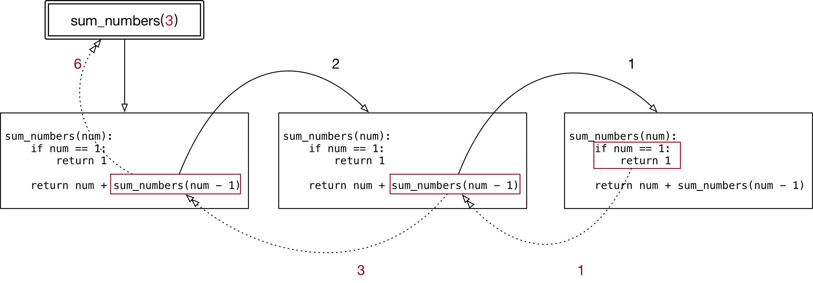

#python 2022/8/31

## 目标

- 函数参数和返回值的作用
- 函数的返回值进阶
- 函数的参数进阶
- 递归函数

## 01.函数参数和返回值的作用

函数根据**有没有参数**以及返回值，可以相互组合，一共有4中形式

1. 无参数，无返回值
2. 无参数，有返回值
3. 有参数，无返回值
4. 有参数，有返回值


>定义函数时，**是否接受参数，或者是否返回结果**，是**根据实际的功能需求**来决定的！

1. 如果函数**内部处理的数据不确定**，就可以将外界的数据以参数传递到函数内部
2. 如果希望一个函数**执行完成后，向外界汇报执行结果**，就可以增加函数的返回值

## 02.函数的返回值进阶

- 在程序开发中，有时候会希望**一个函数执行结束后，告诉调用者一个结果**，以便调用者针对具体的结果做后续的处理
- 返回值是函数完成工作后，最后给调用者的一个结果
- 在函数中使用 `return` 关键字可以返回结果
- 调用函数一方，可以**使用变量来接收函数的返回结果**

>问题：一个函数执行或能否返回多个结果？

```python
def measure():
    """测量温度"""

    temp = 39
    wetness = 50

    # 元组 - 可以包含多个数据，因此可以使用元组让函数一次返回多个值
    # 如果函数返回的类型是元组，小括号可以省略
    # return (temp, wetness)
    return temp, wetness

# 元组
res = measure()
print(res)

# 需要单独的处理温度或者湿度
print(res[0])
print(res[1])

# 如果函数返回的类型是元组，同时希望单独的处理元组中的元素
# 可以使用多个变量，一次接受函数的返回结果
gl_temp, gl_wetness = measure()
print(gl_temp)
print(gl_wetness)
```

**交换两个数字**

1. 有两个整数变量 `a=6`, `b=100`
2. 不使用其他变量，交换两个变量的值

解法1--使用其他变量

```python
# 使用临时变量
c = b
b = a
a = c
```

解法2--使用临时变量

```python
# 不使用临时变量
a = a + b
b = a - b
a = a - b
```

解法3--Python专有，利用元组

```python
a, b = b, a
```

## 03.函数的参数进阶

### 3.1 不可变和可变参数

>问题1：在函数内部，针对参数使用**赋值语句**，会不会影响调用函数时传递的**实参变量**？--**不会**

- 无论传递的参数是可变还是不可变
	- 只要**针对参数使用赋值语句，会在函数内部修改局部变量的引用，不会影响到外部变量的引用**

>问题2：如果传递的参数是**可变类型**，在函数内部，使用**方法**修改了数据的内容，**同样会影响到外部的数据**

```python
def demo(num_list: list):
    print("函数内部的代码")

    # 使用方法修改列表的内容
    num_list.append(9)

    print(num_list)

    print("函数执行完成")

gl_list = [1, 2, 3]
demo(gl_list)
print(gl_list)
```

**运算符 `+=`**

- 在 `python` 中，列表变量调用 `+=` 本质上是在执行列表变量的 `extend` 方法，不会修改变量的引用

### 3.2 缺省参数

- 定义函数时，可以给**某个参数**指定一个默认值，具有默认值的参数就叫做**缺省参数**
- 调用函数时，如果没有传入缺省参数的值，则在函数内部使用定义函数时指定的**参数默认值**
- **函数的缺省参数，将常见的值设置为参数的缺省值，从而简化函数的调用**
- 例如：对列表排序的方法

```python
gl_list = [4, 8, 2]

# 默认按照升序排序 - 较常用
gl_list.sort()
print(gl_list)

# 如果需要降序排序，需要执行reverse参数
gl_list.sort(reverse=True)
print(gl_list)
```

**指定函数的缺省参数**

- 在参数后使用赋值语句，可以指定参数的缺省值

```python
def print_info(name, gender=True):

    gender_text = "男生"
    if not gender:
        gender_text = "女生"
    print("%s 是 %s" % (name, gender_text))


# 假设班上的同学，男生居多，所以将默认值设置为男生
# 提示：在指定缺省参数的默认值时，应该使用最常见的值作为默认值！
print_info("小明")
print_info("小红", False)
```

1. 缺省参数，需要**使用最常见的值作为默认值**
2. 如果一个参数的值**不能确定**，则不应该设置默认值，具体的数值在调用函数时，由外界传递

**缺省参数的注意事项**

1) 缺省参数的定义位置

- **必须保证带有默认值的缺省参数在参数列表末尾**
- 所以，一下定义是错误的

```python
def print_info(name, gender=True, title):
	pass
```

2) 调用带有多个缺省参数的函数

- **在调用函数时，如果有多个缺省参数，需要指定参数名**，这样解释器才知道参数的对应关系！

### 3.3 多值参数

**定义支持多值参数的函数**

- 有时候可能需要一个**函数能够处理的参数个数是不确定的，这个时候，就可以使用多值参数**
- `python` 中有两种多值参数：
	- **参数名前增加一个 `*` 可以接受元组**
	- **参数名前增加两个 `*` 可以接受字典**
- 一般在给多值参数命名时，习惯使用以下两个名字
	- `*args` -- 存放元组参数，前面有一个 `*`
	- `**kwargs` -- 存放字典参数，前面有两个 `*`
- `args` 是 `arguments` 的缩写，有变量的含义
- `kw` 是 `keywprd` 的缩写，`kwargs` 可以记忆键值对参数

```python
def demo(num, *nums, **person):

    print(num)
    print(nums)
    print(person)


demo(1) # 输出：1 () {}
demo(1, 2, 3, 4, 5) # 输出：1, (2, 3, 4, 5) {}
demo(1, 2, 3, 4, 5, name="小明", age=18)    # 输出：1, (2,3,4,5) {name="小明",age=18}
```

>提示：多值参数的应用会经常出现在网络上一些大牛开发的框架中，知道多值参数，有利于读懂大牛的代码

**多值参数案例 -- 计算任意多个数字的和**

```python
import argparse


def sum_numbers(*args):

    num = 0
    # 循环遍历
    for n in args:
        num += n

    print(args)
    return num


res = sum_numbers(1, 2, 3, 4, 5)
print(res)
```

**元组和字典的拆包**

- 在调用带有多值参数的函数时，如果希望：
	- 将一个元组变量，直接传递给 `args`
	- 将一个字典变量，直接传递给 `kwargs`
- 就可以使用**拆包**，简化参数传递，拆包的方式是：
	- 在元组变量前，增加一个 `*`
	- 在字典变量前，增加两个 `*`

```python
def demo(*args, **kwargs):

    print(args)
    print(kwargs)


# 元组/字典变量
gl_num = (1, 2, 3)
gl_dict = {"name":"小明", "age":18}

# 会将两个参数都传递给 *args
demo(gl_num, gl_dict)   

# 拆包语法，简化元组/自带你变量的传递
demo(*gl_num, **gl_dict)

# 等价于
demo(1, 2, 3, name="小明", age=18)
```

## 04.函数的递归

>函数调用自身的**编程技巧**称为递归

### 4.1 递归函数的特点

- 一个函数内部调用自己
	- 函数内部可以调用其他函数，当然在函数内部也可以调用自己
- 函数内部的代码是相同的，只是针对参数不同，处理的结果不同
- 当参数满足一个条件时，函数不再执行
	- 这个非常重要，通常被称为递归的出口，否则会出现死循环

```python
def print_num(num):

    print(num)
    # 递归的出口，当参数满足某个条件时，不再执行函数
    if num == 1:
        return 
    
    # 自己调用自己
    print_num(num - 1)


print_num(3)
```


### 4.2 递归案例--计算数字累加

1. 定义一个函数 `sum_numbers`
2. 能够接受一个 `num` 的整数参数
3. 计算 `1+2+……num` 的结果

```python
# 1. 定义一个函数 `sum_numbers`
# 2. 能够接受一个 `num` 的整数参数
# 3. 计算 `1+2+……num` 的结果

def sum_numbers(num):

    # 1.出口
    if num == 1:
        return 1
    
    # 2.数字的累加 num + (1 2 3 ... num-1)
    # 假设 sum_numbers 能够正确处理 1 2 ... num-1
    return num + sum_numbers(num-1)


res = sum_numbers(5)
print(res)
```



>提示：递归是一个编程技巧，在处理不确定的循环条件时，格外的有用，例如：**遍历整个文件目录的结构**

