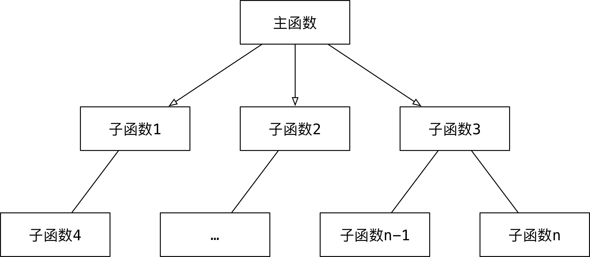
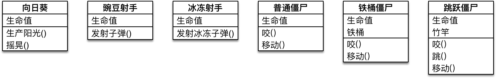

#python 2022/9/1

# 面向对象(OOP)基本概念

面向对象编程 -- `Object Oriented Propragramming` 简称 `OOP`

## 01.面向对象基本概念

- 之前学习的编程方式就是**面向过程**的
- 面向过程和面向对象，是两种不同的编程方式
- 对比面向过程的特点，可以更好地了解什么是面向对象

### 1.1 过程和函数

- 过程是早期地一个编程概念
- 过程类似于函数，只能执行，但是没有返回值
- 函数不仅能执行，还可以返回结果

### 1.2 基本概念

1) **面向过程 -- 怎么做？**

1. 把完成某一个需求时 `所有步骤` `从头到尾` 逐步实现
2. 根据开发需求，将某些功能独立地代码封装成一个又一个函数
3. 最后完成地代码，就是顺序地调用不同的函数

**特点**

1. 注重步骤与过程，不注重职责分工
2. 如果需求复杂，代码会变得很复杂
3. 开发复杂项目，没有固定的套路，开发难度大



2) 面向对象 -- 谁来做？

>相比较函数，**面向对象是更大的封装，根据职责在一个对象中封装多个方法**

1. 在完成某一个需求前，首先确定职责--要做的事情(方法)
2. 根据职责确定不同的需求变化，**是专门应对复杂项目开发，提供的固定套路**
3. 最后完成的代码，就是顺序地让不同地对象调用不同的方法

特点

1. 注重**对象和职责**，不同的对象承担不同的职责
2. 更加适合应对复杂的需求变化，是专门应对复杂项目开发，提供的固定套路
3. **需要在面向过程基础上，再学习一些面向对象的语法**


![[img24.png]]

# 类和对象

## 目标

- 类和对象的概念
- 类和对象的关系
- 类的设计

## 01.类和对象的概念

类和对象是面向对象编程的两个核心概念

### 1.1 类

- 类是对一群**具有相同特征或者行为的事物的一个统称**，是抽象的，**不能直接使用**
	- **特征**被称为**属性**
	- **行为**被称为**方法**
- 类就相当于制造飞机时的图纸，**是一个模板，是负责创建对象的**

### 1.2 对象

- 对象是由类创建出来的一个具体存在，可以直接使用
- 由哪一个类创建出来的对象，就拥有在哪一个类中定义的：
	- 属性
	- 方法
- 对象就相当于用图纸制造的飞机

>在程序开发中，应该现有类，再有对象

## 02.类和对象的关系

- 类是模板，对象是根据类这个模板创建出来的，应该**先有类，再有对象**
- 类只有一个，而对象可以有很多个
	- 不同的对象之间属性可能会各不相同
- 类中定义了什么属性和方法，对象中就有什么属性和方法，不可能多，也不可能少

## 03.类的设计

在使用面向对象开发前，应该首先分析需求，确定一下程序中需要包含哪些类！



在程序开发中，要设计一个类，通常需要满足以下三个要素：
1. **类名** 这类事物的名字，满足大驼峰命名法
2. **属性** 这类食物具有什么样的特征
3. **方法** 这类食物具有什么样的行为

### 3.1 类名的确定

**名词提炼法**分析整个业务流程，出现的名词，通常就是找到的类

### 3.2 属性和方法的确定

- 对**对象的特征描述**，通常可以定义成属性
- **对象具有的行为**(动词)，通常可以定义成方法

>提示：需求中没有设计的属性或者方法在设计类时，不需要考虑

# 面向对象基础语法

## 目标

- `dir` 内置函数
- 定义简单的类(只包含方法)
- 方法中的 `self` 参数
- 初始化方法
- 内置方法和属性

## 01.dir内置函数

- 在 Python 中**对象几乎是无处不在的**，之前学习的变量、数据、函数都是对象
- 在 Python 中可以使用以下两个方法验证：
	1. 在**标识符/数据**后输入一个 `.` ，然后按下 `Tab` 键，`iPython` 会提示改对象能够调用的**方法列表**
	2. 使用内置函数 `dir` 传入标识符/数据，可以查看对象内的**所有属性及方法**

>提示：`__方法名__` 格式的方法是 `Python` 提供的内置方法/属性

| 序号 | 方法名     | 类型 | 作用                               |
| ---- | ---------- | ---- | ---------------------------------- |
| 01   | `__new__`  | 方法 | **创建对象**时，会被自动调用           |
| 02   | `__init__` | 方法 | **对象被初始化**时，会被自动调用       |
| 03   | `__del__`  | 方法 | **对象被从内存中销毁**前，会被自动调用 |
| 04   | `__str__`  | 方法 | 返回**对象的描述信息**，print 函数输出使用                                   |

## 02.定义简单的类

>面向对象是更大的封装，在一个类中封装多个方法，这样通过这个类创建出来的对象，就可以直接调用这些方法

### 2.1 定义只包含方法的类

- 在 Python 中要定义一个只包含方法的类，语法格式如下：

```python
class 类名:
	def 方法1(self, 参数列表):
		pass
	
	def 方法2(self, 参数列表):
		pass
```

- 方法的定义格式和之前学习过的函数几乎一样
- 区别在于第一个参数必须是 `self` 
- 注意：**类名**的命名规则要符合**大驼峰命名法**

### 2.2 创建对象

- 当一个类定义完成之后，要使用这个类来创建对象，语法格式如下：

```
对象变量 = 类名()
```

### 2.3 第一个面向对象程序

1. 定义一个猫类 `Cat`
2. 定义两个方法 `eat` 和 `drink`
3. 按照需求 - -不需要定义属性

```python
class Cat:
    """这是一个猫类"""

    def eat(self):
        print("小猫爱吃鱼")

    def drink(self):
        print("小猫要喝水")


# 创建猫对象
tom = Cat()

tom.eat()
tom.drink()

print(tom)

addr = id(tom)
print("%x" % addr)
```

**引用概念的强调**

>在面向对象开发中，引用的概念是同样适用的

- 在 Python 中使用类**创建对象之后**，`tom` 变量中仍然记录的是**对象在内存中的地址**
- 也就是 `tom` **变量引用了新建的猫对象**
- 使用 `print` 输出对象变量，在默认情况下，是能够**输出这个变量引用的对象是由哪一个类创建的对象，以及在内存中的地址(十六进制标识)**


>提示：在计算机中，通常**使用十六进制标识内存地址**
>- 十进制和十六进制都是用来表达数字的，只是标识的方式不一样
>- 十进制和十六进制的数字之间可以来回转换

- `%d` 可以以10进制输出数字
- `%x` 可以以16进制输出数字

## 03.方法中的 self 参数

### 3.1 案例改造--给对象增加属性

- 在 Python中，要给对象设置属性，非常容易，但是不推荐使用
	- 因为对象属性的封装应该封装在类的内部
- 著需要在类的外部代码中直接通过 `.` 设置一个属性即可

>注意：这种方式虽然简单，但是不推荐使用

```python
tom.name = "Tom"
...
jerry.name = "Jerry"
```

### 3.2 使用 self 在方法内部输出每一只猫的名字

>由哪一个对象调用的方法，方法内的 `self` 就是哪一个对象的引用

- 在类封装的方法内部，`self` 就表示**当前调用方法的对象自己**
- 调用方法时，程序员不需要传递 `self` 参数
- 在放啊内部
	- 可以通过 `self.` **访问对象的属性**
	- 也可以通过 `self.` **调用其他的对象方法**
- 改造代码如下：

```python
class Cat:
    """这是一个猫类"""

    def eat(self):
        # 哪一个对象调用方法，self 就是哪一个对象的引用
        print("%s 爱吃鱼" % self.name)

    def drink(self):
        print("%s 要喝水" % self.name)


# 创建猫对象
tom = Cat()

# 可以使用 .属性名，通过赋值语句就可以了
tom.name = "Tom"

tom.eat()
tom.drink()

# 再创建一个猫对象
jerry = Cat()

jerry.name = "大懒猫"
jerry.eat()
jerry.drink()
```

## 04.初始化方法

### 4.1 之前代码存在的问题--在类的外部给对象增加属性

- 将案例代码进行调整，**先调用方法再设置属性**，程序会报错

```
AttributeRrroe: 'Cat' object has no attribute 'name'
属性错误: 'Cat' 对象没有 'name' 属性
```

- 在日常开发中，不推荐在类的外部给对象增加属性
	- **如果在运行时，没有找到属性，程序会报错**
- 对象应该包含有哪些属性，应该**封装在类的内部**

### 4.2 初始化方法

- 当使用 `类名()` 创建对象时，会自动执行以下操作：
	1. 为对象在内存中**分配空间 -- 创建对象**
	2. 为对象的**属性设置初始值 -- 初始化方法**(`init`)
- 这个初始化方法就是 `__init__` 方法，是对象的**内置方法**

>`__init__` 方法是专门用来**定义一个类具有哪些属性的方法**

在 `Cat` 中增加 `__init__` 方法，验证该方法在创建对象时会被自动调用

```python
class Cat:
	"""这是一个猫类"""
	def __init__(self):
		print("初始化方法")
```

### 4.3 在初始化方法内部定义属性

- 在 `__init__` 方法内部使用 `self.属性名 = 属性的初始值` 就可以**定义属性**
- 定义属性之后，再使用 `Cat` 类创建的对象，都会拥有该属性

```python
class Cat:
    """这是一个猫类"""

    def __init__(self):
        print("调用初始化方法")
        self.name = "Tom"

    def eat(self):
        print("%s 爱吃鱼" % self.name)

# 使用类名()创建对象时，会自动调用初始化方法 __init__
tom = Cat()
print(tom.name)
tom.eat()
```

## 4.4 改造初始化方法--初始化的同时设置初始值

- 在开发中，如果希望在创建对象的同时，就设置对象的属性，可以对 `__init__` 方法进行改造
	1. 把希望设置的属性值，定义成 `__init__` 方法的参数
	2. 在方法内部使用 `self.属性 = 形参` 接收外部传递的参数
	3. 在创建对象时，使用 `类名(属性1,属性2,...)` 调用

```python
class Cat:
    """这是一个猫类"""

    def __init__(self, name):
        print("调用初始化方法")
        self.name = name

    def eat(self):
        print("%s 爱吃鱼" % self.name)

# 使用类名()创建对象时，会自动调用初始化方法 __init__
tom = Cat("Tom")
print(tom.name)
tom.eat()

snow = Cat("Snow")
snow.eat()
```

## 05.内置方法和属性

| 序号 | 方法名    | 类型 | 作用                               |
| ---- | --------- | ---- | ---------------------------------- |
| 01   | `__del__` | 方法 | **对象被从内存中销毁前，会被自动调用** |
| 02   | `__str__` | 方法 | 返回对象的描述信息，print 函数输出使用                                   |

### 5.1 `__del__`方法

- 在 Python 中
	- 当使用 `类名()` 创建对象时，为对象分配空间后，自动调用 `__init__` 方法
	- 当一个**对象被从内存中销魂前**，会自动调用 `__del__` 方法
- 应用场景
	- `__init__` 改造初始化方法，可以让创建对象更加灵活
	- `__del__` 如果希望在对象被销魂前，再做一些事情，可以考虑使用该方法
- 生命周期
	- 一个对象从调用 `类名()` 创建，生命周期开始
	- 一个对象的 `__del__` 方法一旦被调用，生命周期结束
	- 在对象的生命周期内，可以访问对象属性，或者让对象调用方法

### 5.2 `__str__` 方法

- 在 Python 中，使用 `print` 输出对象变量，默认情况下，会**输出这个变量引用的对象是由哪一个类创建的对象，以及在内存中的地址(十六进制表示)**
	- 如果在开发中，希望使用 `print` 输出对象变量时，能够打印自定义的内容，就可以利用 `__str__` 这个内置方法

>注意：`__str__` 方法必须返回一个字符串

```python
class Cat:

    def __init__(self, name):
        self.name = name
        print("%s 来了" % self.name)

    def __del__(self):
        print("%s 走了" % self.name)

    def __str__(self):
        
        # 必须返回一个字符串
        return "我是小猫[%s]" % self.name

# tom 是一个全局变量，在程序执行结束时内存被释放
tom = Cat("Tom")
print(tom)
```

# 面向对象封装案例

## 01.封装

1. 封装是面向对象编程的一大特点
2. 面向对象编程的第一步--将属性和方法封装到一个抽象的类中
3. 外界使用类创建对象，然后让对象调用方法
4. 对象方法的细节都被封装在类的内部

## 02.小明爱跑步

1. 小明体重 `75.0` 公斤
2. 小明每次跑步会减肥 `0.5` 公斤
3. 小明每次吃东西体重会增加 `1` 公斤


>提示：**在对象的方法内部，是可以直接访问对象的属性**

```python
class Person:

    def __init__(self, name, weight) -> None:
        
        # self.属性 = 形参
        self.name = name
        self.weight = weight

    def __str__(self) -> str:
    
        return "我的名字叫%s，体重是%.2f" % (self.name, self.weight)
    
    def run(self):
        print("%s 癌跑步，锻炼身体" % self.name)
        self.weight -= 0.5

    def eat(self):
        print("%s 是吃货，吃完这顿再减肥" % self.name)
        self.weight += 1


xm = Person("小明", 75)
xm.run()
xm.eat()

print(xm)
```

- 在对象的方法内部，是可以直接访问对象的属性
- 同一个类创建的多个对象之间，属性互不干扰
