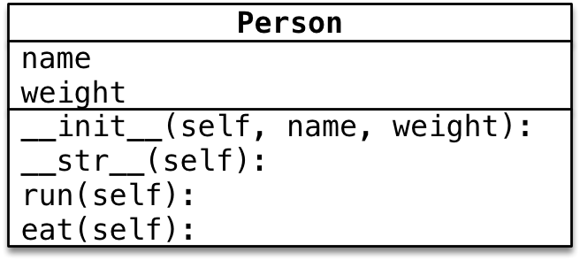

# 面向对象封装案例

## 01.封装

1. 封装是面向对象编程的一大特点
2. 面向对象编程的第一步--将属性和方法封装到一个抽象的类中
3. 外界使用类创建对象，然后让对象调用方法
4. 对象方法的细节都被封装在类的内部

## 02.小明爱跑步

1. 小明体重 `75.0` 公斤
2. 小明每次跑步会减肥 `0.5` 公斤
3. 小明每次吃东西体重会增加 `1` 公斤



>提示：**在对象的方法内部，是可以直接访问对象的属性**

```python
class Person:

    def __init__(self, name, weight) -> None:
        
        # self.属性 = 形参
        self.name = name
        self.weight = weight

    def __str__(self) -> str:
    
        return "我的名字叫%s，体重是%.2f" % (self.name, self.weight)
    
    def run(self):
        print("%s 癌跑步，锻炼身体" % self.name)
        self.weight -= 0.5

    def eat(self):
        print("%s 是吃货，吃完这顿再减肥" % self.name)
        self.weight += 1


xm = Person("小明", 75)
xm.run()
xm.eat()

print(xm)
```

- 在对象的方法内部，是可以直接访问对象的属性
- 同一个类创建的多个对象之间，属性互不干扰

## 03.摆放家具

1. 房子(House)有户型、总面积和家具名称列表
	- 新房子没有任何的家具
2. 家具(HouseItem)有名字和占地面积，其中
	- 席梦思(bed)占地 4 平米
	- 衣柜(chest)占地 2 平米
	- 餐桌(table)占地 1.5 平米
3. 将以上三件家具添加到房子中
4. 打印房子，要求输出：户型、总面积、剩余面积、家具名称列表


**剩余面积**

1. 在创建房子对象时，定义一个剩余面积的属性，初始值和总面积相等
2. 当调用 `add_item` 方法，向房间添加家具时，让剩余面积 -= 家具面积

**添加家具**

1. 判断家具的面积是否超过剩余面积，如果超过，提示不能添加这家家具
2. 将家具名称追加到家具名称列表
3. 用房子的剩余面积 -= 家具面积

```python
class HouseItem:

    def __init__(self, name, area) -> None:
        
        self.name = name
        self.area = area
    
    def __str__(self) -> str:
        
        return "[%s] 占地 %.2f" % (self.name, self.area)


class House:

    def __init__(self, house_type, area) -> None:
        
        # 只有需要外部自定义初始值的属性才需要设置成初始化函数的形参
        self.house_type = house_type
        self.area = area
        # 剩余面积
        self.free_area = area
        # 家具名称列表
        self.item_list = []
    
    def __str__(self) -> str:
        
        # Python 能自动地将一对括号内部地代码连接在一起
        return ("户型：%s\n总面积：%.2f[剩余：%.2f]\n家具：%s"
                 % (self.house_type, self.area, 
                 self.free_area, self.item_list))

    def add_item(self, item: HouseItem):

        print("要添加 %s" % item)
        # 1.判断家具的面积
        if item.area > self.free_area:
            print("%s 的面积过大，无法添加" % item.name)
            return
        # 2.将家具的名称添加到列表中
        self.item_list.append(item.name)
        # 3.计算剩余面积
        self.free_area -= item.area


# 1.创建家具
bed = HouseItem("席梦思", 4)
chest = HouseItem("衣柜", 2)
table = HouseItem("餐桌", 1.5)

print(bed)
print(chest)
print(table)

# 2.创建房子对象
my_home = House("两室一厅", 60)

my_home.add_item(bed)
my_home.add_item(chest)
my_home.add_item(table)

print(my_home)
```

**小结**

- 主程序只负责创建房子对象和家具对象
- 让房子对象调用 `add_item` 方法将家具添加到房子中
- 面积计算、剩余面积、家具列表等处理都被封装到房子类的内部

## 04.士兵突击

>一个对象的属性可以是另外一个类创建的对象

### 4.1 需求

1. 士兵许三多有一把 AK47
2. 士兵可以开火
3. 枪能够发射子弹
4. 枪装填子弹--增加子弹数量


### 4.2 开发士兵类

>假设：每一个新兵都没有枪

**定义没有初始值的属性**

在定义属性时，如果不知道设置什么初始值，可以设置为 `None`

- `None` 关键字表示什么都没有
- **表示一个空对象，没有方法和属性，是一个特殊的常量**
- 可以将 `None` 赋值给任何一个变量

**`fire` 方法需求**

1. 判断是否有枪，没有枪没法冲锋
2. 喊一声口号
3. 装填子弹
4. 射击

```python
class Gun:

    def __init__(self, model: str) -> None:
        
        # 1.枪的型号
        self.model = model
        # 2.子弹的数量
        self.bullet_count = 0

    def add_bullet(self, count: int):

        self.bullet_count += count
    
    def shoot(self):

        # 1.判断子弹数量
        if self.bullet_count <= 0:
            print("[%s]没有子弹了" % self.model)
            return
        # 2.发射子弹
        self.bullet_count -= 1
        # 3.提示发射信息
        print("[%s] 突突突...[%s]" % (self.model, self.bullet_count))


class Soldier:

    def __init__(self, name: str) -> None:
        
        # 1.姓名
        self.name = name

        # 2.枪--新兵没有枪
        self.gun = None

    def fire(self):

        # 1.判断士兵是否有枪
        if self.gun == None:
            print("[%s]还么有枪..." % self.name)
            return
        # 2.高喊口号
        print("冲啊...[%s]" % self.name)
        # 3.装填子弹
        self.gun.add_bullet(50)
        # 4.发射
        self.gun.shoot()

# 1.创建枪对象
ak47 = Gun("AK47")

# ak47.add_bullet(50)
# ak47.shoot()

# 2.创建士兵许三多
xsd = Soldier("许三多")
xsd.gun = ak47
xsd.fire()
print(xsd.gun)
```

## 05.身份运算符

身份运算符用于**比较两个对象的内存地址是否一致**--是否是对同一个对象的引用

- 在 Python 中针对 `None` 比较时，建议使用 `is` 判断

| 运算符   | 描述                               | 实例                             |
| -------- | ---------------------------------- | -------------------------------- |
| `is`     | 判断两个标识符是不是引用同一个对象 | `x is y` ，类似于 `id(x)==id(y)` |
| `is not` | 判断两个表示符是不是引用不同对象   | `x is not y` ，类似于 `id(x)!=id(y)`                                 |

### 5.1 `is` 与 `==` 区别

- `is` 用于判断**两个变量引用对象是否为同一个**
- `==` 用于判断**引用变量的值是否相等**

```python
a = [1, 2, 3]
b = [1, 2, 3]

a == b # True

a is b # False
```

