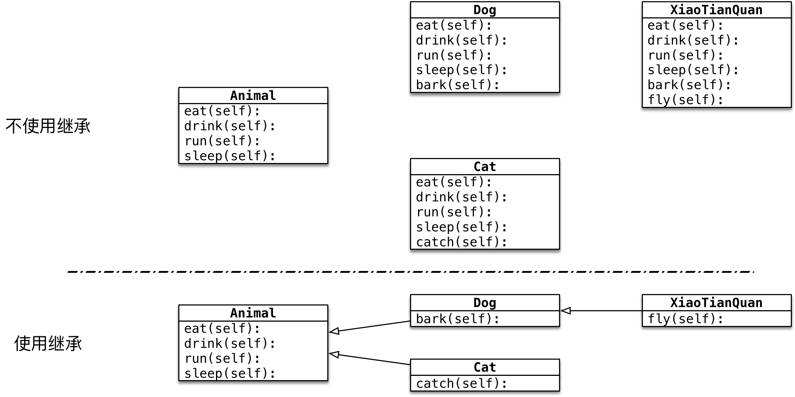

#python 2022/9/3

# 私有属性和私有方法

## 01.应用场景及定义方式

**应用场景**

- 在实际开发中，对象的某些属性或方法可能只希望在对象的内部被使用，而不希望在外部被访问到
- 私有属性就是对象不希望公开的属性
- 私有方法就是对象不希望公开的方法

**定义方法**

- 在定义属性或方法时，**在属性名或者方法名前增加两个下划线**，定义的就是私有属性或方法


```python
class Woman:

    def __init__(self, name) -> None:
        
        self.name = name
        self.__age = 18

    def __secret(self):
        # 在对象的方法内部，是可以访问对象的私有属性的
        print("%s 的年龄是 %d" % (self.name, self.__age))


a = Woman("小芳")

# 私有属性，在外界不能直接访问
# print(a.__age)

# 私有方法，同样不允许在外界直接访问
# a.__secret()
```

## 02.伪私有属性和私有方法

>提示：在日常开放中，不要使用以下这种方式，访问对象的私有属性或方法

`Python` 中，并没有真正意义的私有

- 在给属性、方法命名时，**实际是对名称做了一些特殊化处理，使得外界无法访问到**
- 处理方式：在名称前面加上 `_类名` => `_类名__名称`

```python
# 伪私有属性，在外界直接访问
print(a._Woman__age)

# 伪私有方法
a._Woman__secret()
```

# 继承

## 目标

- 单继承
- 多继承

**面向对象三大特性**

1. **封装**：根据职责将属性和方法封装到一个抽象的类中
2. **继承**：实现代码的重用，相同的代码不需要重复的编写
3. **多态**：不同的对象调用相同的方法，产生不同的执行结果，增加代码的灵活度

## 01.单继承

### 1.1 继承的概念、语法和特点

**继承的概念：子类拥有父类的所有方法和属性**



1) **继承的语法**

```python
class 类名(父类名):

	pass
```

- 子类继承自父类，可以直接享受父类中已经封装好的方法，不需要再次开发
- 子类中应该根据职责，封装子类特有的属性和方法

2) **专业术语**

- `Dog` 类是 `Animal` 类的子类，`Animal` 类是 `Dog` 类的父类，`Dog` 类从 `Animal` 类继承
- `Dog` 类是 `Animal` 类的派生类，`Animal` 类是 `Dog` 类的基类，`Dog` 类从 `Animal` 类派生

3) **继承的传递性**

- `C` 类从 `B` 类继承，`B` 类又从 `A` 类继承
- 那么 `C` 类就具有 `B` 类和 `A` 类的所有属性和方法

子类拥有父类以及父类的父类中封装的所有属性和方法

### 1.2 方法的重写

- 子类拥有父类的所有方法和属性
- 子类继承自父类，可以直接享受父类中已经封装好的方法，不需要再次开发

**应用场景**

- 当父类的方法实现不能满足子类需求时，可以对方法进行**重写(override)**


- 重写父类方法有两种情况：
	1. 覆盖父类的方法
	2. 对父类方法进行扩展

1) **覆盖父类的方法**

	- 如果在开发中，父类的方法实现和子类的方法实现，完全不同
	- 就可以使用覆盖的方式，在子类中重新编写父类的方法实现
	- 重写之后，再运行时，只会调用子类中重写的放啊，而不再调用父类封装的方法

>具体的实现方式，就相当于**在子类中定义了一个和父类同名的方法并且实现**

2) **对父类方法进行扩展**

- 如果在开发中，子类的方法实现中包含父类的方法实现
	- 父类原本封装的方法实现是子类方法的一部分
- 就可以使用扩展的方式
	1. 在子类中重写父类的方法
	2. 在需要的位置使用 `super().父类方法` 来调用父类方法的执行
	3. 代码其他的位置针对子类的需求，编写子类特有的代码实现

**关于 super**

- 在 `Python` 中 `super` 是一个**特殊的类**
- `super()` 就是使用 `super` 类**创建出来的对象**
- 最常使用的场景就是**在重写父类方法时，调用在父类中封装的方法实现**

**调用父类方法的另一种方式**

>在 `Python 2.x` 时，如果需要调用父类的方法，还可以使用以下方式：

```python
父类名.方法(self)
```

- 这种方式，目前在 `Python 3.x` 还支持
- 不推荐使用，因为一旦父类发生变化，方法调用位置的类名同样需要修改

**提示**

- 在开发时，`父类名`  和 `super()` 两种方式不要混用
- 如果使用当前子类名调用方式，会形成递归掉调用，出现死循环

### 1.3 父类的私有属性和私有方法

1. 子类对象不能在自己的方法内部，直接访问父类的私有属性或私有方法
2. 子类对象可以通过父类的公有方法，间接访问到私有属性或私有方法

>- 私有属性、方法是对象的隐私，不对外公开，外界以及子类都不能直接访问
>- 私有属性、方法通常用于做一些内部的事情


- `B` 的对象不能直接访问 `__num2` 属性
- `B` 的对象不能在 `demo` 方法内访问 `__num2` 属性
- `B` 的对象可以在 `demo` 方法内，调用父类的 `test` 方法
- 父类的 `test` 方法内部，能够访问 `__num2` 属性和 `__test` 方法

## 02.多继承

**概念**

- 子类可以拥有多个父类，并且具有所有父类的属性和方法
- 例如：孩子会继承自己父亲和母亲的特性


**语法**

```python
class 子类名(父类名1,父类名2...):
	pass
```

```python
class A:

    def test(self):
        print("test 方法")


class B:

    def demo(self):
        print("demo 方法")


class C(A, B):
    """多继承可以让子类对象，同时具有多个父类的属性和方法"""
    pass

# 创建子类对象
c = C()

c.test()
c.demo()
```

### 2.1 多继承的使用注意事项

**问题的提出**

- 如果不同的类中存在同名的方法，子类对象在调用方法时，会调用哪一个父类中的方法？

>提示：**开发时，应该尽量避免这种容易产生混淆的情况**！--如果父类之间存在同名的属性或者方法，应该尽量避免使用多继承


**Python 中的 MRO -- 方法搜搜索顺序**

- Python 中针对类提供了一个**内置属性** `__mro__` 可以查看方法搜索顺序
- MRO 是 `method resolution order` ，主要用于**在多继承时判断方法、属性的调用路径**

```python
print(C.__mro__)

# 输出结果
(<class '__main__.C'>, <class '__main__.A'>, <class '__main__.B'>, <class 'object'>)
```

- 在搜索方法时 ，是按照 `__mro__` 的输出结果**从左至右的书匈奴查找的**
- 如果在当前类中**找到方法，就直接执行，不再搜索**
- 如果**没有找到，就查下一个类**中是否有对应的方法，如果找到，就直接执行，不再搜索
- 如果找到最后一个类，还没有找到方法，程序报错

### 2.2 新式类与旧式(经典)类

>`object` 是 `Python` 为所有对象提供的基类，提供有一些内置的属性和方法，可以使用 `dir` 函数查看

```python
class A:
	pass

a = A()
dir(a)
```


- **新式类**：以 `object` 为基类的类，**推荐使用**
- 经典类：不以 `object` 为基类的类，不推荐使用
- 在 `Python 3.x` 中定义类时，如果没有指定父类，会默认使用 `object` 作为该类的基类 -- `Python 3.x` 中定义的类都是新式类
- 在 `Python 2.x` 中定义的类，如果没有指定父类，则不会以 `object` 作为基类

>新式类和经典类在多继承时 -- 会影响到方法的搜索顺序

为了保证编写的代码能够同时在 `Python 2.x` 和 `Python 3.x` 运行，今后在定义类时，如果没有父类，建议统一继承自 `object`

```python
class 类名(object):
	pass
```