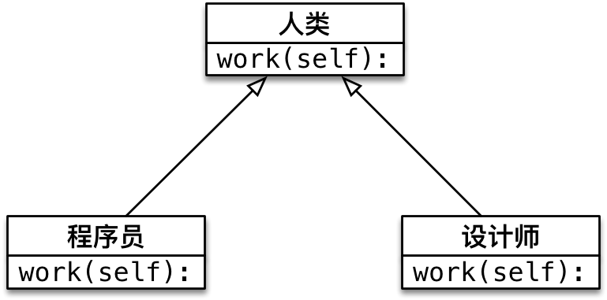
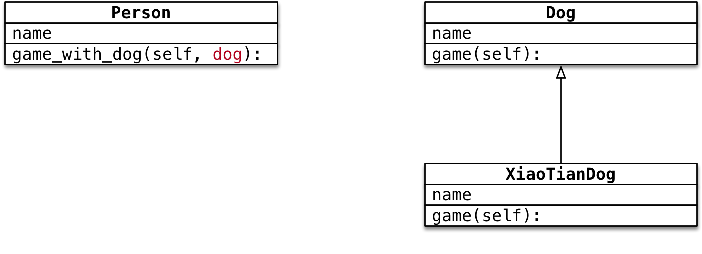
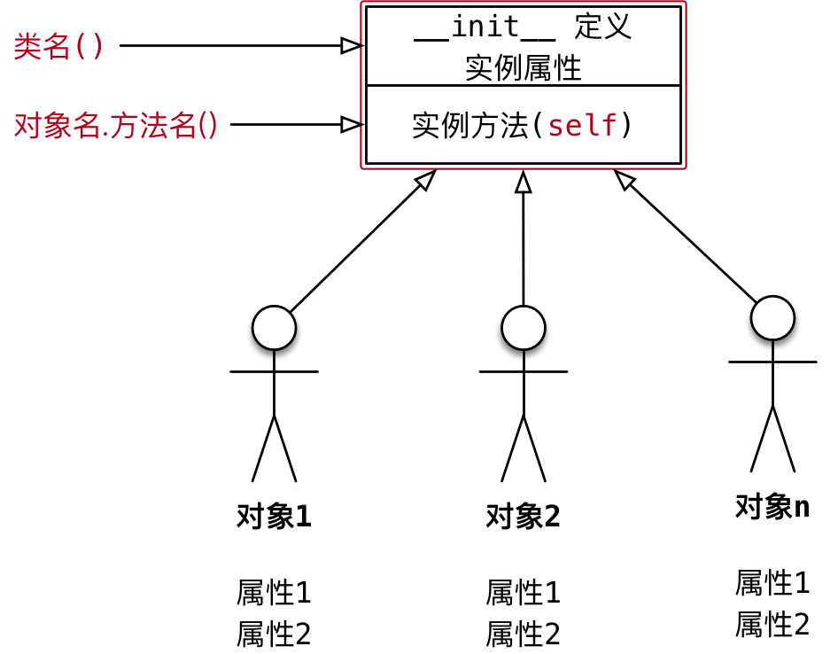
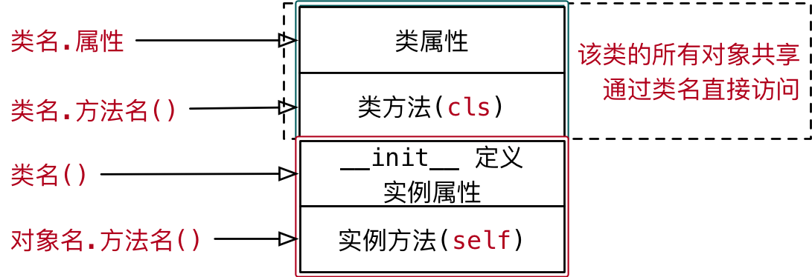
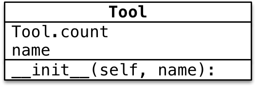
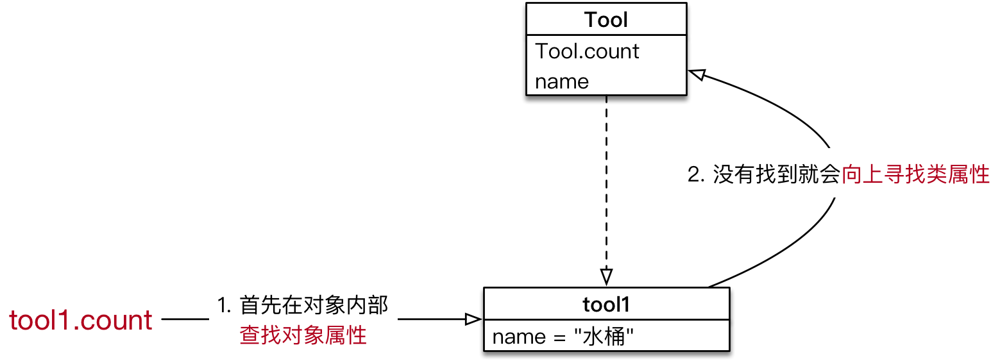

#python 2022/9/4

# 多态

## 目标

- 多态

**面向对象三大特性**

1. 封装：根据职责将属性和方法封装到一个抽象的类中
	- 定义类的准则
2. 继承：实现代码的重用，相同的代码不需要重复的编写
	- 设计类的技巧
	- 子类针对自己特有的需求，编写特定的代码
3. 多态：不同的子类对象调用相同的父类方法，产生不同的执行结果
	- 多态可以增加代码的灵活度
	- **以继承和重写父类方法为前提**
	- 是调用方法的技巧，不会影响到类的内部设计



## 多态案例演练

**需求**

1. 在 `Dog` 类中封装方法 `game`
	- 普通狗只是简单的玩耍
2. 定义 `XiaoTianQuan` 继承自 `Dog` ，并且重写 `game` 方法
	- 哮天犬需要在天上玩耍
3. 定义 `Person` 类，并且封装一个和狗玩的方法
	- 在方法内部，直接让狗对象调用 `game` 方法



```python
class Dog(object):

    def __init__(self, name) -> None:
        self.name = name

    def game(self):
        print("%s 蹦蹦跳跳地玩耍..." % self.name)


class XiaoTianDog(Dog):

    def game(self):
        print("%s 飞到天上玩耍..." % self.name)


class Person(object):

    def __init__(self, name) -> None:
        self.name = name

    def game_with_dog(self, dog: Dog):
        print("%s 和 %s 快乐地玩耍..." % (self.name, dog.name))
        # 让狗玩耍
        dog.game()


# 1.创建 狗 对象
# wangcai = Dog("旺财")
wangcai = XiaoTianDog("飞天旺财")

# 2.创建一个 小明 对象
xiaoming = Person("小明")

# 3.让小明调用和狗玩的方法
xiaoming.game_with_dog(wangcai)
```

**案例小结**

- `Person` 类中只需要让狗对象调用 `game` 方法，而不关心具体是什么狗
	- `game` 方法是在 `Dog` 父类中定义的
- 在程序执行时，传入不同的狗对象实参，就会产生不同的执行效果

# 类属性

## 01.类的结构

### 1.1 术语 -- 实例

1. 使用面向对象开发，第1步是设计类
2. 使用 类名() 创建对象，创建对象的动作有两步
	1) 在内存中为对象**分配空间**
	2) 调用初始化方法 `__init__` 为**对象初始化**
3. 对象创建后，内存中就有了一个对象的实实在在的存在 -- 实例



因此，通常也会把：

1. 创建出来的对象叫作**类的实例**
2. 创建对象的当作叫作**实例化**
3. 对象的属性叫作**实例属性**
4. 对象调用的方法叫作**实例方法**

在程序执行时：

1. 对象各自拥有自己的实例属性
2. 调用对象方法，可以通过 `self.`
	- 访问自己的属性
	- 访问自己的方法

**结论**

- **每一个对象都有自己独立的内存空间，保存各自不同的属性**
- **多个对象的方法，在内存中只有一份，在调用方法时，需要把对象的引用传递到方法内部**

### 1.2 类是一个特殊的对象

>`Python` 中**一切皆对象**：
>	- `class AAA:` 定义的类属于类对象
>	- `obj1 = AAA()` 属于实例对象

- 在程序运行时，类同样会被加载到内存
- 在 `Python` 中，类是一个特殊的对象--类对象
- 在程序运行时，类对象在内存中只有一份，使用一个类可以创建很多个对象实例
- 除了封装实例的属性和方法外，类对象还可以拥有自己的属性和方法
	1. 类属性
	2. 类方法
- 通过 `类名.` 的方式可以访问类的属性或者调用类的方法



## 02.类属性和实例属性

### 2.1 概念和使用

- 类属性就是给类对象中定义的属性
- 通常**用来记录与这个类相关的特征**
- 类属性不会用于记录具体对象的特征

**示例需求**

- 定义一个根据类
- 每件工具都有自己的 `name`
- 需求 -- 知道使用这个类，创建了多少个工具对象？



```python
class Tool(object):

    # 使用赋值语句定义类属性，记录所有工具对象的数量
    count = 0

    def __init__(self, name) -> None:
        self.name = name

        # 每次创建对象都会调用初始化方法
        Tool.count += 1


# 1.创建工具对象
tool1 = Tool("斧头")
tool2 = Tool("锤子")
tool3 = Tool("水桶")

# 2.输出工具对象的数量
print(Tool.count)
```

### 2.2 属性的获取机制

- 在 `Python` 中属性的获取存在一个**向上查找机制**



- 因此，要访问类属性有两种方式“
	1. 类名.类属性
	2. 对象.类属性(不推荐)

**注意**

- 如果使用 `对象.类属性 = 值` 赋值语句，只会给对象添加一个实例属性，而不会影响到类属性的值

## 03.类方法和静态方法

### 3.1 类方法

- **类属性**就是针对**类对象**定义的属性
	- **使用赋值语句在 `class` 关键字下方可以定义类属性**
	- 类属性用于记录与这个类相关的特征
- 类方法就是针对类对象定义的方法
	- 在类方法内部可以直接访问类属性或者调用其他的类方法

**语法如下**

```python
@classmethod
def 类方法名(cls):
	pass
```

- 类方法需要用修饰器 `@classmethod` 来标识，告诉解释器这是一个类方法
- 类方法的第一个参数应该是 `cls`
	- 由哪一个类调用的方法，方法内的 `cls` 就是哪一个类的引用
	- 这个参数和实例方法的第一个参数是 `self` 类似
	- 提示：使用其他名称也可以，不过习惯使用 `cls`
- 通过`类名.` 调用类方法时，不需要传递 `cls` 参数
- 在方法内部
	- 可以通过 `cls.` 访问类的属性
	- 也可以通过 `cls.` 调用其他的类方法

**示例需求**

- 定义一个工具类
- 每件工具都有自己的 `name`
- 需求 -- 在类封装一个 `show_tool_count` 的类方法，输出使用当前这个类，创建的对象个数


```python
class Tool(object):

    # 使用赋值语句定义类属性，记录所有工具对象的数量
    count = 0

    @classmethod
    def show_tool_count(cls):

        print("工具对象的数量 %d" % cls.count)

    def __init__(self, name) -> None:
        self.name = name

        # 每次创建对象都会调用初始化方法
        Tool.count += 1


# 创建工具对象
tool1 = Tool("锤子")
tool2 = Tool("榔头")

# 调用类方法
Tool.show_tool_count()
```

>在类方法内部，可以直接使用 `cls` **访问类属性或者调用类方法**

### 3.2 静态方法

- 在开发时，如果需要在类中封装一个方法，这个方法：
	- 既不需要访问实例属性或者调用实例方法
	- 也不需要访问类属性或者调用类方法
- 这个时候，可以把这个方法封装成一个静态方法

**语法如下**

```python
@staticmethod
def 静态方法名():
	pass
```

- **静态方法需要用修饰器 `@staticmethod` 来标识，告诉解释器这是一个静态方法**
- 通过 `类名.` 调用静态方法

```python
class Dog:

    @staticmethod
    def run():
        # 不访问实例属性/类属性
        print("小狗要跑...")

    def __init__(self, name) -> None:
        
        self.name = name

# 通过 类名. 调用静态方法 -- 不需要创建对象，就可以调用
Dog.run()
```

### 3.3 方法综合范例

1. 设计一个 `Game` 类
2. 属性：
	- 定义一个类属性 `top_score` 记录游戏的历史最高分
	- 定义一个实例属性 `player_name` 记录当前游戏的玩家姓名
3. 方法：
	- **静态方法**： `show_help` 显示游戏帮助信息
	- **类方法**： `show_top_score` 显示历史最高分
	- **实例方法**： `start_game` 开始当前玩家的游戏
4. 主程序步骤
	1) 查看帮助信息
	2) 查看历史最高分
	3) 创建游戏对象，开始游戏

![[img43.png]]

```python
class Game(object):

    # 历史最高分
    top_score = 0

    def __init__(self, player_name) -> None:
        self.player_name = player_name

    @staticmethod
    def show_help():
        print("帮助信息：让僵尸进入大门")
    
    @classmethod
    def show_top_score(cls):
        print("历史记录 %d" % cls.top_score)

    def start_game(self):
        print("%s 开始游戏" % self.player_name)


# 1.查看游戏的帮助信息
Game.show_help()

# 2.查看历史最高分
Game.show_top_score()

# 3.创建游戏对象
game = Game("小明")
game.start_game()
```

**案例小结**

1. **实例方法** -- 方法内部需要访问实例属性
	- 实例方法内部可以使用 `类名.` 访问类属性
2. **类方法** -- 方法内部**只**需要访问类属性
3. **静态方法** -- 方法内部，**不需要访问实例属性和类属性**

**提问**

如果方法内部既需要访问实例属性，右需要访问类属性，应该定义成什么方法？

>答案：
>- 应该定义 **实例方法**
>- 因为，类只有一个，在实例方法内部可以使用 `类名.` 访问类属性