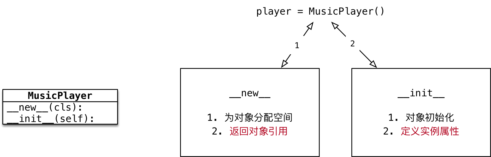

#python 2022/9/4

# 单例

## 目标

- 单例设计模式
- `__new__` 方法
- Python 中的单例

## 01.单例设计模式

- 设计模式
	- **设计模式是前人工作的总结和提炼**，通常被人们广泛流传的设计模式都是针对某一特定问题的成熟的解决方案
	- 使用设计模式是为了可重用代码、让代码更容易被他人理解、保证代码可靠性
- 单例的设计模式
	- 目的 -- **让类创建的对象，在系统中只有唯一的一个实例**
	- 每一次执行 `类名()` 返回的对象，**内存地址是相同的**

**单例设计模式的应用场景**

- 音乐播放对象
- 回收站对象
- 打印机对象
- ...

## 02. `__new__` 方法

- 使用 `类名()` 创建对象时，Python的解释器首先会调用 `__new__` 方法为对象**分配空间**
- `__new__` 是一个由 `object` 基类提供的**内置的静态方法**，主要作用有两个：
	1) **在内存中为对象分配空间**
	2) **返回对象的引用**
- Python 的解释器获得对象的引用后，将引用作为第一个参数，传递给 `__init__` 方法

>重写 `__new__` 方法的海马非常固定!

- 重写 `__new__` 方法一定要 `return super().__new__(cls)`
- 否则 Python 的解释器**得不到**分配了空间的对象引用，就不会调用对象的初始化方法
- 注意：`__new__` 是一个静态方法，在调用时需要出动传递 `cls` 参数



```python
class MusicPlayer:

    def __new__(cls, *args, **kwargs):
        # 1.创建对象时，new方法会被自动调用
        print("创建对象，分配空间")

        # 2.为对象分配空间
        instance = super().__new__(cls)

        # 3.返回对象的引用
        return instance

    def __init__(self) -> None:
        print("播放器初始化")


# 创建播放器对象
player = MusicPlayer()

print(player)
```

## 03.Python 中的单例

- **单例 -- 让类创建的对象，在系统中只有唯一一个实例**
	1. 定义一个类属性，初始值为 `None` ，用于记录单例对象的引用
	2. 重写 `__new__` 方法
	3. 如果类属性 `is None` ，调用父类方法分配空间，并在类属性中记录结果
	4. 返回类属性中记录的对象引用


```python
class MusicPlayer(object):

    # 记录第一个被创建对象的引用
    instance = None

    def __new__(cls, *args, **kwargs):
        # 1.判断类属性是否是空对象
        if cls.instance is None:
            # 2.调用父类的方法，为第一个对象分配空间
            cls.instance = super().__new__(cls)

        # 3.返回类属性保存的对象引用
        return cls.instance
```

**只执行一次初始化工作**

- 在每次使用 `类名()` 创建对象时，Python 的解释器都会自动调用两个方法：
	1) `__new__` 分配空间
	2) `__init__` 对象初始化
- 上个例子中对 `__new__` 方法改造之后，每次得到**第一次被创建对象的引用**
- 但是，**初始化方法还会被再次调用**

**需求**

- 让初始化当作只被执行一次

**解决办法**

1. 定义一个类属性 `init_flag` 标记是否执行过初始化动作，初始化为 `False`
2. 在 `__init__` 方法中，判断 `init_flag` ，如果为 `False` 就执行初始化动作
3. 然后将 `init_flag` 设置为 `True`
4. 这样，再次自动调用 `__init__` 方法时，初始化动作就不会被再次执行了

```python
class MusicPlayer(object):

    # 记录第一个被创建对象的引用
    instance = None

    # 记录是否执行过初始化动作
    init_flag = False

    def __new__(cls, *args, **kwargs):
        # 1.判断类属性是否是空对象
        if cls.instance is None:
            # 2.调用父类的方法，为第一个对象分配空间
            cls.instance = super().__new__(cls)

        # 3.返回类属性保存的对象引用
        return cls.instance

    def __init__(self) -> None:
        # 1.判断是否执行过初始化动作
        if MusicPlayer.init_flag:
            return

        # 2.如果没有执行过，再执行初始化动作
        print("初始化播放器")

        # 3.修改类属性标记
        MusicPlayer.init_flag = True


# 创建多个对象
player1 = MusicPlayer()
print(player1)

player2 = MusicPlayer()
print(player2)
```