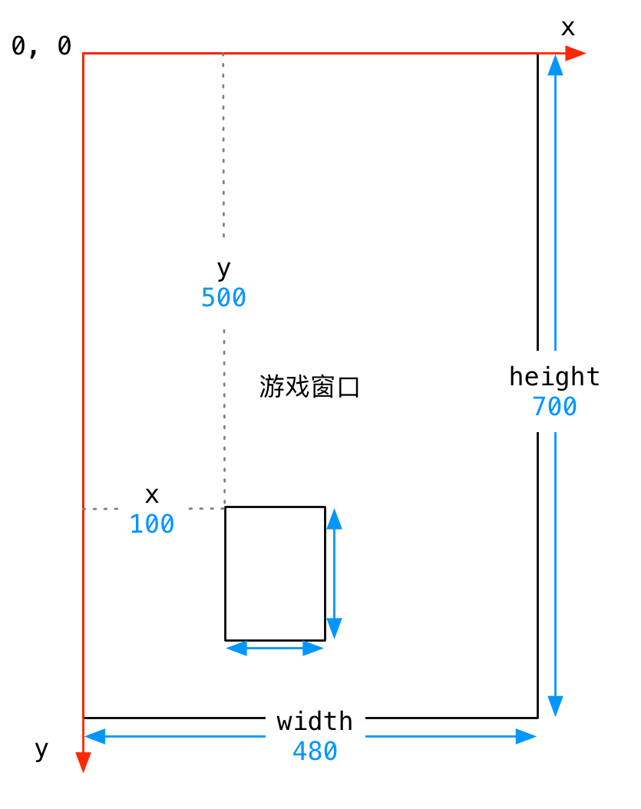

#python 2022/9/7

# 项目实战 -- 飞机大战

## 目标

- 强化面向对象程序设计
- 体验使用 `pygame` 模块进行游戏开发

## 实战步骤

1. `pygame` 快速体验
2. 飞机大战实战

## 确认模块 -- pygame

- `pygame` 就是一个 Python 模块，专为电子游戏设计
- 官方网站：[pygame](https://www.pygame.org/)
	- 提示：要学习第三方模块，通常最好的参考资料就在官方网站

| 网站栏目       | 内容                   |
| -------------- | ---------------------- |
| GettingStarted | 在各平台安装模块的说明 |
| Docs           | pygame 模块所有类和子类的参考手册                       |

## 安装 pygame


## pygame 快速入门

### 目标

1. 项目预备
2. 使用 `pygame` 创建图形窗口
3. 理解图像并实现图像绘制
4. 理解游戏循环和游戏时钟
5. 理解精灵和精灵组

### 项目预备

1. 新建飞机大战项目
2. 新建一个 `ch_01_pygame入门`
3. 导入游戏素材图片

**游戏的第一印象**

- 把一些静止的图像绘制到游戏窗口中
- 根据用户的交互或其他情况，移动这些图像，产生动画效果
- 根据图像之间是否发生重叠，判断敌机是否被摧毁等其他情况

### 01.使用 pygame 创建图像窗口

**小节目标**

1. 游戏的初始化和退出
2. 理解游戏中的坐标系
3. 创建游戏主窗口
4. 简单的游戏循环

>可以将图片素材**绘制到游戏窗口**上，开发游戏之前需要知道**如何建立游戏窗口**

#### 1.1 游戏的初始化和退出

- 要使用 `pygame` 提供的所有功能之前，需要调用 `init` 方法
- 在游戏结束前需要调用以下 `quit` 方法

| 方法            | 说明                                                                 |
| --------------- | -------------------------------------------------------------------- |
| `pygame.init()` | 导入并初始化所有 pygame 模块，使用其他模块之前，必须先调用 init 方法 |
| `pygame.quit()` | 卸载所有 pygame 模块，在游戏结束之前调用                                                                     |


#### 1.2 理解游戏中的坐标系

- 坐标系
	- 远点在左上角 `(0, 0)`
	- x轴水平方向向右，逐渐增加
	- y轴垂直方向向下，逐渐增加



- 在游戏中，所有可见的元素都是以矩形区域来描述位置的
	- 要描述一个矩形区域有四个要素：`(x, y) (width, height)`
- `pygame` 专门提供了一个类 `pygame.Rect` 用于描述矩形区域

```python
Rect(x, y, width, height) -> Rect
```


**提示**

- `pygame.Rect` 是一个比较特殊的类，内部只封装了一些数字计算
- 不执行 `pygame.init()` 方法同样能够直接使用

**案例演练**

**需求**

1. 定义 `hero_rect` 矩形描述英雄的位置和大小
2. 输出英雄的坐标远点 `(X, y)`
3. 输出英雄的尺寸 (宽度和高度)

### 1.3 创建游戏主窗口

- `pygame` 专门提供了一个模块 `pygame.display` 用于创建、管理游戏窗口

| 方法                         | 说明               |
| ---------------------------- | ------------------ |
| `pygame.display.set_model()` | 初始化游戏显示窗口 |
| `pygame.display.update()`    | 刷新屏幕内容显示，稍后使用                   |

**`set_model` 方法**

```python
set_model(resolution=(0,0), flags=0, depth=0) -> Surface
```

- **作用** -- 创建游戏显示窗口
- **参数**
	- `resolution` 指定屏幕的 `宽` 和 `高` ，默认创建的窗口大小和屏幕大小一致
	- `flags` 参数指定屏幕的附加选项，例如是否全屏等等，默认不需要床底
	- `depth` 参数表示颜色的位置，默认自动匹配
- **返回值**
	- **暂时**可以理解为**游戏的屏幕，游戏的元素**都需要被绘制到游戏的屏幕上
- **注意**：必须使用变量记录 `set_mode` 方法的返回结果！因为：后续所有的图像绘制都基于这个返回结果

```python
# 创建游戏主窗口
screen = pygame.display.set_mode((480, 700))
```

#### 1.4 简单的游戏循环

- 为了做到游戏程序启动后，**不会立即退出**，通常会在游戏程序中增加一个**游戏循环**
- 所有游戏循环就是一个**无限循环**
- 在**创建游戏窗口**代码下方，增加一个无限循环
	- 注意：**游戏窗口不需要重复创建**

```python
# 创建游戏主窗口
screen = pygame.display.set_mode((480, 700))

# 游戏循环
while True:
	pass
```

### 02.理解图像并实现图像绘制

- 在游戏中，能够看到的**游戏元素大多都是图像**
	- **图像文件**初始是保存在**磁盘**上的，如果需要使用，**第一步就需要被加载到内存**
- 要在屏幕上看到某一个图像的内容，需要按照三个步骤：
	1. 使用 `pygame.image.load()` **加载图像的数据**
	2. 使用**游戏屏幕**对象，调用 `blit` 方法将图像绘制到指定位置
	3. 调用 `pygame.display.update()` 方法更新整个屏幕的显示


>提示：要想在屏幕上看到绘制的结果，就一定要调用 `pygame.display.update()` 方法

**代码演练 Ⅰ -- 绘制背景图像**

**需求**

1. 加载 `background.png` 创建背景
2. 将背景绘制在屏幕的 `(0, 0)` 位置
3. 调用屏幕更新显示背景图像

```python
import pygame

pygame.init()

# 创建游戏窗口 480 * 700
screen = pygame.display.set_mode((480, 700))

# 绘制背景图像
# 1>加载图像数据
bg = pygame.image.load("./飞机大战/images/background.png")
# 2>blit 绘制图像
screen.blit(bg, (0,0))
# 3>update 更新屏幕显示
pygame.display.update()

# while True:
#     pass

pygame.quit()
```

**代码演练 Ⅱ -- 绘制英雄图像**

**需求**

1. 加载 `me1.png` 创建英雄飞机
2. 将英雄飞机绘制在屏幕的 `(200,500)` 位置
3. 调用屏幕更新显示飞机图像

```python
# 1.绘制英雄的飞机
hero = pygame.image.load("./飞机大战/images/me1.png")
# 2.绘制在屏幕
screen.blit(hero, (200, 500))
# 3.更新显示
pygame.display.update()
```

**透明图像**

- `png` 格式的图像**支持透明的**
- 在绘制图像时，**透明区域不会显示任何内容**
- 但是如果**下方已经有内容，会透过透明区域显示出来**

#### 2.1 理解 update() 方法的作用

>可以在 `screen` 对象完成所有 `blit` 方法之后，统一调用一次 `display.update` 方法，同样可以在屏幕上看到最终的绘制结果

- 使用 `display.set_mode()` 创建的 `screen` 对象是一个**内存中的屏幕数据对象**
	- 可以理解成是油画的画布
- `screen.blit` 方法可以在画布上绘制很多图像
	- 例如：英雄、敌机、子弹...
	- 这些图像**有可能会彼此重叠或者覆盖**
- `display.update()` 会**将画布的最终结果绘制在屏幕上，这样可以提高屏幕绘制效率，增加游戏的流畅度**

### 03.理解游戏循环和游戏时钟

>现在英雄飞机已经被绘制到屏幕上，如何能够让飞机移动呢？

#### 3.1 游戏中的动画实现原理

- 跟电影的原理类似，游戏中的动画效果，本质上是快速的在屏幕上绘制图像
	- 电影是将多张**静止的电影胶片连续、快速的播放**，产生连贯的视觉效果
- 一般在电脑上**每秒绘制60次**，就能够达到非常**连续高品质**的动画效果
	- 每次绘制的结果被称为 **帧(Frame)**


#### 3.2 游戏循环

**游戏的两个组成部分**

>游戏循环的开始就意味着游戏的正式开始


**游戏循环的作用**

1. **保证游戏不会直接退出**
2. **变化图像位置 -- 动画效果**
	- 每隔 `1/60 秒` 移动以下所有图像的位置
	- 调用 `pygame.display.update()` 更新屏幕显示
3. **检测用户交互** -- 按键、鼠标等...

#### 3.3 游戏时钟

- `pygame` 专门提供了一个类 `pygame.time.Clock` 可以非常方便的设置屏幕绘制速度 -- **刷新帧率**
- 要使用**时钟对象**需要两步：
	1) 在**游戏初始化中创建一个时钟对象**
	2) 在**游戏循环中让时钟对象调用 `tick(帧率)` 方法**
- `tick` 方法会**根据上次被调用的事件，自动设置游戏循环中的延时**

```python
# 创建时钟对象
clock = pygame.time.Clock()

# 游戏循环 -> 意味着游戏的正式开始
i = 0
while True:
    # tick()的参数指定循环体内部的代码执行的频率
    clock.tick(60)
    print(i)
    i += 1
```

#### 3.4 英雄的简单动画实现

**需求**

1. 在游戏初始化定义一个 `pygame.Rect` 的变量记录英雄的初始位置
2. 在游戏循环中每次让英雄的 `y-1` --向上移动
3. `y <= 0` 将英雄移动到屏幕的底部

>提示：
>- 每一次调用 `update()` 方法之前，需要**把所有的游戏图像都重新绘制一遍**
>- 而且应该**最先重新绘制背景图像**

```python
import pygame

# 游戏的初始化
pygame.init()

# 创建游戏窗口 480 * 700
screen = pygame.display.set_mode((480, 700))

# 绘制背景图像
bg = pygame.image.load("./飞机大战/images/background.png")
screen.blit(bg, (0,0))

# 绘制英雄飞机
hero = pygame.image.load("./飞机大战/images/me1.png")
screen.blit(hero, (200, 500))

# 更新屏幕显示，可以在所有绘制工作完成之后，统一调用 update 方法
pygame.display.update()

# 创建时钟对象
clock = pygame.time.Clock()

# 1.定义 rect记录飞机的初始位置
hero_rect = pygame.Rect(200, 500, 102, 126)

# 游戏循环 -> 意味着游戏的正式开始
while True:
    # tick()的参数指定循环体内部的代码执行的频率
    clock.tick(60)
    
    # 2.修改飞机的位置
    hero_rect.y -= 1
    if hero_rect.bottom <= 0:
        hero_rect.y = 700
    # 3.调用 blit 方法绘制图像
    screen.blit(bg, (0,0))
    screen.blit(hero, hero_rect)
    # 4.调用 update 方法更新显示
    pygame.display.update()

pygame.quit()
```

#### 3.5 在游戏循环中 监听 事件

**事件 event**

- 就是游戏启动后，**用户针对游戏所作的操作**
- 例如：**点击关闭按钮，点击鼠标，按下键盘...**

**监听**

- 在游戏循环中，判断用户**具体的操作**

>只有捕获到用户具体的操作，才能针对性的做出响应

**代码实现**

- `pygame` 中通过 `pygame.event.get()` 可以**获得用户当前所做动作的 事件列表**
	- 用户可以同一时间做很多事情
- 提示：**这段代码非常的固定**，几乎所有的 `pygame` 游戏都大同小异

```python
# 游戏循环
while True:

	# 设置屏幕刷新帧率
	clock.tick(60)

	# 事件监听
	for event in pygame.event.get():
		print("退出游戏...")

		pygame.quit()

		# 直接退出系统
		exit()
```

#python 2022/9/8

### 04.理解 精灵和精灵组

#### 4.1 精灵和精灵组

- 在刚刚完成的案例中，**图像加载、位置变化、绘制图像**都需要程序员编写代码分别处理
- 为了简化开发步骤，`pygame` 提供了两个类
	- `pygame.sprite.Sprite` -- 存储图像数据 image 和位置 rect 的对象
	- `pygame.sprite.Group`


### 4.2 派生精灵子类

1. 新建 `plane_sprites.py` 文件
2. 定义 `GameSprite` 继承自 `pygame.sprite.Sprite`

注意

- 如果一个类的父类不是 `object`
- 在重写初始化方法时，一定要先 `super()` 一下父类的 `__init__` 方法
- **保证父类中实现的 `__init__` 代码能够被正常执行**


**属性**

- `image` 精灵图像，使用 `image_name` 加载
- `rect` 精灵大小，默认使用图像大小
- `speed` 精灵移动速度，默认为 `1`

**方法**

- `update` 每次更新屏幕时在游戏循环内调用
	- 让精灵的 `self.rect.y += self.speed`

**提示**

- `image` 的 `get_rect()` 方法，可以返回 `pygame.Rect(0, 0, 图像宽， 图像高)` 的对象

```python
from email.mime import image
import pygame

class GameSprite(pygame.sprite.Sprite):
    """飞机大战游戏精灵"""

    def __init__(self, image_name, speed=1) -> None:
        
        # 调用父类的初始化方法
        super().__init__()

        # 定义对象的属性
        self.image = pygame.image.load(image_name)
        self.rect = self.image.get_rect()
        self.speed = speed
        
    def update(self):

        # 在屏幕的垂直方向移动
        self.rect.y += self.speed
```

### 4.3 使用游戏精灵和精灵组创建敌机

**需求**

- 使用刚刚派生的 游戏精灵 和 精灵组 创建敌机并且实现敌机动画

**步骤**

1. 使用 `from` 导入 `plane_sprites` 模块
	- `from` 导入的模块可以直接使用
	- `import` 导入的模块需要通过 `模块名.` 来使用
1. 在游戏初始化创建精灵对象和精灵组对象
2. 在游戏循环中让精灵组分别调用 `update()` 和 `draw(screen)` 方法

**职责**

- 精灵
	- 封装 **图像image、位置rect 和 速度speed**
	- 提供 `update()` 方法，根据游戏需求，更新位置rect
- 精灵组
	- 包含**多个精灵对象**
	- `update` 方法，让精灵组中的所有精灵调用 `update` 方法更新位置
	- `draw(screen)` 方法，在 `screen` 上绘制精灵组中的所有精灵