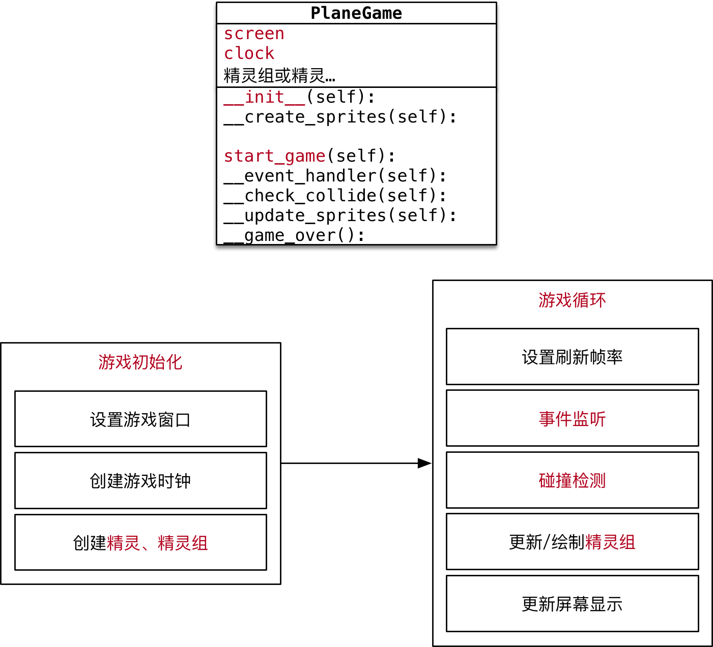

#python 2022/9/8

# 游戏框架搭建

目标 -- 使用面向对象设计飞机大战游戏类

## 目标

- 明确主程序职责
- 实现主程序类
- 准备游戏精灵类

## 01.明确主程序职责

- 回顾快速入门案例，一个游戏主程序的职责可以分为两个部分：
	- 游戏初始化
	- 游戏训话
- 根据明确的职责，设计 `PlaneGame` 类如下：



>提示根据职责封装私有方法，可以避免某一个方法的代码写得太过冗长，如果某一个方法编写的太长，既不好阅读，也不好维护！

- **游戏初始化** -- `__init__()` 会调用以下方法

| 方法                     | 职责                                   |
| ------------------------ | -------------------------------------- |
| `__event_handler(self)`  | 事件监听                               |
| `__checkcollide(self)`   | 碰撞检测 -- 子弹销毁敌机、敌机撞毁英雄 |
| `__update_sprites(self)` | 精灵组更新和绘制                       |
| `__game_over()`          | 游戏结束                                       |

## 03.实现飞机大战主游戏类

### 2.1 明确文件职责


- `plane_main`
	1. 封装 主游戏类
	2. 创建 游戏对象
	3. 启动游戏
- `plane_sprites`
	1. 封装游戏中所有需要使用的精灵子类
	2. 提供游戏的相关根据

**代码实现**

- 新建 `plane_main.py` 文件，并且设置为可执行
- 编写基础代码

```python
import pygame
from plane_sprites import *


class PlaneGame(object):
    """飞机大战主游戏类"""

    def __init__(self) -> None:
        print("游戏初始化")

        # 1.创建游戏的窗口
        self.screen = pygame.display.set_mode((480, 700))
        # 2.创建游戏的时钟
        self.clock = pygame.time.Clock()
        # 3.调用私有方法，精灵和精灵组的创建
        self.__create_sprites()

    def __create_sprites(self):
        pass

    def start_game(self):
        print("游戏开始...")

    

if __name__ == "__main__":

    # 创建游戏对象
    game = PlaneGame()

    # 启动游戏
    game.start_game()
```

**使用常量代替固定的数值**

>- 常量 -- 不变化的量
>- 变量 -- 可以变化的量

**应用场景**

- 在开发时，可能会需要使用固定的数值，例如 屏幕的高度是 `700`
- 这个时候，建议不要直接使用固定数值，而应该使用**常量**
- 在开发时，为了保证代码的可维护性，尽量不要使用 **魔法数字**

**常量的定义**

- 定义常量和定义变量的语法完全一样，都是使用赋值语句
- **常量的命名**应该**所有字母都使用大写，单词与单词之间使用下划线连接**

>提示：Python 中并没有真正意义的常量，只是通过命名的约定 -- 所有字母都是大写的就是常量，开发时不要轻易修改！

**代码调整**

- 在 `plane_sprites.py` 中增加常量定义

```python
# 屏幕大小的常量
SCREEN_RECT = pygame.Rect(0, 0, 480, 700)
# 屏幕刷新率
FRAME_PER_SEC = 60
```

```python
# coding=utf8
from logging import PlaceHolder
import pygame
from plane_sprites import *


class PlaneGame(object):
    """飞机大战主游戏类"""

    def __init__(self) -> None:
        print("游戏初始化")

        # 1.创建游戏的窗口
        self.screen = pygame.display.set_mode(SCREEN_RECT.size)
        # 2.创建游戏的时钟
        self.clock = pygame.time.Clock()
        # 3.调用私有方法，精灵和精灵组的创建
        self.__create_sprites()

    def __create_sprites(self):
        pass

    def start_game(self):
        print("游戏开始...")

        while True:
            # 1.设置刷新帧率
            self.clock.tick(FRAME_PER_SEC)
            # 2.事件监听
            self.__event_handler()
            # 3.碰撞检测
            self.__check_collider()
            # 4.更新/绘制精灵组
            self.__update_sprites()
            # 5.更新显示
            pygame.display.update()

    def __event_handler(self):
        for event in pygame.event.get():
            # 判断是否退出游戏
            if event.type == pygame.QUIT:
                PlaneGame.__game_over()

    def __check_collider(self):
        pass

    def __update_sprites(self):
        pass

    @staticmethod
    def __game_over():
        print("游戏结束...")
        pygame.quit()
        exit()
    

if __name__ == "__main__":

    # 创建游戏对象
    game = PlaneGame()

    # 启动游戏
    game.start_game()
```