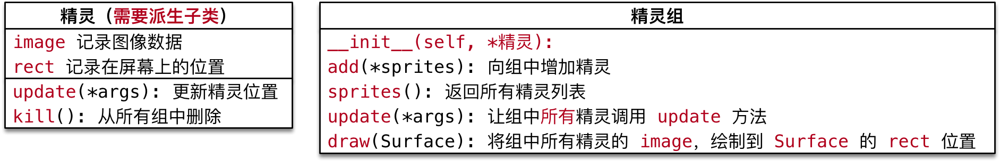
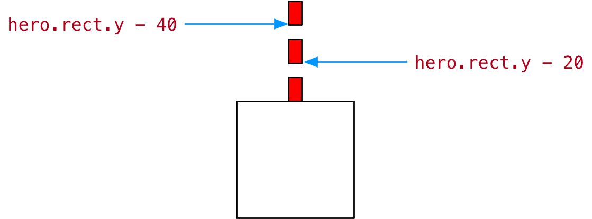

#python 2022/9/9

# 游戏背景

## 目标

- 背景交替滚动的思路确定
- 显示游戏背景

## 01.背景交替滚动的思路确定

- 游戏启动后，背景图像会连续不断地向下方移动
- 在视觉上产生英雄地飞机不断向上方飞行的错觉 -- 在很多跑酷类游戏中常用的套路
	- 游戏的背景不断变化
	- 游戏的主角位置保持不变

### 1.1 实现思路分析


**解决方法**

1. 创建两张背景图像精灵
	- 第 1 张 完全和屏幕重合
	- 第 2 张 在屏幕的正上方
2. 两张图像一起向下方运动
	- `self.rect.y += self.speed`
3. 当任意背景精灵的 `recy.y >= 屏幕高度` 说明已经移动到屏幕下方
4. 将移动到屏幕下方的这张图像设置屏幕的正下方
	- `rect.y = -rect.height`

### 1.2 设计背景类


- **初始化方法**
	- 直接指定背景图片
	- `is_alt` 判断是否另一张图像
		- `False` 表示第一张图像，需要与屏幕重合
		- `True` 表示另一张图像，在屏幕的正上方
- `update()` 方法
	- 判断是否移动出屏幕，如果是，将图像设置到屏幕正上方，从而实现交替滚动

>**继承** 如果父类提供的方法，不能满足子类的需求：
>- 派生一个子类
>- 在子类中针对特有的需求，重写父类方法，并且进行扩展

## 02.显示游戏背景

### 2.1 背景精灵的基本实现

- 在 `plane_sprites` 新建 `Background` 继承自 `GameSprite`

```python
class Background(GameSprite):
    """游戏背景精灵"""

    def update(self):
        # 1.调用父类的方法实现
        super().update()
        # 2.判断是否移出屏幕，如果移出普，将图像设置到屏幕的正上方
        if self.rect.y >= SCREEN_RECT.height:
            self.rect.y = -self.rect.height
```

### 2.2 在 plane_main.py 中显示背景精灵

1. 在 `__crete_sprites` 方法中创建精灵和精灵组
2. 在 `__update_sprites` 方法中，让精灵组调用 `update()` 和 `draw()` 方法

>`__crete_sprites` 方法

```python
    def __create_sprites(self):

        # 创建背景精灵和精灵组
        bg1 = Background("./飞机大战/images/background.png")
        bg2 = Background("./飞机大战/images/background.png")
        bg2.rect.y = -bg2.rect.height

        self.back_group = pygame.sprite.Group(bg1, bg2)
```

>`__update_sprites` 方法

```python
    def __update_sprites(self):

        self.back_group.update()
        self.back_group.draw(self.screen)
```

### 2.3 利用初始化方法，简化背景精灵创建

>思考--上一小结完成的代码存在什么样的问题？能否简化？

- 主程序中，创建的两个背景精灵，传入了相同的文件路径
- 创建第二个背景精灵时，在主程序中，设置背景精灵的图像向位置

>思考 -- 精灵初始位置的设置，应该由主程序负责？还是由精灵自己负责？

**答案 -- 由精灵自己负责**

- 根据面向对象设计原则，应该将对象的职责，封装到类的代码内部
- 尽量简化程序调用一方的代码调用


- **初始化方法**
	- 直接指定背景图片
	- `is_alt` 判断是否是另一张图像
		- `False` 表示第一张图像，需要与屏幕重合
		- `True` 表示另一张图像，在屏幕的正上方

在 `plane_sprites.py` 中实现 `Background` 的初始化方法

```python
    def __init__(self, is_alt=False) -> None:
        
        # 1.调用父类方法实现精灵创建(images/rect/speed)
        super().__init__("./飞机大战/images/background.png")
        # 2.判断是否是交替图像，如果是，需要设置初始设置
        if is_alt:
            self.rect.y = -self.rect.height
```

# 敌机出场

## 目标

- 使用定时器添加敌机
- 设计 `Enemy` 类

## 01.使用定时器添加敌机

1. 游戏启动时，每隔1秒会出现一架敌机
2. 每架敌机向屏幕下方飞行，飞行速度各不相同
3. 每家敌机出现的水平位置也不尽相同
4. 当敌机从屏幕下方飞出，不会再非回到屏幕中

### 1.1 定时器

- 在 `pygame` 中可以使用 `pygame.time.set_timer()` 来添加定时器
- 所谓定时器，就是每隔一段事件，去执行一些动作

```python
set_timer(eventid, milliseconds) -> None
```

- `set_timer` 可以创建一个事件
- 可以在游戏循环的事件监听方法中捕获到该事件
- 第1个参数 **事件代码** 需要基于常量 `pygame.USEREVENT` 来指定
	- `USEREVENT` 是一个整数，再增加的事件可以使用 `USEREVENT + 1` 指定，一次类推...
- 第2个参数是事件**触发间隔的毫秒值**

**定时器事件的监听**

- 通过 `pygame.event.get()` 可以获取当前时刻所有的**事件列表**
- 遍历列表并且判断 `event.type` 是否等于 `eventid` ，如果相等，表示 定时器事件发生

### 1.2 定义并监听创建敌机事件

`pygame` 的定时器使用套路非常固定：

1. 定义**定时器常量** -- `eventid`
2. 在初始化方法中，调用 `set_timer` 方法，**设置定时器事件**
3. 在游戏循环中，监听定时器事件

1) **定义事件**

- 在 `plane_sprites.py` 的顶部定义**事件常量**

```python
# 敌机出现事件
CREATE_ENEMY_EVENT = pygame.USEREVENT
```

## 02.设计 Enemy 类

1. 游戏启动后，每隔1秒会出现一架敌机
2. 每架敌机向屏幕下方飞行，飞行速度各不相同
3. 每架敌机出现的水平位置也不尽相同
4. 当敌机从屏幕下方废除，不会再飞回到屏幕中


- **初始化方法**
	- 指定敌机图片
	- **随机** 敌机的初始位置和速度
- 重写 `update()` 方法
	- 判断是否飞出屏幕，如果是，从精灵组删除

### 2.1 敌机类的准备

```python
class Enemy(GameSprite):
    """敌机精灵"""

    def __init__(self) -> None:
        
        # 1.调用父类方法，创建敌机精灵，同时指定敌机图片
        super().__init__("./飞机大战/images/enemy1.png")
        # 2指定敌机的初始随机速度

        # 3.指定敌机的初始随机位置
        
        pass

    def update(self):
        
        # 1.调用父类方法，保持垂直方向的飞行
        super().update()
        # 2.判断是否飞出屏幕，如果是，需要从精灵组删除敌机
        if self.rect.y >= SCREEN_RECT.height:
            print("飞出怕没有，需要从精灵组删除...")
        pass
```

### 2.2 创建敌机

**演练步骤**

1. 在 `__create_sprites` ，添加敌机精灵组
	- 敌机是**定时被创建的**，因此在初始化方法中，不需要创建敌机
2. 在 `__event_handler` ，创建敌机，并且添加到精灵组
	- 调用精灵组的 `add` 方法可以**向精灵组添加精灵**
3. 在 `__update_sprites` ，让敌机精灵组调用 `update` 和 `draw` 方法



**代码演练**

- 创建敌机的精灵组

```python
# 创建敌机的精灵组
self.enemy_group = pygame.sprite.Group()
```

- 修改 `plane_main` 的 `__update_sprites` 方法

```python
self.enemy_group.update()
self.enemy_group.draw(self.screen)
```

- 定时出现敌机

```python
elif event.type == CREATE_ENEMY_EVENT:
	# print("敌机出场...")
	# 创建敌机精灵
	enemy = Enemy()
	# 将敌机精灵添加到敌机精灵组
	self.enemy_group.add(enemy)
```

### 2.3 随机敌机位置和速度

1) 导入模块

- 在导入模块时，建议按照以下顺序导入

```
1. 官方标准模块导入
2. 第三方模块导入
3. 应用程序模块导入
```

- 修改 `plane_sprites.py` 增加 `random` 的导入

```python
import random
```

2) **随机位置**


使用 `pygame.Rect` 提供的 `bottom` 属性，在指定敌机初始位置时，会比较方便

- `bottom = y + height`
- `y = bottom - height`

3) **代码实现**

- 修改初始化方法，随机敌机出现速度和位置

```python
def __init__(self) -> None:
	
	# 1.调用父类方法，创建敌机精灵，同时指定敌机图片
	super().__init__("./飞机大战/images/enemy1.png")
	
	# 2指定敌机的初始随机速度
	self.speed = random.randint(1, 3)
	# 3.指定敌机的初始随机位置
	self.rect.bottom = 0
	# 水平随机位置
	max_x = SCREEN_RECT.width - self.rect.width
	self.rect.x = random.randint(0, max_x)
```

### 2.4 移出欧姆销毁敌机

- 敌机移出屏幕之后，如果没有撞到英雄，敌机的历史使命终结
- 需要从敌机组删除，否则会造成内存浪费

**检测敌机被销毁**

- `__del__` 内置方法会在对象被销毁前调用，在开发中，可以用于**判断对象是否被销毁**

```python
def __del__(self):
	print("敌机挂了 %s" % self.rect)
```

**代码实现**


- 判断敌机是否飞出屏幕，如果是，调用 `kill()` 方法从所有组中删除

```python
def update(self):
	
	# 1.调用父类方法，保持垂直方向的飞行
	super().update()
	# 2.判断是否飞出屏幕，如果是，需要从精灵组删除敌机
	if self.rect.y >= SCREEN_RECT.height:
		print("飞出屏幕，从精灵组删除...")
		# kill方法可以将精灵从所有精灵组中移出，精灵就会被自动销毁
		self.kill()	
```

# 英雄登场

## 目标

- 设计英雄和子弹类
- 使用 `pygame.key.get_pressed()` 移动英雄
- 发射子弹

## 01.设计英雄和子弹类

### 1.1 英雄需求

1. 游戏启动后，英雄出现在屏幕的水平中间位置，距离屏幕底部 `120` 像素
2. 英雄每隔 `0.5s` 发射一次子弹，每次连发三枚子弹
3. 英雄默认不会移动，需要通过 左/右 方向键，控制英雄在水平方向移动


```python
class Hero(GameSprite):
    """英雄精灵"""

    def __init__(self) -> None:
        
        # 1.调用父类方法，设置 image, speed
        super().__init__("./飞机大战/images/me1.png", 0)
        # 2.设置英雄的初始位置
        self.rect.centerx = SCREEN_RECT.centerx
        self.rect.bottom = SCREEN_RECT.bottom - 120
        pass
```

### 1.2 子弹需求

1. 子弹从英雄的正上方发射沿直线向上方飞行
2. 飞出屏幕后，需要从精灵组中删除


### 1.3 Hero -- 英雄

- **初始化方法**
	- 指定**英雄图片**
	- **初始速度 = 0** -- 英雄默认静止不动
	- 定义 `bullets` **子弹精灵组**保存子弹精灵
- 重写 `update()` 方法
	- 英雄需要**水平移动**
	- 并且需要保证不能**移出屏幕**
- 增加 `bullets` 属性，记录所有**子弹精灵**
- 增加 `fire` 方法，用于发射子弹

## 02.创建英雄

### 2.1 准备英雄类

- 在 `plane_sprites` 新建 `Hero` 类
- 重写初始化方法，直接指定图片名称，并且将初始速度设置为 `0`
- 设置英雄的初始位置


- `centerx = x + 0.5 * width`
- `centery = y + 0.5 * height`
- `bottom = y + height`

### 2.2 绘制英雄

1. 在 `__create_sprites`， 添加英雄精灵和英雄精灵组
	- 后续要针对英雄左碰撞检测以及发射子弹
	- 所有英雄需要单独定义成属性
2. 在 `__update_sprites`， 让英雄精灵组调用 `update` 和 `draw` 方法

**代码实现**

- 修改 `__create_sprites` 方法如下：

```python
# 创建英雄的精灵和精灵组
self.hero = Hero()
self.hero_group = pygame.sprite.Group(self.hero)
```

- 修改 `__update_sprites` 方法如下：

```python
self.hero_group.update()
self.hero_group.draw(self.screen)
```

## 0.3移动英雄位置

>在 pygame 中针对硬盘按键的捕获，有两种方式

- 第一种方式，判断 `event.type = pygame.KEYDOWN`
- 第二种方式
	1. 首先使用 `pygame.key.get_pressed()` 返回**所有按键元组**
	2. 通过**按键常量**，判断元组中**某一个键是否被按下** -- 如果被按下，对应数值为 `1`

>思考：这两种方式之间有什么区别呢？

- 第一种方式

```python
elif event.type == pygame.KEYDOWN and event.key == pygame.K_RIGHT:
	print("向右移动")
```

- 第二种方式

```python
# 使用键盘提供的方法获取键盘按键 - 按键元组
keys_pressed = pygame.key.get_pressed()
# 判断元组中对应的按键索引值 1
if keys_pressed[pygame.K_RIGHT]:
	print("向右移动...")
```

**结论**

- 第一种方式 `event.type` 用户**必须要抬起按键才算一次按键事件，操作灵活性会大打折扣**
- 第二种方式，用户可以按住方向键不放，就能够实现持续向某一个方向移动，操作灵活性更好

### 3.1 移动英雄位置

**演练步骤**

1. 在 `Hero` 类中重写 `update` 方法
	- 用速度 `speed` 和英雄 `rect.x` 进行叠加
	- **不需要调用父类方法** -- 父类方法只是实现了单纯的垂直运动
2. 在 `__event_handler` 方法中根据**左右方向键**设置英雄的速度
	- 向右 => `speed = 2`
	- 向左 => `speed = -2`
	- 其他 => `speed = 0`

**代码演练**

- 在 `Hero` 类，重写 `update()` 方法，根据速度水平移动英雄的飞机


### 3.2 控制英雄运动边界

- 在 `Hero` 类的 `update()` 方法判断英雄是否超出屏幕边界


- `right = x + width` 利用 `right` 属性可以非常任意的针对右侧设置精灵位置


## 04.发射子弹

需求回顾 -- 英雄需求

1. 游戏启动后，英雄出现在屏幕的水平之间位置，距离屏幕底部 `120` 像素
2. 英雄每隔 `0.5` 秒发射一次子弹，每次连发三枚子弹
3. 英雄默认不会移动，需要通过 左/右 方向键，控制英雄在水平方向移动

### 4.1 添加发射子弹事件

`pygame` 的定时器使用套路非常固定：

1. 定义定时器常量 -- `eventid`
2. 在初始化方法中，调用 `self.timer` 方法**设置定时器事件**
3. 在游戏循环中，监听定时器事件

**代码实现**

- 在 `Hero` 中定义 `fire` 方法

```python
def fire(self):
	print("放射子弹...")
```

### 4.2 定义子弹

**需求回顾 -- 子弹需求**

1. 子弹从英雄的正上方发射沿直线向上方飞行
2. 飞出屏幕后，需要从精灵族中删除

**Bullet -- 子弹**

- 初始化方法
	- 指定子弹图片
	- **初始速度 = -2** -- 子弹需要向上方飞行
- 重写 `update()` 方法
	- 判断是否飞出屏幕，如果是，从精灵组删除

**定义子弹类**

- 在 `plane_sprites` 新建 `Bullet` 继承自 `GameSprite`
- 重写 初始化方法，直接指定图片名称，并且设置初始速度
- 重写 `update()` 方法，判断子弹**飞出屏幕从精灵组删除**

### 4.3 发射子弹

演练步骤

1. 在 `Hero` 的初始化方法中创建子弹精灵组属性
2. 修改 `plane_main.py` 的 `__update_sprites` 方法，让子弹精灵组调用 `update` 和 `draw` 方法
3. 实现 `fire()` 方法
	- 创建子弹精灵
	- 设置初始位置 -- 在英雄的正上方
	- 将子弹添加到精灵组

**代码实现**

- 初始化方法

```python
# 3.创建子弹的精灵组
self.bullets = pygame.sprite.Group()
```

- 修改 `fire()` 方法

```python
def fire(self):
	print("发射子弹...")
	# 1.创建子弹精灵
	bullet = Bullet()
	# 2.设置精灵的位置
	bullet.rect.bottom = self.rect.y - 20
	bullet.rect.centerx = self.rect.centerx
	# 3.将精灵添加到精灵组
	self.bullets.add(bullet)
```

**一次发射三枚子弹**



- 修改 `fire()` 方法，一次发射三枚子弹

# 碰撞检测

## 目标

- 了解碰撞检测方法
- 碰撞实现

## 01.了解碰撞检测方法

- `pygame` 提供了两个非常方便的方法可以实现碰撞检测：

**pygame.sprite.groupcollide()**

- 两个精灵组中所有精灵的碰撞检测

```python
groupcollide(group1, group2, dokill1, dokill2, collided=None) -> Sprite_dict
```

- 如果将 `dokill` 设置为 `True` ，则**发生碰撞的精灵将被自动删除**
- `collided` 参数是用来**计算碰撞的回调函数**
	- 如果没有指定，则每隔精灵必须有一个 `rect` 属性

**pygame.sprite.spritecollide()**

- 判断某个精灵和指定精灵组中的精灵的碰撞

```python
spritecollide(sprite, group, dokill, collided=None) -> Sprite_list
```

- 如果将 `dokill` 设置为 `True` ，则指定精灵组中发生碰撞的精灵将被自动移除
- `collided` 参数是用于 计算碰撞的回调函数
	- 如果没有指定，则每隔精灵必须有一个 `rect` 属性
- 返回精灵组中跟精灵发生碰撞的**精灵列表**

## 02.碰撞实现

```python
def __check_collide(self):
	# 1.子弹摧毁敌机
	pygame.sprite.groupcollide(self.hero.bullets, self.enemy_group, True, True)

	# 2.敌机撞毁英雄
	enemies = pygame.sprite.spritecollide(self.hero, self.enemy_group, True)
	
	# 3.判断列表是否有内容
	if len(enemies) > 0:
		# 让英雄牺牲
		self.hero.kill()
		# 结束游戏
		PlaneGame.__game_over()
```