# B站黑马程序员Python教程学习笔记

视频地址：[黑马程序员Python教程_Python从入门到精通](https://www.bilibili.com/video/BV1ex411x7Em?share_source=copy_web&vd_source=4419ca8be7ab90348a330c27adecd36c)

#python 2022/8/14

## 1.0 起源

>Python的创始人为吉多·范罗苏姆(Gudio van Rossum)

1991年，第一个Python**解释器**诞生，它是用C语言实现的，并能调用C语言的库文件

## 1.1 解释器(科普)

**计算机不能直接理解任何机器语言以外的语言**，所以必须要把程序员所写的程序语言翻译成机器语言，计算机才能执行程序。**将其它语言翻译成机器语言的工具，被称为编译器**。

编译器翻译的方式有两种：一个是**编译**，另一个是**解释**，两种方式之间的区别在于**翻译时间点的不同**。当编译器**以解释方式运行的时候**，也称之为**解释器**。


- **编译型语言(如C/C++)**：程序在执行之前需要一个专门的编译过程，把程序编译成机器语言的文件，运行时不需要重新翻译，直接使用编译的结果就行。程序执行效率高，依赖编译器，跨平台性能差些。
- **解释性语言(如Python)**：解释型语言编写的程序不进行预先编译，以文本方式存储程序代码，会将代码一句一句直接运行。在发布程序时，看起来节省了编译工序，但是在运行程序的时候，必须先解释再运行。

编译型语言和解释型语言对比
- 速度--编译型语言比解释型语言执行速度快
- 跨平台性--解释型语言比编译型语言跨平台性号

## 1.2 Python的设计目标

- 一门**简单直观**的语言并与主要竞争者一样强大
- **开源**，以便任何人都可以为它做贡献
- 代码**像纯英语那样容易理解**
- 适用于**短期**开发的日常任务

## 1.3 Python的设计哲学

1. 优雅
2. 明确
3. 简单

- Python开发者的哲学是：用一种方法，最好是只有一种方法来做一件事
- 如果面临多种选择，Python开发者一般会拒绝花哨的语法，而选择明确没有或者很少有歧义的语法

>在Python社区，吉多被称为“仁慈的独裁者”

## 02 为什么选择Python？

- 代码量少
- 人生苦短，我用Python

## 0.3 Python特点

- Python是**完全面向对象**的语言
	- **函数、模块、数字、字符串**都是对象，在**Python中一切皆对象**
	- 完全支持继承、重载、多重继承
	- 支持重载运算符，也支持泛型设计
- Python**拥有一个强大的标准库**，Python语言的核心只包含 **数字、字符串、列表、字典、文件** 等常见类型和函数，而由Python标准库提供了 **系统管理、网络通信、文本处理、数据库接口、图形系统、XML处理** 等额外的功能
- Python社区提供了**大量第三方模块**，使用方式与标准库类似。它们的功能覆盖 **科学计算、人工智能、机器学习、Web开发、数据库接口、图形系统** 多个领域

## 面向对象的思维方式

- **面向对象** 是一种 **思维方式**，也是一门 **程序设计技术**
- 要解决一个问题前，首先考虑**由谁**来做，怎么做事情是 谁 的职责，最好把事情做好就行！
	- **对象** 就是 **谁**
- 要解决复杂的问题，就可以找**多个不同的对象，各司其职**，共同实现，最终完成需求

## 0.4 Python的优缺点

### 4.1 优点

- 简单、易学
- 免费、开源
- 面向对象
- 丰富的库
- 可扩展性
	- 如果需要一段关键代码运行得更快或者希望某些算法不公开，可以把这部分程序用`C/C++`编写，然后在`Python`程序中使用它们
- ...

### 4.2 缺点

- 运行速度
- 国内市场较小
- 中文资料匮乏

#python 2022/8/15

# 第一个Python程序

## 目标

- 第一个`HelloPython`程序
- `Python2.x`与`3.x`版本简介
- 执行`Python`程序的三种方式
	- 解释器--`python/python3`
	- 交互式--`ipython`
	- 集成开发环境--`PyCharm`

## 01.第一个HelloPython程序

### 1.1 Python源程序的基本概念

1. Python源程序就是一个特殊格式的文本文件，可以使用任意文本编辑软件做`Python`的开发
2. Python程序的 文件扩展名 通常都是`.py`

### 1.2 演练步骤

- 在桌面下，新建`认识Python`目录
- 在`认识Python`目录下新建`01-HelloPython.py`文件
- 使用 **gedit编辑** `01-HelloPython.py`并且输入以下内容

```python
print("hello python")
print("hello world")
```

- 在终端输入以下命令执行`01-HelloPython.py`

```linux
$ python 01-HelloPython.py
```

>`print`是`python`学习的第一个函数
>`print`函数的作用，可以把`""`中的内容，输出到屏幕上

```python
$ mkdir 认识Python
$ cd 认识Python
$ touch 01-HelloPython.py
$ gedit 01-HelloPython.py

print("hello python")
print("hello world")
```

### 1.3 演练扩展--认识错误(BUG)

关于错误
- 编写的程序**不能正常执行，或者执行的结果不是我们期望的**
- 俗称`BUG`，是程序员在开发时非常常见的
- 在学习语言时，不仅要**学会语言的语法，而且还要学会如何认识错误和解决错误的方法**

>每个程序员都是在不断地修改错误中成长的

常见错误
1. 手误，例如使用`pirnt("Hello world")`

```md
NameError: name 'pirnt' is not defined
名称错误：'pirnt'名字没有定义
```

2. 将多条`print`写在一行

```md
SyntaxError: invalid syntax
语法错误：语法无效
```

>每行代码负责完成一个动作

3. 缩进错误

```md
IndentationError: unexpected indext
```

- Python是一个格式非常严格的程序设计语言
- 目前而言，每行代码之前都不要增加空格

4. python 2.x默认不支持中文

## 02. Python 2.x 与 3.x版本简介

- **Python 2.x**的解释器名称是**python**
	- 当代码中有输出中文，而使用的是python解释器时，会放生**语法错误**
	- `SyntaxError: Non-ASCII charcter`
- **Python 3.x**的解释器名称是**python3**

## 03.执行Python程序的三种方式

### 3.1 解释器python/Python3

```linux
# 使用 python 2.x 解释器
$ python xxx.py

# 使用 python 3.x 解释器
$ python3 xxx.py
```

**Python的解释器**如今有多个语言的实现，包括：
- `CPython` -- 官方版本的C语言实现
- `Jython` -- 可以运行Java平台
- `IronPython` -- 可以运行在.NET和Mono平台
- `PyPy` -- Python实现的，支持JIT即时编译

### 3.2.交互式运行Python程序

- 直接在终端中运行的解释器，而不输入要执行的文件名
- 在Python的`Shell`中直接输入**Python的代码**，会立即看到程序执行结果

1. 交互式运行Python的优缺点

优点
- 适合于学习/验证Python语法或者局部代码

缺点
- 代码不能保存
- 不适合运行太大的程序

2. 退出 官方的解释器

**1>直接输入exit()**

```shell
>>> exit()
```

**2>使用热键退出**

在Python解释器中，按热键`ctrl + d`可以退出解释器

3. **IPython**

- IPython中的"I"代表**交互interactive**

特点
- IPython是一个python**交互式shell**，比默认的`python shell`好用得多
	- **支持自动补全**
	- **自动缩进**
	- **支持`bash shell`命令(可以直接输入linux终端命令)**
	- **内置了许多很有用得功能和函数**
- IPython是基于BSD开源的

版本
- Python 2.x使用的解释器是 **ipython**
- Python 3.x使用的解释器是 **ipython3**
- 要退出解释器可以有以下两种方式

1>直接输入exit

```ipython
>>> exit
```

2>使用热键退出

在Ipython解释器中，按热键`ctrl + d`，`IPython`会询问是否退出解释器

### 3.3.Python的IDE -- PyCharm

1. 集成开发环境(IDE)

集成开发环境(`IDE`, Integrated Development Environment) -- **集成了开发软件需要的所有工具** ，一般包括以下工具：
- 图形用户界面
- 代码编辑器(支持 **代码补全/自动缩进**)
- 编译器/解释器
- 调试器(**断点/单步执行**)
- ...

2. PyCharm介绍

- `PyCharm`是Python的一款非常优秀的集成开发环境
- `PyCharm`除了具有一般IDE所必备功能外，还可以在`Windows/Linux/macOS`下使用
- `PyCharm`适合开发大型项目
	- 一个项目通常会包括 **很多源文件**
	- 每个 **源文件** 的代码行数是有限的，通常在几百行之内
	- 每个 **源文件** 各司其职，共同完成复杂的业务功能

## 0.4.命名规则

- 以后的 **项目名** 前面都以 数字编号，随着知识点递增，编号递增
	- 例如：01_Python基础、02_分治、03_循环
- 每个项目下的文件名都以`hm_xx_知识点`方式来命名
	- 其中**xx**是演练文件的序号
- 注意
	1. 命名文件名建议只是用**小写字母**、**数字**和**下划线**
	2. **文件名不能以数字开始**

#python 2022/8/16

## 01.注释

### 1.1 注释的作用

>使用自己熟悉的语言，在程序中对某些代码进行标注说明，增强程序的可读性

### 1.2 单行注释

- 以`#`开头，`#`右边的所有东西都被当作说明文字，而不是真正要执行的程序，只起到辅助说明作用
- 为保证程序的可读性，在`#`后要添加一个空格
- 示例代码如下

```python
# 这是一个注释
print("hello world")
```

在代码后面增加的单行注释

- 在程序开发时，同样可以使用`#`在代码后面(旁边)增加说明性的文字
- 但是，需要注意的是，为了**保证代码的可读性，注释和代码之间** 至少要有 **两个空格**

```python
print("Hello world")  # 输出"Hello world"
```

### 1.3 多行注释(块注释)

- 如果希望编写的 注释信息很多，一行无法显示，就可以使用多行注释
- 要在Python程序中使用多行注释，可以用 一对 连续的 三个 引号(单引号和双引号都可以)
- 示例代码如下：

```python
"""
这是一个多行注释

在多行注释之间，可以写很多内容
"""
print("Hello Python")
```

### 1.4 什么时候需要使用注释？

1. 注释不是越多越好，对于一目了然的代码，不需要添加注释
2. 对于复杂的操作，应该在操作开始前写上若干行注释
3. 对于 不是一目了然的代码，应该在其行尾添加注释
4. 绝不要描述代码，假设阅读代码的人比你更懂Python，他只是不知道你的代码要做什么

>在一些正规的开发团队，通常会有 **代码审核** 的惯例，就是一个团队中彼此阅读对方的代码

关于代码规范

- `Python`官方提供一系列PEP(Python Enhancement Proposals)文档
- 其中第8篇文档专门针对Python的代码格式 给出了建议，也就是俗称的 PEP8
- 文档地址: [PEP8](https://www.python.org/dev/peps/pep-0008)

>任何语言的程序员，编写出符合规范的代码，是开始程序生涯的第一步

## 02.算数运算符

**计算机**，顾名思义就是负责进行**数学计算**并且**存储计算结果**的电子设备

### 2.1 算数运算符

- 算数运算符是 运算符的一种
- 是完成基本的算数运算使用的符号，用来处理四则运算

| 运算符 | 描述   | 实例                            |
| ------ | ------ | ------------------------------- |
| `+`    | 加     | `10+20=30`                      |
| `-`    | 减     | `10-20=-10`                     |
| `*`    | 乘     | `10*20=200`                     |
| `/`    | 除     | `10/20=0.5`                     |
| `//`   | 取整除 | 返回除法的整数部分(商) `9//2=4` |
| `%`    | 取余数 | 返回除法的余数 `9%2=1`          |
| `**`   | 幂     | 又称为次方、乘方`2**3=8`                                |

- 在Python中`*`运算符还可以用于字符串，计算结果就是字符串重复指定次数的结果

```python
"+" * 5  # 输出 +++++
```

### 2.2 算数运算符的优先级

- 和数学中的运算符的优先级一致，在Python中进行数学计算时，同样也是：
	- 先乘除后加减
	- 同级运算符是 从左至右 计算
	- 可以使用小括号`()`调整计算的优先级
- 以下表格的算数优先级由高到低顺序排列

| 运算符     | 描述               |
| ---------- | ------------------ |
| `**`       | 幂(最高优先级)     |
| `* / % //` | 乘、除、取余、取整 |
| `+ -`      | 加法、减法                   |

#python 2022/8/16

## 目标

- 计算机中的 **三大件**
- 程序执行的原理
- 程序的作用

## 01.计算机中的三大件

计算机中包含有较多的硬件，但是一个程序要运行，有三个核心的硬件，分别是：

1. CPU
	- 中央处理器，是一块超大规模的集成电路
	- 负责 **处理数据/计算**
2. 内存
	- **临时** 存储数据(断电之后，数据会消失)
	- 速度快
	- 空间小
	- 价格高
3. 硬盘
	- **永久** 存储数据
	- 速度慢
	- 空间大
	- 价格便宜


## 02.程序执行的原理

```md

	CPU <-------> 内存 <-------> 硬盘
			  |执行的程序|    |没有执行的程序|

```

1. 程序 **运行之前**，是 **保存在硬盘** 中的
2. 当要运行一个程序时

	- 操作系统会首先 让**CPU**把程序复制到 **内存** 中
	- **CPU** 执行 **内存** 中的 **程序代码**

>**程序要执行，首先要被加载到内存**

### 2.1 Python程序执行原理

```md

	CPU <-------> 内存 <-------> 硬盘
			 |Python解释器|    |Python程序|

```

1. 操作系统会首先让CPU把 **Python解释器** 的程序复制到 **内存** 中
2. **Python解释器** 根据语法规则，**从上向下** 让**CPU**翻译**Python程序中的代码**
3. **CPU** 负责执行翻译完成的代码

**Python的解释器有多大？**

- 执行以下终端命令可以查看Python解释器的大小

```linux
# 1.确认解释器所在位置
$ which python

# 2.查看 python 文件大小(只是一个软链接)
$ ls -lh /usr/bin/python

# 3.查看具体文件大小
$ ls -lh /usr/bin/python2.7
```

>`which`查找执行终端命令所在的位置
>提示：建立 **软链接** 的目的，是为了方便使用者不用记住使用的解释器是 **哪一个具体版本**

## 03.程序的作用

>程序就是 **用来处理数据** 的！

- **新闻软件** 提供 **新闻内容、评论**……是数据
- **电商软件** 提供的 **商品信息、配送信息**……是数据
- **运动类软件** 提供的 **运动数据**……是数据
- **地图类软件** 提供的 **地图信息、定位信息、车辆信息**……是数据
- **即时通讯软件** 提供的 **聊天信息、好友信息**……是数据
- ……

### 3.1 思考QQ程序的启动过程

1. QQ在**运行之前**，是保存在 **硬盘** 中的
2. **运行之后**，QQ程序就会被加载到 **内存** 中

### 3.2 登陆过程

1. 读取用户输入的**QQ号码**
2. 读取用户输入的**QQ密码**
3. 将 **QQ号码** 和 **QQ密码** 发送给腾讯的服务器，等待服务器确认用户信息

思考1

>在QQ这个程序将 QQ号码 和 QQ密码 发送给服务器之前，是否需要先存储以下QQ号码 和 密码？

需要！-- 否则QQ这个程序就不知道把什么内容发送给服务器了！

思考2

>QQ这个程序把QQ号码 和 QQ密码 保存在哪里？

保存在 **内存** 中，因为QQ程序自己就在内存中

思考3

>QQ程序是怎么保存用户的 QQ号码 和 QQ密码的？

1. 在内存中为 QQ号码 和 QQ密码 各自分配一块空间

	- 在QQ程序结束之前，这两块空间是由QQ程序负责管理的，其它任何程序都不允许使用
	- 在QQ自己使用完成之前，这两块空间始终都只负责保存QQ号码 和 QQ密码

2. **使用一个别名 标记 QQ号码 和 QQ密码 在内存中的位置**

>在程序内部，为QQ号码和QQ密码**在内存中分配的空间**就叫作 **变量**
>**程序就是用来处理数据的，而变量就是用来存储数据的**

#python 2022/8/17

# 变量的基本使用

>程序就是用来处理数据的，而变量就是用来存储数据的

## 目标

- 变量的定义
- 变量的类型
- 变量的命名

## 01.变量定义

- 在Python中，每个变量 **在使用前都必须赋值**，变量 **赋值以后** 该变量 **才会被创建**
- 等号（`=`）用来给变量赋值

	- `=`左边是一个变量名
	- `=`右边是存储在变量中的值

```md
变量名 = 值
```

>变量定义之后，后续就可以直接使用了

1）变量演练1 -- iPython

```python
# 定义qq_number的变量用来保存 qq号码
In[1] : qq_number = "1234567"
# 输出 qq_number中保存的内容
In[2] : qq_number
Out[2] : '1234567'
```

>使用交互式方式，如果要查看变量内容，直接输入变量名即可，不需要使用`print`函数

2）变量演练2 -- PyCharm

```python
# 定义qq_number的变量用来保存 qq号码
qq_number = "1234567"
# 输出 qq_number中保存的内容
print(qq_number)
```

>使用解释器执行，如果要输出变量的内容，必须要使用`print`函数

3）超市卖苹果，只要买就返回5元钱

```python
# 定义苹果价格变量
price = 8.5
# 定义购买重量
weight = 7.5
# 计算金额
money = price * weight*
# 只要买苹果就返 5 元
money = money - 5
# 输出价格
print(money)
```

提问

- 上述代码，一共定义了几个变量？
	- 三个：`price/weight/money`
- `money = money - 5`是在定义新的变量还是在使用变量？
	- 直接使用之前已经定义的变量
	- **变量名 只有在第一次出现 才是 定义变量**
	- **变量名 再次出现，不是定义变量，而是直接使用之前定义过的变量**
- 在程序开发中，可以修改之前定义变量中保存的值吗？
	- 可以
	- 变量中存储的值，就是可以 **变** 的

## 02.变量的类型

- 在内存中创建一个变量，会包括

	1. 变量的名称
	2. 变量保存的数据
	3. 变量存储数据的类型
	4. 变量的地址(标示)

### 2.1 变量类型的演练 -- 个人信息

需求

- 定义变量保存小明的个人信息
- 姓名：小明
- 年龄：18岁
- 性别：男
- 身高：1.75米
- 体重：75.0公斤

>利用 **单步调试** 确认变量中保存数据的类型

提问

1. 在演练中，一共有几种数据类型？

	- 4种
	- `str`--字符串
	- `bool`--布尔型(真假)
	- `int`--整数
	- `float`--浮点数(小数)

2. 在`Python`中定义变量时需要指定数据类型吗？

	- 不需要
	- `Python`可以根据`=`等号右侧的值，自动推导出变量中存储数据的类型

### 2.2 变量的类型

- 在`Python`中定义变量是**不需要指定类型**(在其他很多高级语言中都需要)
- 数据类型可以分为 **数字型** 和 **非数字型**
- 数字型
	- 整型(`int`)
	- 浮点型(`flaot`)
	- 布尔型(`bool`)
		- 真`True` `非 0 数` --非零即真
		- 假`False` `0`
	- 复数型(`complex`)
		- 主要用于科学计算，例如：平面场问题、波动问题、电感电容等问题
- 非数字型
	- 字符串
	- 列表
	- 元组
	- 字典

>提示：在Python2.x中， **整数**根据保存数值的长度还分为：
>- `int`(整数)
>- `long`(长整数)

- 使用`type`函数可以查看一个变量的类型

```python
In [1]: type(name)
Out [1]: str
```

### 2.3 不同数据类型变量之间的计算

1) **数字型变量 之间可以直接计算**

	- 在 Python 中，两个数字型变量是可以直接进行 算数运算的
	- 如果变量是`bool`型，在计算时
		- `True`对应的数字是`1`
		- `False`对应的数字是`0`

**演练步骤**

1. 定义整数`i = 10`
2. 定义 浮点数`f = 10.5`
3. 定义布尔型`b = True`

-  在 iPython 中，使用上述三个变量相互进行算数运算


2) 字符串变量 之间使用 + 拼接字符串

	- 在 Python 中，字符串之间可以使用`+`拼接**生成新的字符串**

3) 字符串变量 可以和 整数 使用 `*`重复拼接相同的字符串


4) 数字型变量 和 字符串 之间 不能进行其他计算

### 2.4 变量的输入

- 所谓`输入`，就是 用代码获取 用户通过 键盘 输入的信息
- 例如：去银行取钱，在ATM上输入密码
- 在Python中，如果要获取用户在 键盘 上输入信息，需要使用到 `input` 函数

1) 关于函数

- 一个 提前准备号的功能(别人或者自己写的代码)，可以直接使用，而不用关心内部的细节
- 目前语句学过的函数

| 函数       | 说明            |
| ---------- | --------------- |
| `print(x)` | 将x输出到控制台 |
| `type(x)`  | 查看x的变量类型                |

2) input 函数实现键盘输入

- 在 Python 中可以使用`input`函数从键盘等待用户的输入
- **用户输入的任何内容 Python都认为是一个 字符串**
- 语法如下：

```md
字符串变量 = input("提示信息: ")
```

3) **类型转换函数**

| 函数       | 说明                  |
| ---------- | --------------------- |
| `int(x)`   | 将 x 转换为一个整数   |
| `float(x)` | 将 x 转换到一个浮点数 |

### 2.5 变量的格式化输出

>苹果单价`9.00`元/斤。购买了`5.00`斤，需支付`45.00`元

- 在 Python 中可以使用`print`函数将信息输出到控制台
- 如果希望输出文字信息的同时，**一起输出 数据**，就需要使用到 **格式化操作符**
- `%`被称为 **格式化操作符**，专门用于处理字符串中的格式
	- 包含`%`的字符串，被称为 **格式化字符串**
	- `%`和不同的 **字符** 连用，不同类型的数据 需要使用 **不同的格式化字符**

| 格式化字符 | 含义                                                                  |
| ---------- | --------------------------------------------------------------------- |
| `%s`       | 字符串                                                                |
| `%d`       | 有符号十进制整数，`%06d`表示输出的整数显示位数，不足的地方使用 0 补全 |
| `%f`       | 浮点数，`%.2f`表示小数点后只显示两位                                 |
| `%%`       | 输出`%`                                                                      |

- 语法格式如下：

```python
print("格式化字符串" % 变量1)
print("格式化字符串" % (变量1, 变量2...))
```

格式化输出演练-- 基本练习

1. 定义字符串变量`name`，输出 我的名字叫小明，请多多关照！
2. 定义整数 变量`student_no`，输出 我的学号是 000001
3. 定义小数`price`、`weight`、`money`输出 苹果单价 9.00元/斤，购买了5.00斤， 需要支付45.00元
4. 定义一个小数 `scale` ，输出 数据比例是 10.00%

```python
name = "小明"
print("我的名字叫 %s ，请多多关照！" % name)

student_no = 100
print("我的学号是 %06d" % student_no)

price = 9.00
weight = 5.00
money = price * weight
print("苹果单价 %.2f元/斤， 购买了%.3f斤， 需要支付%.4f元" % (price, weight, money))

# 输出10.00%
scale = 0.25
print("数据比例是 %.2f%%" % (scale * 100))
```

## 03.变量的命名

### 3.1.标识符和关键字

1. 标识符

>标识符就是程序员定义的 变量名、函数名
>名字 需要有 见名知意 的效果

- 标识符可以有 **字母、下划线 和 数字** 组成
- **不能以数字开头**
- **不能与关键字重名**

思考：下面的标识符哪些是正确的，哪些不正确为什么？

```md
fromNo12
from#12
my_Boolean
my-Boolean
Obj2
2ndObj
myInt
My_tExt
_test
test!32
haha(da)tt
jack_rose
jack&rose
GUI
G.U.I
```

2. 关键字

- **关键字** 就是在 `Python`内部已经使用的标识符
- **关键字** 具有特殊的功能和含义
- 开发者 **不允许定义和关键字相同的名字的标识符**

通过以下命令可以查看`Python`中的关键字

```python
import keyword
print(keyword.kwlist)
```


>- `import`关键字 可以导入一个 ”工具包“
>- 在`Python`中不同的工具包，提供有不同的工具

### 3.2.变量的命名规则

>**命名规则** 可以被视为一种 **惯例**，并无绝对与强制
>目的是为了 **增强代码的识别和可读性**

**注意`Python`中的 标识符 是 区分大小写的**

1. 在定义变量时，为了保证代码格式，`=`的左右应该各保留一个空格
2. 在`Python`中，如果 变量名 需要由 两个或多个单词 组成时，可以按照以下方式命名

	a. 每个单词都使用小写字母
	b. 单词与单词之间使用 `_` **下划线**连接
	c. 例如：`first_name`, `last_name`, `qq_password`

驼峰命名法

- 当 变量名 是由两个或多个单词组成时，还可以利用驼峰命名法来命名
- 小驼峰命名法
	- 第一个单词以小写字母开始，后续单词的首字母大写
	- 例如： `firstName`, `lastName`
- 大驼峰命名法
	- 每一个单词的首字母都采用大写字母
	- 例如：`FirstName`, `LastName`, `CamelCase`

#python 2022/8/18

# 判断(if)语句

## 目标

- 开发中的应用场景
- if语句体验
- if语句进阶
- 综合应用

## 01.开发中的应用场景

生活中的判断几乎是无处不在的，我们每天都会在做各种各样的选择

**判断的定义**

- 如果 条件满足，才能做某件事情
- 如果 条件不满足，就做另一件事情，或者说明也不做

>正是因为有了判断，才使得程序世界丰富多彩，充满变化！
>**判断语句** 又被称为“分支语句”，正是因为有了判断，才让程序有了很多的分支

## 02.if语句体验

### 2.1 if判断语句基本语法

在 `Python` 中，if语句就是用来进行判断的，格式如下：

```python
if 要判断的条件:
	条件成立时，要做的事情
	...
```

>注意：代码的缩进为一个 `Tab` 键，或者 4个空格--建议使用空格
>- 在 Python开发中，Tab和空格不要混用！

- `if`语句以及缩进部分可以看成是一个**完整的代码块**

### 2.2 else处理条件不满足的情况

**思考**

在使用 `if` 判断时，只能做到满足条件是要做的事情，如果需要在 不满足条件的时候，做某些事情，该如何做呢？

**答案**

`else`， 格式如下：

```python
if 要判断的条件:
	条件成立时，要做的事情
	...
else:
	条件不成立时，要做的事情
	...
```

**注意：**

- `if` 和 `else` 语句以及各自的缩进部分共同是一个 **完整的代码块**

## 03.if语句进阶

### 3.1 elif

- 在开发中，使用 `if` 可以**判断条件**
- 使用 `else` 可以处理 **条件不成立** 的情况
- 但是，如果希望 再增加一些条件，条件不同，需要执行的代码也不同时，就可以使用`elif`
- 语法格式如下：

```python
if 条件1:
	条件1满足执行的代码
	...
elif 条件2:
	条件2满足执行的代码
	...
elif 条件3:
	条件3满足执行的代码
	...
else:
	以上条件都不满足时，执行代码
	...
```

**注意**

1. **`elif` 和 `else` 都必须和 `if` 联合使用，而不能单独使用**
2. 可以将 `if`, `elif` 和 `else` 以及各自缩进的diamagnetic，看成一个完整的代码块

### 3.2 if的嵌套

>**elif** 的应用场景是：**同时** 判断 **多个条件** ，所有的条件是 **平级** 的

- 在开发中，使用 `if` 进行条件判断，如果希望 在条件成立的执行语句中，再增加条件判断，就可以使用 if的嵌套
- **if的嵌套** 的应用场景就是：**再之前条件满足的前提下，再增加额外的判断**
- **if的嵌套** 的语法格式，**除了缩进之外** 和之前的没有区别
- 语法格式如下：

```python
if 条件1:
	条件1满足执行的代码
	...
	if 条件1基础上的条件2:
		条件2满足时，执行的代码
		...
	# 条件2不满足的处理
	else:
		条件2不满足时，执行的代码
# 条件1不满足的处理
else:
	条件1不满足时，执行的代码
```

if的嵌套 演练--火车站安检

需求

1. 定义布尔型变量 `has_ticket` 表示是否有车票
2. 定义整型变量 `knife_length` 表示到的长度，单位：厘米
3. 首先检测是否有车票，如果有，才允许进行 案件
4. 安检时，需要检查刀的长度，判断是都超过20厘米

	- 如果超过20厘米，提示刀的长度，不允许上车
	- 如果不超过，安检通过

5. 如果没有车票，不允许进入

```python
has_ticket = True
knife_length = 15
if has_ticket:
    print("车票检查通过，准备开始安检")
    if knife_length <= 20:
        print("安检通过，祝您旅途愉快")
    else:
        print("携带道具长度为 %d厘米" % knife_length)
        print("不允许上车")
else:
    print("请先买票！")
```

## 04.综合应用--石头剪刀布

目标

1. 强化 **多个条件** 的 **逻辑运算**
2. 体会 `import` 导入模块("工具包")的使用

需求

1. 从控制台输入要出的拳--石头(1)/剪刀(2)/布(3)
2. 电脑 **随机** 出拳--先假定电脑只会出石头，完成完整代码功能
3. 比较胜负

| 序号 | 规则         |
| ---- | ------------ |
| 1    | 石头 胜 剪刀 |
| 2    | 剪刀 胜 布   |
| 3    | 布 胜 石头             |

### 4.1 随机数的处理

- 在 `Python` 中，要使用随机数，首先需要导入 随机数 的 模块--“工具包”

```python
import random
```

- 导入模块后，可以直接在 模块名称 后面敲一个 `.` 然后按 `Tab` 键，会提示该模块中包含的函数
- `raddom.randint(a, b)` ，返回 `[a, b]` 之间的整数，包含 `a` 和 `b`
- 例如：

```python
random.randint(12, 20)  # 生成的随机数n：12 <= n <= 20
random.randint(20, 20)  # 结果永远是 20
random.randint(20, 10)  # 该语句是错误的，下限必须小于上限
```

```python
# 导入随机工具包
import random
player = int(input("请输入您出的拳 石头(1)/剪刀(2)/布(3): "))
computer = random.randint(1, 3)
print("玩家出的拳头是 %d - 电脑出的拳是 %d" % (player, computer))
# 玩家胜利的三种情况
if ((player == 1 and computer == 2)
        or (player == 2 and computer == 3) 
        or (player == 3 and computer == 1)):
    print("玩家赢了！")
# 平局
elif player == computer:
    print("平居")
# 电脑获胜
else:
    print("电脑获胜！")
```

# 运算符

## 目标

- 比较(关系)运算符
- 逻辑运算符
- 运算符的优先级

## 01.比较(关系)运算符

| 运算符 | 描述 |
| ------ | ---- |
| `==`   |检查两个操作数的值是否 **相等**，如果是，则条件成立，返回True      |
| `!=`   |检查两个操作数的值是否 **不相等**，如果是，则条件成立，返回True     |
| `>`    |检测左操作数的值是否 **大于** 右操作数的值，如果是，则条件成立，返回True      |
| `<`    |检测左操作数的值是否 **小于** 右操作数的值，如果是，则条件成立，返回True      |
| `>=`   |检测左操作数的值是否 **大于等于** 右操作数的值，如果是，则条件成立，返回True      |
| `<=`       |检测左操作数的值是否 **小于等于** 右操作数的值，如果是，则条件成立，返回True      |

>Python 2.x 中判断 **不等于** 还可以使用 `<>` 运算符

## 02.逻辑运算

- 在程序开发中，通常 **在判断条件时**，回需要同时判断多个条件
- 只有多个条件都满足，才能执行后续代码，这个时候需要使用到 **逻辑运算符**
- 逻辑运算符 可以把 多个条件 按照 逻辑 进行 连接 变成 更复杂的条件
- Python 中的 逻辑运算符 包括：`与and`, `或or`, `非not` 三种

### 2.1 and

```md
条件1 and 条件2
```

- **与/并且**
- 两个条件同时满足，返回`True`
- 只要有一个不满足，就返回`False`

### 2.2 or

```md
条件1 or 条件2
```

- **或/或者**
- 两个条件只要有一个满足，返回 `True`
- 两个都不满足，返回 `False`

### 2.3 not

```md
not 条件
```

- **非/不是**
- 将条件取反，如果条件为假，则返回 `True`

逻辑运算演练

1. 练习1：定义一个整数变量 `age` ，缩写代码判断年龄是否正确

	- 要求人的年龄在0-120之间

2. 练习2：定义两个整数变量 `python_score`, `c_score` ，缩写代码判断成绩

	- 要求只要有一门成绩 > 60分就及格

3. 练习3：定义一个布尔型变量，`is_employee`，缩写代码判断是否是公司员工

	- 如果不是提示不允许入内

```python
age = int(input("请输入年龄："))
if age >= 0 and age <= 120:
    print("legal")

python_score = int(input("Python成绩: "))
c_score = int(input("C语言成绩: "))
if python_score >= 60 or c_score > 60:
    print("pass")

is_employee = bool(input("是否是本公司员工: "))
if is_employee:
    print("Welcome!")
else:
    print("Worn!")
```

#python 2022/8/19

# 循环

## 目标

- 程序的三大流程
- while循环基本使用
- break 和 continue
- while 循环嵌套

## 01.程序的三大流程

- 在程序开发中，一共有三种流程方式
	- **顺序** -- **从上向下**，顺序执行代码
	- **分支** -- 根据条件判断，决定执行代码的 **分支**
	- **循环** -- 让 **特定代码 重复** 执行


## 02.while循环基本使用

- 循环的作用就是让 **指定的代码** 重复的执行
- `while` 循环最常用的应用场景就是 **让执行的代码 按照 指定的次数 重复**执行

### 2.1 while 语句基本语法

```
初始条件设置 - 通常是重复执行的 计数器

while 条件(判断 计数器 是否达到 目标次数):
	条件满足时，做的事情1
	条件满足时，做的事情2
	...(省略)...
	处理条件(计数器 + 1)
```

注意

- `while` 语句以及缩进部分是一个 **完整的代码块**
- 循环结束后，之前定义的计数器条件的数值是依旧存在的

**死循环**

>由于程序员的原因，忘记 在循环内部 修改循环的判断条件，导致循环持续执行，程序无法终止！

### 2.2 赋值运算符

- 在 Python 中，使用 `=` 可以给变量赋值
- 在算术运算时，为了简化代码的编写，`Python`还提供了一系列的 与 算数运算符 对应的 赋值运算符
- 注意：**赋值运算符中间不能使用空格**

| 运算符 | 描述                 | 实例 |
| ------ | -------------------- | ---- |
| `=`    | 简单的赋值运算符     | `c = a + b` 将 `a + b` 的运算符结果赋值为 `c`     |
| `+=`   | 加法赋值运算符       | `i += 1` 等价于 `i = i + 1`     |
| `-=`   | 减法赋值运算符       |      |
| `*=`   | 乘法赋值运算符       |      |
| `/=`   | 除法赋值运算符       |      |
| `//=`  | 取整除赋值运算符     |      |
| `%=`   | 取模(余数)赋值运算符 |      |
| `**=`  | 幂赋值运算符         |      |

### 2.3 Python 中的计数方法

常见的计数方法有两种，可以分别称为

- **自然计数法(从 1 开始)** -- 更符合人类的习惯
- **程序计数法(从 0 开始)** -- 几乎所有的程序语言都选择从0开始计数

因此，在编写程序，应该尽量养成习惯；**除非需求的特殊要求，否则 循环 的计数都从0开始**

### 2.4 循环计算

>在程序开发中，通常会遇到 利用循环 重复计算 的需求

遇到这种需求，可以：

1. 在 `while` 上定义一个变量，用于 **存放最终计算结果**
2. 在循环体内部，每次循环都用 **最新的计算结果，更新** 之前定义的变量

需求

- 计算 0~100 之间所有数字的累计求和结果

```python
# 计算 0！100 之间所有数字的累计求和结果
# 0. 定义最终结果的变量
result = 0
# 1. 定义一个整数的变量记录循环的次数
i = 0

# 2. 开始循环
while i <= 100:
    print(i)
    # 每一次循环，都让 result 这个变量和 i 这个计数器相加
    result += i
    i += 1
print("0~100 之间的数字求和结果 = %d" % result)
```

需求进阶

- 计算 0~100 之间 所有 **偶数** 的累计求和结果

开发步骤

1. 编写循环 确认 要计算的数字
2. 添加 结果 变量，在循环内部 处理计算结果

```python
# 计算 0~100 之间 所有 偶数 的累计求和结果
i, sum = 0, 0
while i <= 100:
    # 判断变量 i 中的数值，是否是一个偶数
    # 偶数 i % 2 == 0
    # 奇数 i % 2 != 0
    if i % 2 == 0:
        print(i)
        sum += i
    i += 1
print("sum = %d" % sum)
```

## 03. break 和 continue

> `break` 和 `continue` 是专门在循环中使用的关键字

- `break` 某一条件满足时，退出循环，不再执行后续重复的代码
- `continue` 某一条件满足时，不执行后续重复的代码

> `break` 和 `continue` 只针对 **当前所在循环** 有效

```python
i = 0
while i < 10:
    # break 某一条件满足时，退出循环，不再执行后续重复的代码
    # i == 3
    if i == 3:
        break
    print(i)
    i += 1

print("over")
```

```python
i = 0
# 输出 0~10 不包括3
while i < 10:
    # - `continue` 某一条件满足时，不执行后续重复的代码
    # i == 3
    if i == 3:
        # 注意：在循环中，如果使用 continue 这个关键字
        # 在使用关键字之前，需要确认循环的计数是否修改，
        # 否则可能会导致死循环
        i += 1
        continue
    
    print(i)
    i += 1

print("over")
```

## 04. while 循环嵌套

### 4.1 循环嵌套

- `while` 嵌套就是：`while` 里面还有 `while`

```
while 条件1：
	条件满足时，做的事情1
	条件满足时，做的事情2
	...(省略)...

	while 条件2：
		条件满足时，做的事情1
		条件满足时，做的事情2
		...(省略)...
		处理条件2
	处理条件1
```

### 4.2 循环嵌套演练 -- 九九乘法表

第一步：用嵌套打印小星星

需求

- 在控制台连续输出五行 `*` ，每一行星号的数量次数递增

```
*
**
***
****
*****
```

- 使用字符串 `*` 打印

```python
# 1.定义一个计数器变量，从数字1开始，循环会比较方便
row = 1

# 2.开始循环
while row <= 5:
    print("*" * row)
    row += 1
```

第 2 步：使用循环嵌套打印小星星

- 默认情况下，`print` 函数输出内容之后，会自动在内容末尾增加换行
- 如果不希望末尾增加换行，可以在 `print` 函数输出内容的后面增加 `, end=""`
- 其中 `""` 中间可以指定 `print` 函数输出内容之后，继续希望显示的内容
- 语法格式如下：

```python
# 向控制台输出内容结束之后，不会换行
print("*", end="")

# 单纯的换行
print("")
```

>`end=""` 表示向控制台输出内容结束之后，不会换行

假设 `python` 没有提供 字符串的 `*` 操作，拼接字符串

开发步骤

- 1> 完成5行内容的简单输出
- 2> 分析每行内部的 `*` 应该如何处理？

```python
row = 1
while row <= 5:

    # 每一行要打印的星星就是和当前的行数是一致的
    # 增加一个小的循环，专门负责当前行中，每一列的星星显示
    # 1. 定义一个列计数器变量
    col = 1
    # 2.开始循环
    while col <= row:
        print("*", end="")
        col += 1
    print() # 每打印一行换行一次
    row += 1
```

第 3 步：九九乘法表

需求 输出 九九乘法表，格式 `略`

```python
# 打印九九乘法表
row = 1
while row <= 9:
    col = 1
    while col <= row:
        print("%d * %d = %d" % (col, row, row * col), end="\t") # 使用横向制表位对齐文本
        col += 1
    print()
    row += 1
```

## 05 字符串中的转义字符

- `\t` 在控制台输出一个 **制表符**，协助在输出文本时 **垂直方向** 保持对齐
- `\n` 在控制台输出一个 **换行符**

>**制表符** 的功能是在不适用表格的情况下在 **垂直方向** 按列对齐文本

| 转义字符 | 描述       |
| -------- | ---------- |
| `\\`     | 反斜杠符号 |
| `\'`     | 单引号     |
| `\"`     | 双引号     |
| `\t`     | 横向制表符 |
| `\r`     | 回车       |
| `\n`     | 换行           |

#python 2022/8/20

# 函数基础

## 目标

- 函数的快速体验
- 函数的基本使用
- 函数的参数
- 函数的返回值
- 函数的嵌套调用
- 在模块中定义函数

## 01.函数的快速体验

### 1.1 快速体验

- 所谓 **函数**，就是把 **具有独立功能的代码块** 组织为一个小模块，在需要的时候 **调用**
- 函数的使用包含两个步骤：

	1. **定义函数** -- **封装** 独立的功能
	2. **调用函数** -- 享受 **封装** 的成果

- **函数的作用**，在于开发程序时，使用函数可以提高缩写的效率以及代码的 **重用**

**演练步骤**

1. 新建 `04_函数` 项目
2. 复制之前完成的 乘法表 文件
3. 修改文件，增加函数定义 `multiple_table():`
4. 新建另一个文件，使用 `import` 导入并调用函数

## 02.函数基本使用

### 2.1 函数的定义

定义函数的格式如下：

```
def 函数名():
	函数封装的代码
	...
```

1. `def` 是英文 `define` 的缩写
2. **函数名称** 应该能够表达 **函数封装代码** 的功能，方便后续使用
3. **函数名称** 的命名应该 符合 **标识符的命名规则**

	- 可以由 **字母，下划线 和 数字** 组成
	- **不能以数字开头**
	- **不能与关键字重名**

### 2.2 函数调用

调用函数很简单的，通过 `函数名()` 即可完成对函数的调用

### 2.3 第一个函数演练

需求

1. 编写一个打招呼 `say_hello` 的函数，封装三行打招呼的代码
2. 在函数下方用打招呼的代码

```python
name = "小明"

# Python 解释器知道下方定义了一个函数
def say_hello():
    
    print("hello 1")
    print("hello 2")
    print("hello 3")

print(name)

# 只有在程序中，主动调用函数，才会让函数执行
say_hello()

print(name)
```

>用 单步执行 观察上述代码的执行过程

- 定义好的函数之后，只表示这个函数封装了一段代码而已
- 如果不主动调用函数，函数是不会主动执行的

**思考**

- 能否将 **函数调用** 放在 **函数定义** 的上方？
	- 不能！
	- 因为在 **使用函数名** 调用函数之前，必须要保证 `Python` 已经知道函数的存在
	- 否则控制台会提示 `NameError: name 'say_hello' is not defined` (名称错误：函数名未被定义)

### 2.4 PyCharm的调试工具

- **F8 Step Over** 可以单步执行代码，会把函数调用看作是一行代码直接执行
- **F7 Step Into** 可以单步执行代码，如果是函数，会进入函数内部

### 2.5 函数的文档注释

- 在开发中，如果希望给函数添加注释，应该在 **定义函数** 的下方，使用 **连续的三对引号**
- 在 **连续的三对引号** 之间缩写对函数的说明文字
- 在 **函数调用** 位置，使用快捷键 `Ctrl + Q` 可以查看函数的说明信息

>注意：因为 **函数体相对比较独立，函数定义的上方**，应该和 **其他代码(包括注释)保留两个空行**

## 03.函数的参数

**演练需求**

1. 开发一个 `sum_2_num` 的函数
2. 函数能够实现 **两个数字的求和** 功能

演练代码如下：

```python
def sum_2_num():
    """对两个数字的求和"""

    num1 = 10
    num2 = 20
    res = num1 + num2
    print("%d + %d = %d" % (num1, num2, res))

sum_2_num()
```

**思考一下存在什么问题**

>函数智能处理 **固定数值** 的相加

**如何解决**

- 如果能够把需要计算的数字，在调用函数时，床底到函数内部就好了

### 3.1 函数参数的使用

- 在函数明的后面的小括号内部填写 **参数**
- 多个参数之间使用 `,` 分隔

```python
def sum_2_num(num1, num2):
    """对两个数字的求和"""

    res = num1 + num2
    print("%d + %d = %d" % (num1, num2, res))

sum_2_num(50, 20)
```

### 3.2 参数的作用

- **函数** 把 **具有独立功能的代码** 组织为一个小模块，在需要的时候 调用
- **函数的参数**，增加函数的 **通用性**，针对 **相同的数据处理逻辑**，能够 **适应更多的数据**

	1. 在函数 **内部**，把参数当做 **变量** 使用，进行需要的数据处理
	2. 函数调用时，按照函数定义的**参数顺序**，把 **希望在函数内部处理的数据，通过参数传递**

### 3.3 形参和实参

- **形参** **定义** 函数时，小括号中的参数，是用来**接受参数**用的，在函数内部 **作为变量使用**
- **实参**：**调用** 函数时，小括号中的参数，是用来把数据传递到 **函数内部** 用的

## 04.函数的返回值

- 在程序开发中，有时候，会希望 **一个函数执行结束后，告诉调用者一个结果**，以便调用者针对具体的结果做后续的处理
- **返回值** 是函数完成工作后，**最后** 给调用者的 **一个结果**
- 在函数中使用 `return` 关键字可以返回结果
- 调用函数一方，可以 **使用变量** 来 **接受** 函数的返回结果

>注意：`return` 表示返回，后续代码都不会被执行

```python
def sum_2_num(num1, num2):
    """对两个数字求和"""

    return num1 + num2

# 调用函数，并使用 result 变量接受计算结果
result = sum_2_num(10, 20)

print("计算结果是 %d" % result)
```

## 05.函数的嵌套调用

- 一个函数里面 右调用了 另外一个函数，这就是 函数嵌套调用
- 如果函数 `test2` 中，调用了另外一个函数 `test1`
	- 那么执行调用 `test1` 函数时，会把函数 `test1` 中的任务都执行完
	- 才会回到 `test2` 中调用函数 `test1` 的位置，继续执行后续的代码

```python
def test1():

    print("*" * 50)
    print("test 1")
    print("*" * 50)

def test2():

    print("-" * 50)
    print("test 2")

    test1()

    print("-" * 50)

test2()
```

**函数嵌套的演练 -- 打印分隔线**

>体会一下工作中 **需求是多变** 的

1. 定义一个 `print_line` 函数能够打印 `*` 组成的 **一条分隔线**

```python
def print_line():

    print("*" * 50)
```

2. 定义一个函数能够打印 **由任意字符组成** 的分割线

```python
def print_line(char):

    print(char * 50)
```

3. 定义一个函数能够打印 **任意重复次数** 的分隔  线

```python
def print_line(char, times):

    print(char * times)
```

4. 定义一个函数能够打印5行的分隔线，分隔线要求符合3

>提示：工作中针对需求的变化，应该冷静思考，**不要轻易修改之前已经完成的，能够正常执行的函数！**

```python
def print_line(char, times):

    print(char * times)

def print_lines(c, t):
    i = 0
    while i < 5:
        print_line(c, t)
        i += 1

print_lines("U", 20)
```

### 5.1 插入文档字符串

>Insert documentation string stub
>快速注释函数

## 06.使用模块中的函数

>**模块是 Python 程序架构的一个核心概念**

- **模块** 就好比 **工具包**，要想使用这个工具，就需要导入 **import** 这个模块
- 每一个以扩展名 `.py` 结尾的 `Python` 源代码文件都是一个 **模块**
- 在模块中定义的 **全局变量、函数** 都是模块能够提供给外界直接使用的工具

### 6.1 第一个模块体验

- 新建 `ch_10_分隔线模块.py`
	- 复制 `ch_09_打印多行分隔线.py` 中的内容，最后一行 `print` 代码除外
	- 增加一个字符串变量

```python
name = "Charlie"
```

- 新建 `ch_11_体验模块.py` 文件，并且编写以下代码：

```python
import ch_10_分隔线模块

ch_10_分隔线模块.print_line("M", 6)

print(ch_10_分隔线模块.name)
```

- 可以 **在一个 Python 文件** 中 **定义 变量 或者 函数**
- 然后在 另外一个文件中 使用 `import` 导入这个模块
- 导入之后，就可以使用 `模块名.变量` / `模块名.函数` 的方式，使用这个模块中定义的变量或者函数

>**模块** 可以让 **曾经编写过的代码** 方便的被**复用！**

### 6.2 模块名也是一个标识符

- 标识符可以由 字母、下划线 和 数字 组成
- 不能以数字开头
- 不能与关键字重名

>注意：如果在给 Python 文件起名字是，以数字开头 是无法在 `PyCharm` 中通过导入这个模块的

### 6.3 Pyc文件(了解)

>`C` 是 `compiled` **编译过** 意思

**操作步骤**

1. 浏览程序目录会发现一个 `__pycache__` 的目录
2. 目录下会有一个 `ch_10_分隔线模块.cpython-38.pyc` 文件，`cpython-38` 表示 `Python` 解释器的版本
3. 这个 `pyc` 文件是由 Python 解释器将 **模块的源码** 转换为 **字节码**

	- `Python` 这样保存 **字节码** 是作为一种启动 **速度的优化**

**字节码**

- `Python` 在解释程序时是分成两个步骤的

	1. 首先处理源代码，**编译** 生成一个二进制 **字节码**
	2. 再对 **字节码** 进行处理，才会生成 CPU 能够识别的 **机器码**

- 有了模块的字节码文件之后，下一次运行程序时，如果在 **上次保存字节码之后** 没有修改过源代码，Python 将会加载 `.pyc` 文件并跳过编译这个步骤
- 当 `Python` 重新编译时，它会自动检查源文件和字节码文件的时间数
- 如果修改了源代码，下次程序运行时，字节码将自动重新创建

#python 2022/8/26

# 高级变量类型

## 目标

- 列表
- 元组
- 字典
- 字符串
- 公共方法
- 变量高级

## 知识点回顾

- Python 中数据类型可以分为 **数字型** 和 **非数字型**
- 数字型
	- 整型 (`int`)
	- 浮点型(`float`)
	- 布尔型(`bool`)
		- 真`True` `非0数` -- **非零即真**
		- 假 `False` `0`
	- 复数型(`complex`)
		- 主要用于科学计算，例如：平面场问题、波动问题、电感电容等问题
- 非数字型
	- 字符串
	- 列表
	- 元组
	- 字典
- 在 `Python` 中，所有 **非数字型变量** 都支持以下特点

	1. 都是一个**序列** `sequence`，也可以理解为 **容器**
	2. **取值** `[]`
	3. **遍历**  `for in `
	4. **计算长度、最大/最小值、比较、删除**
	5. **链接** `+` 和 **重复** `*`
	6. **切片**

## 01.列表

### 1.1 列表的定义

- `List` (列表) 是 `Python` 中使用 **最频繁** 的数据类型，在其他语言中通常叫作 **数组**
- 专门用于存储 **一串信息**
- 列表用 `[]` 定义，**数据**之间使用 `,` 分隔
- 列表的 **索引** 从 `0` 开始
	- **索引** 就是数据在 **列表** 中的位置编号，索引 又可以被称为 **下标**

>注意：从列表中取值时，如果 **超出索引范围**，程序会报错

```python
name_list = ["zhangsan", "lisi", "wangwu"]
```

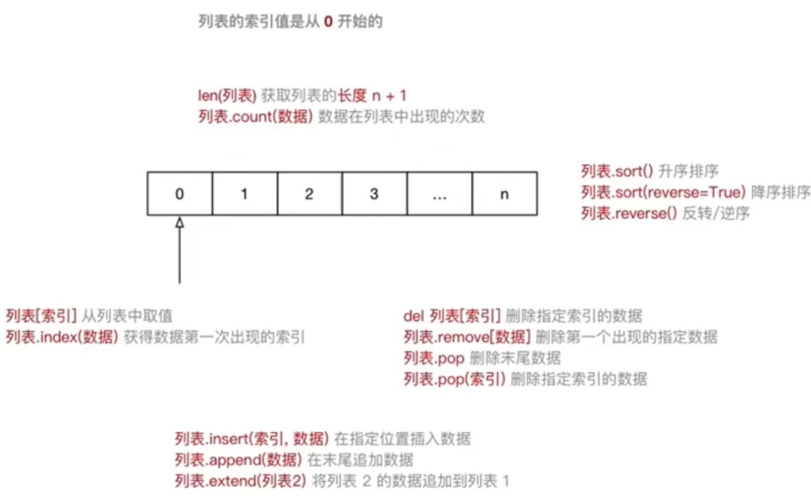

### 1.2 列表常用操作

- 在 `ipython3` 中定义一个 **列表**，例如：`name_list = []`
- 输入 `name_list` 按下 `TAB` 键，`ipython` 会提示 **列表** 能够使用的 **方法** 如下：

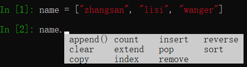

| 序号 | 分类 | 关键字/函数/方法        | 说明                     |
| ---- | ---- | ----------------------- | ------------------------ |
| 1    | 增加 | `list.insert(索引,数据)`  | 在指定位置插入数据       |
|      |      | `list.append(数据) `      | 在末尾追加数据           |
|      |      | `list.extend(列表2)`      | 将列表2 的数据追加到列表 |
| 2    | 修改 | `list[索引] = 数据`      | 修改指定索引的数据       |
| 3    | 删除 | `del list[索引]`          | 删除指定索引的数据       |
|      |      | `list.remove[数据]`      | 删除第一个出现的指定数据 |
|      |      | `list.pop()`          | 删除末尾数据             |
|      |      | `list.pop(索引)`         | 删除指定索引数据         |
|      |      |` list.clear()`          | 清空列表                 |
| 4    | 统计 | `len(list)`              | 列表长度                 |
|      |      | `list.count(数据)`      | 数据在列表中出现的次数   |
| 5    | 排序 | `list.sort()`            | 升序排序                 |
|      |      | `list.sort(reverse=True)` | 降序排序                 |
|      |      | `list.reverse()`        | 逆序、反转                         |

- 使用 `del` 关键字(`delete`) 同样可以删除列表中元素
- `del` 关键字本质上是用来 **将一个变量从内存中删除的**
- 如果使用 `del` 关键字将变量从内存中删除出，后续代码就不能再使用这个变量了

```python
del name_list
```

- **关键字** 是 Python 内置的、具有特殊意义的标识符


>关键字后面不需要使用括号

- **函数** 封装了独立功能，可以直接调用

```
函数名(参数)
```

>函数明需要记忆

- **方法** 和函数类似，同样是封装了独立的功能
- **方法需要通过对象来调用，表示针对这个对象要做的的操作**

```
对象.方法名(参数)
```

>在变量后面输入 `.`，然后选择针对这个变量要执行的操作，基益起来比函数要简单很多

### 1.3 循环遍历

- **遍历**就是**从头到尾**依次从**列表**中获取数据
	- 在**循环内部**针对**每一个元素**，执行相同的操作
- 在 `Python` 中为了提高列表的遍历效率，专门提供的 **迭代 iteration 遍历**
- 使用 `for` 就能够实现迭代遍历

```python
name_list = ["小李广-花荣", "呼保义-宋江", "玉麒麟-卢俊义", "黑旋风-李逵"]

# 使用迭代遍历列表
"""
顺序从列表中依次获取数据，每一次循环过程中，数据都会保存在my_name 这个变量中，
在循环体内部可以访问当前这一次获取到的数据
"""
for my_name in name_list:
    print("我的名字是 %s" % my_name)
```

- 列表中**可以存储不同类型的数据**
- 在开发中，更多的应用场景是
	1. **列表**存储相同类型的数据
	2. 通过**迭代遍历**，在循环体内部，针对列表中的每一项元素，执行相同的操作

#python 2022/8/27

# 02.元组

## 2.1 元组的定义

- 元组(`tuple`) 与列表类似，不同之处在于元组的**元素不能修改**
	- 元组表示多个元素组成的序列
	- 元组在 `Python` 开发中，有特定的应用场景
- 用于存储一串信息，**数据之间使用 `,` 分隔**
- 元组用 `()` 定义
- 元组的**索引**从 `0` 开始
	- 索引就是数据在元素中的位置编号

```python
info_tuple = ("zhangsan", 18, 1.75)
```

**创建空元组**

```python
tuple = ()
```

**元组中只包含一个元素时，需要在元素后面添加逗号**

```python
single_tuple = ("zhangsan",)
```

## 2.2 元组常用操作

- 在 `ipython3` 中定义一个元组，例如：`info=()`
- 输入 `info.` 按下 `Tab` 键，`ipython` 会提示元组能够使用的函数

```python
info_tuple = ("zhangsan", 18, 1.75)

# 1. 取值和取索引
print(info_tuple[0])
# 已知数据的内容，想得到该数据在元组中的索引
print(info_tuple.index("zhangsan"))

# 2. 统计计数
print(info_tuple.count("zhangsan"))
# 统计元组中包含元素的个数
print(len(info_tuple))
```

## 2.3 循环遍历

- **取值**就是从元组中获取存储在指定位置的数据
- **遍历**就是从头到尾依次从元组中获取数据

```python
info_tuple = ("宋江", "及时雨", "天魁星")

# 使用迭代遍历元组
for my_info in info_tuple:
    # 使用格式化字符串拼接 my_info 这个变量不方便！
    # 因为元组中通常保存的数据类型是不同的！
    print(my_info)
```

>- 在 `Python` 中，可以使用 `for` 循环遍历所有非数字类型的变量：**列表、元组、字典以及字符串**
>- 提示：在实际开发中，除非能**够确认元组中的数据类型**，否则针对元组的循环遍历需求并不是很多

## 2.4 应用场景

- 尽管可以使用 `for in` 遍历元组
- 但是在开发中，更多的应用场景是：
	- **函数的参数和返回值**，一个函数可以**接受任意多个参数**，或者一次**返回多个数据**
	- **格式化字符串**，后面的 `()` **本质上就是一个元组**
	- **让列表不可以被修改**，以保护数据安全

```python
info = ("zhangsan", 18)
print("%s 的年龄是 %d" % info)
```

元组和列表之间的转换

- 使用 `list` 函数可以把元组转换成列表

```
list(元组)
```

- 使用 `tuple` 函数可以把列表转换成元组

```
tuple(列表)
```

# 03.字典

## 3.1 字典的定义

- `dictionary` (字典)是除**列表以外** `Python` 之中**最灵活**的数据类型
- 字典同样可以用来**存储多个数据**
	- 通常用来存储 **描述一个 `物体` 的相关信息**
- 和列表的区别
	- **列表是有序的对象集合**
	- **字典是无序的对象集合**
- 字典用 `{}` 定义
- 字典使用**键值对**存储数据，键值对之间使用 `,` 分隔
	- **键** `key` 是索引
	- **值** `value` 是数据
	- **键**和**值**之间使用 `:` 分隔
	- **键必须是唯一的**
	- **值**可以取任**何数据类型**，但**键**只能使用**字符串、数字或元组**

```python
xiaoming = {
    "name":"宋江",
    "绰号":"及时雨",
    "地位":"梁山统领三代目",
    "星宿":"天魁星"
}
```


## 3.2 字典常用操作

- 在 `ipython` 中定义一个字典，例如：`d={}`
- 输入 `d.` 按下 `Tab` 键，`ipython` 会提示字典能够使用的函数如下：


## 3.3 循环遍历

- 遍历就是依次从字典中获取所有键值对

```python
xiaoming_dict = {"name":"小明",
                "qq":"123456",
                "phone":"10086"}

# 迭代遍历字典
# 变量k是每一次循环中，获取到的键值对的key
for k in xiaoming_dict:
    print("%s - %s" % (k, xiaoming_dict[k]))
```

>提示：在实际开发中，由于字典中每一个键值对保存数据的类型是不同的，所以针对字典的循环遍历需求并不是很多

## 3.4 应用场景

- 尽管可以使用 `for in` 遍历字典
- 但是在开发中，更多的应用场景是：
	- 使用多个键值对，存储描述一个 `物体` 的相关信息--描述更复杂的数据信息
	- **将多个字典放在一个列表中，再进行遍历，在循环体内部针对每一个字典进行相同的处理**

```python
card_list = [
    {"name":"xiaoming",
    "qq":"123456",
    "phone":"10086"},
    {"name":"zhangsan",
    "qq":"456789",
    "phone":"10010"}
]

for card_info in card_list:
    print(card_info)
```

# 04.字符串

## 4.1 字符串的定义

- 字符串就是一串字符，是变成语言中表示文本的数据类型
- 在 Python 中可以使用**一对双引号** `""` 或者**一对单引号** `''` 定义一个字符串
	- 如果字符串内部需要使用双引号 `"` ，可以使用单引号 `''` 定义字符串
	- 如果字符串内部需要使用单引号 `'` ，可以使用双引号 `"` 定义字符串
- 可以使用**索引**获取一个字符串中指定位置的字符，索引计数从0开始
- 也可以使用 `for` **循环遍历**字符串中每一个字符

>大多数语言使用双引号 `""` 定义字符串

```python
string = "Hello Python"
for c in string:
	print(c)
```

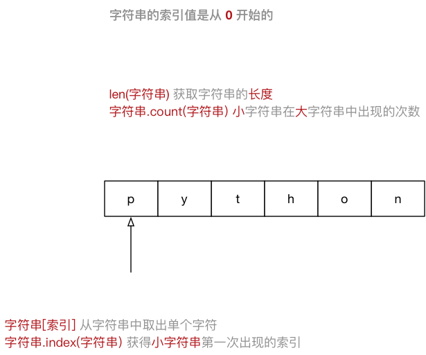

## 4.2 字符串的常用操作

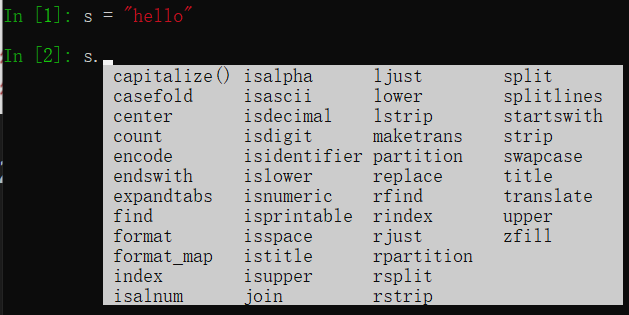

>提示：正是因为 python 内置提供的方法足够多，才使得在开发时，能够针对字符串进行更加灵活的操作！应对更多的开发需求

### 1）判断类型 - 9

| 方法          | 说明                                                                                  |
| ------------- | ------------------------------------------------------------------------------------- |
| `isspace()`   | 如果只包含**空格(空白字符)**，则返回 True                                                           |
| `isalnum()`   | 如果至少有一个字符并且所有字符都是字母或数字则返回 True                               |
| `isalpha()`   | 如果至少有一个字符并且所有字符都是字母则返回 True                                     |
| `isdecimal()` | 如果只包含数字则返回 True，全角数字                                                   |
| `isdigit()`   | 如果只包含数字则返回 True，全角数字,(1),`\u00b2`                                      |
| `isnumeric()` | 如果只包含数字则返回 True, 全角数字,汉字数字                                          |
| `istitle()`   | 如果是标题化的(**每个单词的首字母**大写)则返回 True                                       |
| `islower()`   | 如果包含至少一个区分大小写的字符，并且所有这些(区分大小写的)字符都是小写，则返回 True |
| `isupper()`   | 同上，大写返回 True                                                                                      |

### 2）查找和替换 - 7

| 方法                                                     | 说明                                                                                                                       |
| -------------------------------------------------------- | -------------------------------------------------------------------------------------------------------------------------- |
| `startswith(str)`                                        | 检查字符串是否是以 str 开头，是则返回 True                                                                                 |
| `endswith(str)`                                          | 同上，结尾                                                                                                                 |
| `string.find(str,start=0,end=len(string))`               | 检查 str 是否包含在 string 中，如果 start 和 end 指定范围，则检查是否包含在指定范围内，如果是返回开始的索引值，负责返回 -1 |
| `string.rfind(str,start=0,end=len(string))`              | 类似上，从右边开始查找                                                                                                     |
| `string.index(str,start=0,end=len(string))`              | 和 `find()` 类似，只不过如果 str 不在会报错                                                                                |
| `rindex()`                                               | 同上，从右边开始                                                                                                           |
| `string.replace(old_str, new_str, num=string.count(old)` | 把， string 中的 old_str 替换成 new_str，如果 num 指定，则替换不超过 num 次                                                                                                                           |

### 3）大小写转换 - 5

| 方法                  | 说明                             |
| --------------------- | -------------------------------- |
| `string.capitalize()` | 把字符串的第一个字符大写         |
| `string.title()`      | 把字符串的每个单词首字母大写     |
| `string.lower()`      | 转换 string 中所有大写字母为小写 |
| `string.upper()`      | 转换 string 中的小写字母为大写   |
| `string.swapcase(0`   | 翻转 string 中的大小写                                 |

### 4）文本对齐 - 3

| 方法                   | 说明                                                          |
| ---------------------- | ------------------------------------------------------------- |
| `string.ljust(width)`  | 返回一个原字符串左对齐，并使用空格填充至长度 width 的新字符串 |
| `string.rjust(width)`  | 右对齐                                                        |
| `string.center(width)` | 返回一个原字符串居中，并使用空格填充至长度 width 的新字符串                                                              |

### 5）去除空白字符串 - 3

| 方法              | 说明                             |
| ----------------- | -------------------------------- |
| `string.lstrip()` | 截掉 string 左边(开始)的空白字符 |
| `string.rstrip()` | 右边                             |
| `string.strip()`  | 截掉 string 左右两边的空白字符                                 |

### 6）拆分和连接 - 5

| 方法                       | 说明                                                                                            |
| -------------------------- | ----------------------------------------------------------------------------------------------- |
| `string.partition(str)`    | 把字符串 string 分成一个 3元素的元组(str前面，str，str后面)                                     |
| `string.rpartition(str)`   | 同上，不过是从右边开始查找                                                                      |
| `string.split(str="",num)` | 以 str 分隔符切片 string，如果 num 有指定值，则仅分隔 num+1个字符串，str默认包含`\r,\t,\n,空格` |
| `string.splitlines()`      | 按照行(`\r, \n`)分隔，返回一个包含各行作为元素的列表                                                                                                |
| `string.join(seq)`         | 以 string 作为分隔符，将 seq 中所有元素(的字符串表示)合并为一个新的字符串                       |

## 4.3 字符串的切片

- **切片**方法适用于**字符串、列表、元组**
	- 切片使用索引值来限定范围，从一个大的字符串中切出小的字符串
	- **列表**和**元组**都是有序的集合，都能够**通过索引值**获取到对应的数据
	- **字典**是一个**无序**的集合，是使用**键值对**保存数据

```
字符串[开始索引:结束索引:步长]
```

1. 指定的区间属于 **左闭右开** 型(`[开始索引,结束索引)`)
	- 从 `起始` 位开始，到 `结束` 位的前一位结束(**不包含结束位本身**)
2. 从头开始，**开始索引数字可以省略，冒号不能省略**
3. 到末尾结束，**结束索引数字可以省略，冒号不能省略**
4. 步长默认为1，**如果连续切片，数字和冒号都可以省略**

# 05.公共方法

## 5.1 Python 内置函数

Python 包含了以下内置函数：

| 函数                | 描述                 | 备注                        |
| ------------------- | -------------------- | --------------------------- |
| `len(item)`         | 计算容器中元素个数   |                             |
| `del(item)`         | 删除变量             | del 有两种方式-关键字或函数              |
| `max(item)`         | 返回容器中元素最大值 | 如果是字典，只针对 key 比较 |
| `min(item)`         | 返回容器中元素最小值 | 如果是字典，只针对 key 比较 |
| `cmp(item1, item2)` | 比较两个值           | python3.x中取消                            |

>注意：字符串的比较符合以下规则 `"0"<"A"<"a"`

## 5.2 切片

| 描述 | Python 表达式        | 结果    | 支持的数据类型 |
| ---- | -------------------- | ------- | -------------- |
| 切片 | `"0123456789"[::-2]` | "97531" | 字符串、列表、元组               |

- 切片使用索引值来限定范围，从一个大的字符串中切除小的字符串
- 列表和元组都是有序的集合，都能够通过索引值获取到对应的数据
- 字典是一个无序的集合，是使用键值对保存数据

## 5.3 运算符

| 运算符         | Python表达式       | 结果               | 描述           | 支持的数据类型           |
| -------------- | ------------------ | ------------------ | -------------- | ------------------------ |
| `+`            | `[1,2]+[3,4]`      | `[1,2,3,4]`        | 合并           | 字符串、列表、元组       |
| `*`            | `["Hi"]*3`         | `["Hi","Hi","Hi"]` | 重复           | 字符串、列表、元组       |
| `in`           | `3 in (1,2,3)`     | `True`             | 元素是否存在   | 字符串、列表、元组、字典 |
| `not in`       | `4 not in (1,2,3)` | `True`             | 元素是否不存在 | 字符串、列表、元组、字典 |
| `> >= == < <=` | `(1,2,3)<(2,2,3)`  | `True`             | 元素比较       | 字符串、列表、元组                         |

- `in` 在对**字典**操作时，判断的是**字典的键**
- `in` 和 `not in` 被称为**成员运算符**

- **成员运算符**用于**测试**序列中是否包含指定的成员

| 运算符   | 描述                                                | 实例                     |
| -------- | --------------------------------------------------- | ------------------------ |
| `in`     | 如果在指定的序列中找到值返回 True，否则返回 False   | `3 in (1,2,3)` 返回 True | 
| `not in` | 如果在指定的序列中没有找到值返回True，否则返回False | `3 not in (1,2,3)` 返回 False                         |

>注意：在对字典操作时，判断的是**字典的键**


## 5.4 完整的 for 循环语法

- 在 `Python` 中完整的 `for 循环` 的语法如下：

```
for 变量 in 集合:
	循环体代码
else:
	没有通过 break 退出循环，循环结束后，会执行的代码
```

**应用场景**

- 在**迭代遍历**嵌套的数据类型时，例如一个列表包含了多个字典
- 需求：要判断某一个自带你中是否存在指定的值
	- 如果存在，提示退出循环
	- 如果不存在，在循环整体结束后，希望得到一个统一的提示

```python
students = [
    {"name":"阿土"},
    {"name":"小李"}
]

# 在学员列表中搜索指定的姓名
find_name = "阿乐"

for stu_dict in students:
    print(stu_dict)
    if stu_dict["name"] == find_name:
        print("找到了 %s" % find_name)
        # 如果已经找到，就直接退出循环
        break
else:
    # 如果希望在搜索列表时，所有的字典检查之后，都没有发现需要搜索的目标
    # 还希望得到统一的提示
    print("没有找到 %s" % find_name)
print("循环结束")
```

#python 2022/8/29

## 目标

综合应用已经学过的知识点开发名片管理系统

- 变量
- 流程控制
- 函数
- 模块

## 系统需求

1. 程序启动，显示名片管理系统欢迎界面，并显示功能菜单

```
******************************
欢迎使用 【名片管理系统】 V1.0

1. 新建名片
2. 显示全部
3. 查询名片

0. 退出系统
******************************
```

2. 用户用数字选择不同的功能
3. 根据功能选择，执行不同的功能
4. 用户名片需要记录用户的**姓名、电话、QQ、邮件**
5. 如果查询到指定的名片，用户可以选择修改或者删除名片

## 步骤

1. 框架搭建
2. 新增名片
3. 显示所有名片
4. 查询名片
5. 查询成功后修改、删除名片
6. 让 Python 程序能够直接运行

## 01.框架搭建

- 搭建名片管理系统框架结构
	1. 准备文件，确定文件名，保证能够在需要的位置编写代码
	2. 编写主运行程序，实现基本的用户输入和判断

### 1.1 文件准备

1. 新建 `card_main.py` 保存主程序功能代码
	- 程序的入口
	- 每一次启动名片管理系统都通过 `main` 这个文件启动
2. 新建 `cards_tools.py` 保存所有名片功能函数
	- 将对名片的**新增、查询、修改、删除**等功能封装在不同的函数中

### 1.2 编写主运行循环

- 在 `cards_main` 中添加一个无限循环

```python
# 无限循环，由用户决定何时结束
while True:
    
    # TODO 显示功能菜单

    action_str = input("请选择希望执行的操作：")
    print("您选择的操作是 【%s】" % action_str)

    # 1,2,3 针对名片的操作
    if action_str in ["1", "2", "3"]:
        # 如果在程序开发时，不希望立刻编写分支内部的代码
        # 可以使用 pass 关键字，表示一个占位符，能够保证程序结构正确！
        # 程序运行时，pass 关键字不会执行任何的操作
        pass
    # 0 退出系统
    elif action_str == "0":
        print("欢迎再次使用【名片管理系统】")
        # pass
        break
    # 其他内容输入错误，提示用户
    else:
        print("您输入的不正确，请重新选择")
```

字符串判断

```python
if action_str in ["1", "2", "3"]
```

```python
if action_str == "1" or action_str == "2" or action_str == "3":
```

1. 使用 `in` 针对列表判断，避免使用 `or` 拼接复杂的逻辑条件
2. 没有使用 `int` 转换用户输入，可以避免**一旦用户输入的不是数字**，导致程序运行出错

**pass**

- `pass` 就是一个空语句，不做任何事情，一般用作占位语句
- 是为了保持程序结构的完整性

**无限循环**

- 在开发软件时，如果不希望程序执行后立即退出
- 可以在程序中增加一个无限循环
- 由用户来决定退出程序的时机

**TODO 注释**

- 在 `#` 后更上 `TODO` ，用于标记需要去做的工作

```python
# TODO (作者/邮件) 显示系统菜单
```

## 02.保存名片数据的结构

**程序就是用来处理数据的，而变量就是用来存储数据的**

- 使用**字典**记录每一种名片的详细信息
- 使用 列表统一记录所有**名片字典**


**定义名片列表变量**

- 在 `cards_tools` 文件的顶部增加一个列表变量

```
# 所有名片记录的列表
card_list = []
```

>1. 所有名片相关操作，都需要使用这个列表，所以应该定义在程序的顶部
>2. 程序刚运行时，没有数据，所以是空列表

- `cards_main.py`

```python
# 无限循环，由用户决定何时结束
import cards_tools
while True:

    # 显示功能菜单
    cards_tools.show_menu()

    action_str = input("请选择希望执行的操作：")
    print("您选择的操作是 【%s】" % action_str)

    # 1,2,3 针对名片的操作
    if action_str in ["1", "2", "3"]:
        # 如果在程序开发时，不希望立刻编写分支内部的代码
        # 可以使用 pass 关键字，表示一个占位符，能够保证程序结构正确！
        # 程序运行时，pass 关键字不会执行任何的操作

        # 新增名片
        if action_str == "1":
            cards_tools.new_card()
        # 显示全部
        elif action_str == "2":
            cards_tools.show_all()
        # 查询名片
        else:
            cards_tools.search_card()
    # 0 退出系统
    elif action_str == "0":
        print("-" * 50)
        print("退出系统")
        print("欢迎再次使用【名片管理系统】")
        # pass
        break
    # 其他内容输入错误，提示用户
    else:
        print("您输入的不正确，请重新选择")

```

- `cards_tools.py`

```python
# 记录所有的名片字典
card_list = []


def show_menu():
    """显示菜单"""
    print("*" * 50)
    print("欢迎使用 【名片管理系统】V1.0")
    print()
    print("1. 新增名片")
    print("2. 显示全部")
    print("3. 搜索名片")
    print()
    print("0. 退出系统")
    print("*" * 50)


def new_card():
    """新增名片"""
    print("-" * 50)
    print("新增名片")
    # 1.提示用户输入名片的详细信息
    name_str = input("请输入姓名：")
    phone_str = input("请输入电话：")
    qq_str = input("请输入QQ：")
    email_str = input("请输入邮箱：")

    # 2.使用用户输入的信息建立一个名片字典
    card_dict = {"name": name_str, "phone": phone_str,
                 "qq": qq_str, "email": email_str}

    # 3.及那个名片字典添加到列表中
    card_list.append(card_dict)
    print(card_list)

    # 4.提示用户添加成功
    print("添加 %s 的名片成功" % name_str)


def show_all():
    """显示所有名片"""
    print("-" * 50)
    print("显示所有名片")

    # 判断是否存在名片记录，如果没有，提示用户且返回
    if len(card_list) == 0:
        print("当前名片没有任何记录，请使用新增功能添加名片！")
        # return 可以返回一个函数执行结果
        # 下方的代码不会被执行
        # 如果 return 后面没有任何的内容，表示会返回到调用函数的位置
        # 并且不会返回任何的结果
        return

    # 打印表头
    for name in ["姓名", "电话", "QQ", "邮箱"]:
        print(name, end="\t\t")
    print()
    # 打印分隔线
    print("=" * 50)
    # 遍历名片列表依次输出字典信息
    for card_dict in card_list:
        # print(card_dict)
        print("%s\t\t%s\t\t%s\t\t%s" % (card_dict["name"], card_dict["phone"],
                                        card_dict["qq"], card_dict["email"]))


def search_card():
    """搜索名片"""
    print("-" * 50)
    print("搜索名片")

    # 1.提示用户输入要搜索的姓名
    find_name = input("请输入要搜索的姓名：")
    # 2.遍历名片列表，查询要搜索的姓名，如果没有找到，需要提示用户
    for card_dict in card_list:
        if card_dict["name"] == find_name:
            print("姓名\t\t电话\t\tQQ\t\t邮箱")
            print("=" * 50)
            print("%s\t\t%s\t\t%s\t\t%s" % (card_dict["name"], card_dict["phone"],
                                            card_dict["qq"], card_dict["email"]))

            # 针对找到的名片进行修改/删除操作
            deal_card(card_dict)

            break
    else:
        print("抱歉，没有找到 %s" % find_name)


def deal_card(find_dict):
    """处理查找到的名片"""
    action_str = input("请输入您想执行的操作"
                       "[1] 修改 [2] 删除 [3] 返回上级菜单：")
    if action_str == "1":
        find_dict["name"] = input_card_info(find_dict["name"], "姓名【回车不修改】: ")
        find_dict["phone"] = input_card_info(find_dict["phone"], "电话【回车不修改】: ")
        find_dict["qq"] = input_card_info(find_dict["qq"], "QQ号【回车不修改】: ")
        find_dict["email"] = input_card_info(find_dict["email"], "邮箱【回车不修改】: ")
        print("修改成功")
    elif action_str == "2":
        card_list.remove(find_dict)
        print("删除成功")


def input_card_info(dict_value, tip_message):
    """修改名片信息
    :param dict_value: 字典中原有的值
    :param tip_message: 输入的提示信息
    :return: 如果用户输入了内容，就返回内容，否则返回字典中原有的值
    """
    # 1.提示用户输入内容
    result_str = input(tip_message)
    # 2.针对用户的输入进行判断，如果用户输入内容，直接返回结果
    if len(result_str) > 0:
        return result_str
    # 3.如果用户没有输入内容，返回字典中原有的值
    else:
        return dict_value

```

## 03.LINUX上的 Shebang 符号(#!)

- `#!` 这个符号叫作 `Shebang` 或者 `Sha-bang`
- `Shebang` 通常在 `Unix` 系统脚本中的**第一行开头**使用
- **指明执行这个脚本文件的解释程序**

**使用 Shebang 的步骤**

1. 使用 `which` 查询 `python3` 解释器的路径

```
$ which python3
```

2. 修改要运行的主Python文件，在第一行增加以下内容

```
#! /usr/bin/python3
```

3. 修改主Python文件的文件权限，增加可执行权限

```
$ chmod +x cards_main.py
```

4. 在需要时执行程序即可

```
./cards_main.py
```

#python 2022/8/30

## 目标

- 变量的引用
- 可变和不可变类型
- 局部变量和全局变量

## 01.变量的引用

>- 变量和数据都是保存在内存中的
>- 在 `Python` 中**函数的参数传递**以及**返回值**都是靠**引用**传递的

### 1.1 引用的概念

- **变量和数据是分开存储的**
- 数据保存在内存中的一个位置
- 变量中保存着数据在内存中的地址
- **变量中记录数据的地址**，就叫做**引用**
- 使用 `id()` 函数可以查看变量中保存数据所在的**内存地址**

>注意：如果变量已经定义，当给一个变量赋值的时候，本质是**修改了数据的引用**
>- 变量不再对之前的数据引用
>- 变量改为对新赋值的数据引用

### 1.2  变量引用的示例

在 `Python` 中，变量的名字类似于便签纸贴在数据上

- 定义一个整数变量 `a` ，并且赋值为 `1`

| 代码  | 图示 |
| ----- | ---- |
| a = 1 |      |

- 将变量 `a` 赋值为 `2`

| 代码  | 图示 |
| ----- | ---- |
| a = 2 |      |

- 定义一个整数变量 `b` ，并且将变量 `a` 的值赋值给 `b`

| 代码  | 图示               |
| ----- | ------------------ |
| b = a |  |

>变量 `b` 是第2个贴在数字 `2` 上的标签

## 02.可变和不可变类型

- **不可变类型**，内存中的数据不允许被修改：
	- 数字类型 `int`, `bool`, `float`, `complex`, `long(2.x)`
	- 字符串 `str`
	- 元组 `tuple`
- **可变类型**，内存中的数据可以被修改：
	- 列表 `list`
	- 字典 `dict`

```python
a = 1
a = "hello"
a = [1,2,3]
a = [3,2,1]
```

```python
demo_list = [1, 2, 3]
print("定义列表后的内存地址 %d" % id(demo_list))

demo_list.append(9)
demo_list.pop()
demo_list.remove(2)
demo_list[0] = 10

print("修改数据后的内存地址 %d" % id(demo_list))

demo_dict = {"name":"小明"}

print("定义字典后的内存地址 %d" % id(demo_dict))

demo_dict["age"] = 18
demo_dict.pop("name")
demo_dict["name"] = "老王"

print("修改数据后的内存地址 %d" % id(demo_dict))
```

>注意：字典的 `key` **只能使用不可变类型的数据**

1. **可变类型**的数据变化，是通过**方法**来实现的
2. 如果给一个可变类型的变量，赋值了一个新的数据，**引用会修改**
	- 变量不再对之前的数据引用
	- 变量改为对新赋值的数据引用

**哈希(hash)**

- `Python` 中内置有一个名字叫作 `hash()` 的函数
	- 接受一个**不可变数据类型**的数据作为**参数**
	- **返回**结果是一个**整数**
- `哈希` 是一种算法，其作用就是提取数据的**特征码(指纹)**
	- 相同的内容得到相同的结果
	- 不同的内容得到不同的结果
- 在 `Python` 中，设置字典的**键值对**时，会首先对 `key` 进行 `hash` 以决定如何在内存中保存字典的数据，方便后续对字典的操作：**增、删、改、查**
	- 键值对的 `key` 必须是不可变类型数据
	- 键值对的 `value` 可以是任意类型的数据

## 03.局部变量和全局变量

- 局部变量就是在函数内部定义的变量，只能在函数内部使用
- 全局变量是在函数外部定义的变量，所有函数内部都可以使用这个变量

>提示：在其他开发语言中，大多不推荐使用全局变量--可变范围太大，导致程序不好维护

### 3.1 局部变量

- 局部变量是在函数内部定义的变量，只能在函数内部使用
- **函数执行结束后，函数内部的局部变量，会被系统回收**
- 不同的函数，可以定义相同的名字的局部变量，但是各用各的不会产生影响

**局部变量的作用**

- **在函数内部使用，临时保存函数内部需要使用的数据**

```python
def demo1():

    # 定义一个局部变量
    num = 10
    print("在demo1函数内部的变量是 %d" % num)


def demo2():

    # 不能在其他函数内使用
    # print("%d" % num)
    pass

# 在函数内部定义的变量，不能再其他位置使用
# print("%d" % num)

demo1()
demo2()
```

**局部变量的生命周期**

- 所谓**生命周期**就是变量从**被创建**到**被系统回收**的过程
- 局部变量在函数执行时才会被创建
- **函数执行结束后局部变量被系统回收**
- **局部变量**在生命周期内，可以用来**存储函数内部临时使用到的数据** 

### 3.2 全局变量

- 全局变量是在函数外部定义的变量，所有函数内部都可以使用这个变量

```python

```

注意：函数执行时，需要处理变量时会：

1. 首先查找函数内部是否存在执行名称的局部变量，如果有，直接使用
2. 如果没有，查找函数外部是否存在指定名称的全局变量，如果有，直接使用
3. 如果还没有，程序报错！

1) **函数不能直接修改全局变量的引用**

- 全局变量是在函数外部定义的变量(没有定义在某一个函数内)，所有函数内部都可以使用这个变量

>提示：在其他的开发语言中，大多不推荐使用全局变量--可变返回太大，导致程序不好维护！

- 在函数内部，可以**通过全局变量的引用获取对应的数据**
- 但是，**不允许直接修改全局变量的引用**--使用赋值语句修改全局变量的值

```python
# 全局变量
num = 10

def demo1():

    # 修改全局变量的值
    # 在 python 中，不允许直接修改全局变量的值
    # 如果使用赋值语句，会在函数内部，定义一个局部变量
    num = 99
    print("demo1() ==> %d" % num)


def demo2():

    print("demo2() ==> %d" % num)

demo1()
demo2()
```

2) **在函数内部修改全局变量的值**

- 如果在函数中需要修改全局变量，需要使用 `global` 进行声明

```python
# 全局变量
num = 10

def demo1():

    # 希望修改全局变量的值 - 使用 global 声明一下变量即可
    # global 关键字会告诉解释器后面的变量是一个全局变量
    # 再使用赋值语句时，就不会创建局部变量
    global num
    num = 99
    print("demo1() ==> %d" % num)


def demo2():

    print("demo2() ==> %d" % num)

demo1()
demo2()
```

3) **全局变量定义的位置**

- 为了保证所有的函数都能够正确使用到全局变量，应该**将全局变量定义在其他函数的上方**

```python
a = 10

def demo():
	print("%d" % a)
	print("%d" % b)
	print("%d" % c)

b = 20
demo()
c = 30
```

- 注意：由于全局变量 c，是在调用函数之后才定义的，在执行函数时，变量还没有定义，所以程序会报错！

- `shebang` 标识用哪个解释器解释程序
- `import` 导入模块


4) **全局变量命名的建议**

- 为了避免局部变量和全局变量出现混淆，在定义全局变量时，会有些开发要求，例如：
- 全局变量命名前应该增加 `g_` 或 `gl_` 的前缀

#python 2022/8/31

## 目标

- 函数参数和返回值的作用
- 函数的返回值进阶
- 函数的参数进阶
- 递归函数

## 01.函数参数和返回值的作用

函数根据**有没有参数**以及返回值，可以相互组合，一共有4中形式

1. 无参数，无返回值
2. 无参数，有返回值
3. 有参数，无返回值
4. 有参数，有返回值


>定义函数时，**是否接受参数，或者是否返回结果**，是**根据实际的功能需求**来决定的！

1. 如果函数**内部处理的数据不确定**，就可以将外界的数据以参数传递到函数内部
2. 如果希望一个函数**执行完成后，向外界汇报执行结果**，就可以增加函数的返回值

## 02.函数的返回值进阶

- 在程序开发中，有时候会希望**一个函数执行结束后，告诉调用者一个结果**，以便调用者针对具体的结果做后续的处理
- 返回值是函数完成工作后，最后给调用者的一个结果
- 在函数中使用 `return` 关键字可以返回结果
- 调用函数一方，可以**使用变量来接收函数的返回结果**

>问题：一个函数执行或能否返回多个结果？

```python
def measure():
    """测量温度"""

    temp = 39
    wetness = 50

    # 元组 - 可以包含多个数据，因此可以使用元组让函数一次返回多个值
    # 如果函数返回的类型是元组，小括号可以省略
    # return (temp, wetness)
    return temp, wetness

# 元组
res = measure()
print(res)

# 需要单独的处理温度或者湿度
print(res[0])
print(res[1])

# 如果函数返回的类型是元组，同时希望单独的处理元组中的元素
# 可以使用多个变量，一次接受函数的返回结果
gl_temp, gl_wetness = measure()
print(gl_temp)
print(gl_wetness)
```

**交换两个数字**

1. 有两个整数变量 `a=6`, `b=100`
2. 不使用其他变量，交换两个变量的值

解法1--使用其他变量

```python
# 使用临时变量
c = b
b = a
a = c
```

解法2--使用临时变量

```python
# 不使用临时变量
a = a + b
b = a - b
a = a - b
```

解法3--Python专有，利用元组

```python
a, b = b, a
```

## 03.函数的参数进阶

### 3.1 不可变和可变参数

>问题1：在函数内部，针对参数使用**赋值语句**，会不会影响调用函数时传递的**实参变量**？--**不会**

- 无论传递的参数是可变还是不可变
	- 只要**针对参数使用赋值语句，会在函数内部修改局部变量的引用，不会影响到外部变量的引用**

>问题2：如果传递的参数是**可变类型**，在函数内部，使用**方法**修改了数据的内容，**同样会影响到外部的数据**

```python
def demo(num_list: list):
    print("函数内部的代码")

    # 使用方法修改列表的内容
    num_list.append(9)

    print(num_list)

    print("函数执行完成")

gl_list = [1, 2, 3]
demo(gl_list)
print(gl_list)
```

**运算符 `+=`**

- 在 `python` 中，列表变量调用 `+=` 本质上是在执行列表变量的 `extend` 方法，不会修改变量的引用

### 3.2 缺省参数

- 定义函数时，可以给**某个参数**指定一个默认值，具有默认值的参数就叫做**缺省参数**
- 调用函数时，如果没有传入缺省参数的值，则在函数内部使用定义函数时指定的**参数默认值**
- **函数的缺省参数，将常见的值设置为参数的缺省值，从而简化函数的调用**
- 例如：对列表排序的方法

```python
gl_list = [4, 8, 2]

# 默认按照升序排序 - 较常用
gl_list.sort()
print(gl_list)

# 如果需要降序排序，需要执行reverse参数
gl_list.sort(reverse=True)
print(gl_list)
```

**指定函数的缺省参数**

- 在参数后使用赋值语句，可以指定参数的缺省值

```python
def print_info(name, gender=True):

    gender_text = "男生"
    if not gender:
        gender_text = "女生"
    print("%s 是 %s" % (name, gender_text))


# 假设班上的同学，男生居多，所以将默认值设置为男生
# 提示：在指定缺省参数的默认值时，应该使用最常见的值作为默认值！
print_info("小明")
print_info("小红", False)
```

1. 缺省参数，需要**使用最常见的值作为默认值**
2. 如果一个参数的值**不能确定**，则不应该设置默认值，具体的数值在调用函数时，由外界传递

**缺省参数的注意事项**

1) 缺省参数的定义位置

- **必须保证带有默认值的缺省参数在参数列表末尾**
- 所以，一下定义是错误的

```python
def print_info(name, gender=True, title):
	pass
```

2) 调用带有多个缺省参数的函数

- **在调用函数时，如果有多个缺省参数，需要指定参数名**，这样解释器才知道参数的对应关系！

### 3.3 多值参数

**定义支持多值参数的函数**

- 有时候可能需要一个**函数能够处理的参数个数是不确定的，这个时候，就可以使用多值参数**
- `python` 中有两种多值参数：
	- **参数名前增加一个 `*` 可以接受元组**
	- **参数名前增加两个 `*` 可以接受字典**
- 一般在给多值参数命名时，习惯使用以下两个名字
	- `*args` -- 存放元组参数，前面有一个 `*`
	- `**kwargs` -- 存放字典参数，前面有两个 `*`
- `args` 是 `arguments` 的缩写，有变量的含义
- `kw` 是 `keywprd` 的缩写，`kwargs` 可以记忆键值对参数

```python
def demo(num, *nums, **person):

    print(num)
    print(nums)
    print(person)


demo(1) # 输出：1 () {}
demo(1, 2, 3, 4, 5) # 输出：1, (2, 3, 4, 5) {}
demo(1, 2, 3, 4, 5, name="小明", age=18)    # 输出：1, (2,3,4,5) {name="小明",age=18}
```

>提示：多值参数的应用会经常出现在网络上一些大牛开发的框架中，知道多值参数，有利于读懂大牛的代码

**多值参数案例 -- 计算任意多个数字的和**

```python
import argparse


def sum_numbers(*args):

    num = 0
    # 循环遍历
    for n in args:
        num += n

    print(args)
    return num


res = sum_numbers(1, 2, 3, 4, 5)
print(res)
```

**元组和字典的拆包**

- 在调用带有多值参数的函数时，如果希望：
	- 将一个元组变量，直接传递给 `args`
	- 将一个字典变量，直接传递给 `kwargs`
- 就可以使用**拆包**，简化参数传递，拆包的方式是：
	- 在元组变量前，增加一个 `*`
	- 在字典变量前，增加两个 `*`

```python
def demo(*args, **kwargs):

    print(args)
    print(kwargs)


# 元组/字典变量
gl_num = (1, 2, 3)
gl_dict = {"name":"小明", "age":18}

# 会将两个参数都传递给 *args
demo(gl_num, gl_dict)   

# 拆包语法，简化元组/自带你变量的传递
demo(*gl_num, **gl_dict)

# 等价于
demo(1, 2, 3, name="小明", age=18)
```

## 04.函数的递归

>函数调用自身的**编程技巧**称为递归

### 4.1 递归函数的特点

- 一个函数内部调用自己
	- 函数内部可以调用其他函数，当然在函数内部也可以调用自己
- 函数内部的代码是相同的，只是针对参数不同，处理的结果不同
- 当参数满足一个条件时，函数不再执行
	- 这个非常重要，通常被称为递归的出口，否则会出现死循环

```python
def print_num(num):

    print(num)
    # 递归的出口，当参数满足某个条件时，不再执行函数
    if num == 1:
        return 
    
    # 自己调用自己
    print_num(num - 1)


print_num(3)
```


### 4.2 递归案例--计算数字累加

1. 定义一个函数 `sum_numbers`
2. 能够接受一个 `num` 的整数参数
3. 计算 `1+2+……num` 的结果

```python
# 1. 定义一个函数 `sum_numbers`
# 2. 能够接受一个 `num` 的整数参数
# 3. 计算 `1+2+……num` 的结果

def sum_numbers(num):

    # 1.出口
    if num == 1:
        return 1
    
    # 2.数字的累加 num + (1 2 3 ... num-1)
    # 假设 sum_numbers 能够正确处理 1 2 ... num-1
    return num + sum_numbers(num-1)


res = sum_numbers(5)
print(res)
```


>提示：递归是一个编程技巧，在处理不确定的循环条件时，格外的有用，例如：**遍历整个文件目录的结构**

#python 2022/9/1

# 面向对象(OOP)基本概念

面向对象编程 -- `Object Oriented Propragramming` 简称 `OOP`

## 01.面向对象基本概念

- 之前学习的编程方式就是**面向过程**的
- 面向过程和面向对象，是两种不同的编程方式
- 对比面向过程的特点，可以更好地了解什么是面向对象

### 1.1 过程和函数

- 过程是早期地一个编程概念
- 过程类似于函数，只能执行，但是没有返回值
- 函数不仅能执行，还可以返回结果

### 1.2 基本概念

1) **面向过程 -- 怎么做？**

1. 把完成某一个需求时 `所有步骤` `从头到尾` 逐步实现
2. 根据开发需求，将某些功能独立地代码封装成一个又一个函数
3. 最后完成地代码，就是顺序地调用不同的函数

**特点**

1. 注重步骤与过程，不注重职责分工
2. 如果需求复杂，代码会变得很复杂
3. 开发复杂项目，没有固定的套路，开发难度大


2) 面向对象 -- 谁来做？

>相比较函数，**面向对象是更大的封装，根据职责在一个对象中封装多个方法**

1. 在完成某一个需求前，首先确定职责--要做的事情(方法)
2. 根据职责确定不同的需求变化，**是专门应对复杂项目开发，提供的固定套路**
3. 最后完成的代码，就是顺序地让不同地对象调用不同的方法

特点

1. 注重**对象和职责**，不同的对象承担不同的职责
2. 更加适合应对复杂的需求变化，是专门应对复杂项目开发，提供的固定套路
3. **需要在面向过程基础上，再学习一些面向对象的语法**


# 类和对象

## 目标

- 类和对象的概念
- 类和对象的关系
- 类的设计

## 01.类和对象的概念

类和对象是面向对象编程的两个核心概念

### 1.1 类

- 类是对一群**具有相同特征或者行为的事物的一个统称**，是抽象的，**不能直接使用**
	- **特征**被称为**属性**
	- **行为**被称为**方法**
- 类就相当于制造飞机时的图纸，**是一个模板，是负责创建对象的**

### 1.2 对象

- 对象是由类创建出来的一个具体存在，可以直接使用
- 由哪一个类创建出来的对象，就拥有在哪一个类中定义的：
	- 属性
	- 方法
- 对象就相当于用图纸制造的飞机

>在程序开发中，应该现有类，再有对象

## 02.类和对象的关系

- 类是模板，对象是根据类这个模板创建出来的，应该**先有类，再有对象**
- 类只有一个，而对象可以有很多个
	- 不同的对象之间属性可能会各不相同
- 类中定义了什么属性和方法，对象中就有什么属性和方法，不可能多，也不可能少

## 03.类的设计

在使用面向对象开发前，应该首先分析需求，确定一下程序中需要包含哪些类！


在程序开发中，要设计一个类，通常需要满足以下三个要素：
1. **类名** 这类事物的名字，满足大驼峰命名法
2. **属性** 这类食物具有什么样的特征
3. **方法** 这类食物具有什么样的行为

### 3.1 类名的确定

**名词提炼法**分析整个业务流程，出现的名词，通常就是找到的类

### 3.2 属性和方法的确定

- 对**对象的特征描述**，通常可以定义成属性
- **对象具有的行为**(动词)，通常可以定义成方法

>提示：需求中没有设计的属性或者方法在设计类时，不需要考虑

# 面向对象基础语法

## 目标

- `dir` 内置函数
- 定义简单的类(只包含方法)
- 方法中的 `self` 参数
- 初始化方法
- 内置方法和属性

## 01.dir内置函数

- 在 Python 中**对象几乎是无处不在的**，之前学习的变量、数据、函数都是对象
- 在 Python 中可以使用以下两个方法验证：
	1. 在**标识符/数据**后输入一个 `.` ，然后按下 `Tab` 键，`iPython` 会提示改对象能够调用的**方法列表**
	2. 使用内置函数 `dir` 传入标识符/数据，可以查看对象内的**所有属性及方法**

>提示：`__方法名__` 格式的方法是 `Python` 提供的内置方法/属性

| 序号 | 方法名     | 类型 | 作用                               |
| ---- | ---------- | ---- | ---------------------------------- |
| 01   | `__new__`  | 方法 | **创建对象**时，会被自动调用           |
| 02   | `__init__` | 方法 | **对象被初始化**时，会被自动调用       |
| 03   | `__del__`  | 方法 | **对象被从内存中销毁**前，会被自动调用 |
| 04   | `__str__`  | 方法 | 返回**对象的描述信息**，print 函数输出使用                                   |

## 02.定义简单的类

>面向对象是更大的封装，在一个类中封装多个方法，这样通过这个类创建出来的对象，就可以直接调用这些方法

### 2.1 定义只包含方法的类

- 在 Python 中要定义一个只包含方法的类，语法格式如下：

```python
class 类名:
	def 方法1(self, 参数列表):
		pass
	
	def 方法2(self, 参数列表):
		pass
```

- 方法的定义格式和之前学习过的函数几乎一样
- 区别在于第一个参数必须是 `self` 
- 注意：**类名**的命名规则要符合**大驼峰命名法**

### 2.2 创建对象

- 当一个类定义完成之后，要使用这个类来创建对象，语法格式如下：

```
对象变量 = 类名()
```

### 2.3 第一个面向对象程序

1. 定义一个猫类 `Cat`
2. 定义两个方法 `eat` 和 `drink`
3. 按照需求 - -不需要定义属性

```python
class Cat:
    """这是一个猫类"""

    def eat(self):
        print("小猫爱吃鱼")

    def drink(self):
        print("小猫要喝水")


# 创建猫对象
tom = Cat()

tom.eat()
tom.drink()

print(tom)

addr = id(tom)
print("%x" % addr)
```

**引用概念的强调**

>在面向对象开发中，引用的概念是同样适用的

- 在 Python 中使用类**创建对象之后**，`tom` 变量中仍然记录的是**对象在内存中的地址**
- 也就是 `tom` **变量引用了新建的猫对象**
- 使用 `print` 输出对象变量，在默认情况下，是能够**输出这个变量引用的对象是由哪一个类创建的对象，以及在内存中的地址(十六进制标识)**


>提示：在计算机中，通常**使用十六进制标识内存地址**
>- 十进制和十六进制都是用来表达数字的，只是标识的方式不一样
>- 十进制和十六进制的数字之间可以来回转换

- `%d` 可以以10进制输出数字
- `%x` 可以以16进制输出数字

## 03.方法中的 self 参数

### 3.1 案例改造--给对象增加属性

- 在 Python中，要给对象设置属性，非常容易，但是不推荐使用
	- 因为对象属性的封装应该封装在类的内部
- 著需要在类的外部代码中直接通过 `.` 设置一个属性即可

>注意：这种方式虽然简单，但是不推荐使用

```python
tom.name = "Tom"
...
jerry.name = "Jerry"
```

### 3.2 使用 self 在方法内部输出每一只猫的名字

>由哪一个对象调用的方法，方法内的 `self` 就是哪一个对象的引用

- 在类封装的方法内部，`self` 就表示**当前调用方法的对象自己**
- 调用方法时，程序员不需要传递 `self` 参数
- 在放啊内部
	- 可以通过 `self.` **访问对象的属性**
	- 也可以通过 `self.` **调用其他的对象方法**
- 改造代码如下：

```python
class Cat:
    """这是一个猫类"""

    def eat(self):
        # 哪一个对象调用方法，self 就是哪一个对象的引用
        print("%s 爱吃鱼" % self.name)

    def drink(self):
        print("%s 要喝水" % self.name)


# 创建猫对象
tom = Cat()

# 可以使用 .属性名，通过赋值语句就可以了
tom.name = "Tom"

tom.eat()
tom.drink()

# 再创建一个猫对象
jerry = Cat()

jerry.name = "大懒猫"
jerry.eat()
jerry.drink()
```

## 04.初始化方法

### 4.1 之前代码存在的问题--在类的外部给对象增加属性

- 将案例代码进行调整，**先调用方法再设置属性**，程序会报错

```
AttributeRrroe: 'Cat' object has no attribute 'name'
属性错误: 'Cat' 对象没有 'name' 属性
```

- 在日常开发中，不推荐在类的外部给对象增加属性
	- **如果在运行时，没有找到属性，程序会报错**
- 对象应该包含有哪些属性，应该**封装在类的内部**

### 4.2 初始化方法

- 当使用 `类名()` 创建对象时，会自动执行以下操作：
	1. 为对象在内存中**分配空间 -- 创建对象**
	2. 为对象的**属性设置初始值 -- 初始化方法**(`init`)
- 这个初始化方法就是 `__init__` 方法，是对象的**内置方法**

>`__init__` 方法是专门用来**定义一个类具有哪些属性的方法**

在 `Cat` 中增加 `__init__` 方法，验证该方法在创建对象时会被自动调用

```python
class Cat:
	"""这是一个猫类"""
	def __init__(self):
		print("初始化方法")
```

### 4.3 在初始化方法内部定义属性

- 在 `__init__` 方法内部使用 `self.属性名 = 属性的初始值` 就可以**定义属性**
- 定义属性之后，再使用 `Cat` 类创建的对象，都会拥有该属性

```python
class Cat:
    """这是一个猫类"""

    def __init__(self):
        print("调用初始化方法")
        self.name = "Tom"

    def eat(self):
        print("%s 爱吃鱼" % self.name)

# 使用类名()创建对象时，会自动调用初始化方法 __init__
tom = Cat()
print(tom.name)
tom.eat()
```

## 4.4 改造初始化方法--初始化的同时设置初始值

- 在开发中，如果希望在创建对象的同时，就设置对象的属性，可以对 `__init__` 方法进行改造
	1. 把希望设置的属性值，定义成 `__init__` 方法的参数
	2. 在方法内部使用 `self.属性 = 形参` 接收外部传递的参数
	3. 在创建对象时，使用 `类名(属性1,属性2,...)` 调用

```python
class Cat:
    """这是一个猫类"""

    def __init__(self, name):
        print("调用初始化方法")
        self.name = name

    def eat(self):
        print("%s 爱吃鱼" % self.name)

# 使用类名()创建对象时，会自动调用初始化方法 __init__
tom = Cat("Tom")
print(tom.name)
tom.eat()

snow = Cat("Snow")
snow.eat()
```

## 05.内置方法和属性

| 序号 | 方法名    | 类型 | 作用                               |
| ---- | --------- | ---- | ---------------------------------- |
| 01   | `__del__` | 方法 | **对象被从内存中销毁前，会被自动调用** |
| 02   | `__str__` | 方法 | 返回对象的描述信息，print 函数输出使用                                   |

### 5.1 `__del__`方法

- 在 Python 中
	- 当使用 `类名()` 创建对象时，为对象分配空间后，自动调用 `__init__` 方法
	- 当一个**对象被从内存中销魂前**，会自动调用 `__del__` 方法
- 应用场景
	- `__init__` 改造初始化方法，可以让创建对象更加灵活
	- `__del__` 如果希望在对象被销魂前，再做一些事情，可以考虑使用该方法
- 生命周期
	- 一个对象从调用 `类名()` 创建，生命周期开始
	- 一个对象的 `__del__` 方法一旦被调用，生命周期结束
	- 在对象的生命周期内，可以访问对象属性，或者让对象调用方法

### 5.2 `__str__` 方法

- 在 Python 中，使用 `print` 输出对象变量，默认情况下，会**输出这个变量引用的对象是由哪一个类创建的对象，以及在内存中的地址(十六进制表示)**
	- 如果在开发中，希望使用 `print` 输出对象变量时，能够打印自定义的内容，就可以利用 `__str__` 这个内置方法

>注意：`__str__` 方法必须返回一个字符串

```python
class Cat:

    def __init__(self, name):
        self.name = name
        print("%s 来了" % self.name)

    def __del__(self):
        print("%s 走了" % self.name)

    def __str__(self):
        
        # 必须返回一个字符串
        return "我是小猫[%s]" % self.name

# tom 是一个全局变量，在程序执行结束时内存被释放
tom = Cat("Tom")
print(tom)
```
# 面向对象封装案例

## 01.封装

1. 封装是面向对象编程的一大特点
2. 面向对象编程的第一步--将属性和方法封装到一个抽象的类中
3. 外界使用类创建对象，然后让对象调用方法
4. 对象方法的细节都被封装在类的内部

## 02.小明爱跑步

1. 小明体重 `75.0` 公斤
2. 小明每次跑步会减肥 `0.5` 公斤
3. 小明每次吃东西体重会增加 `1` 公斤


>提示：**在对象的方法内部，是可以直接访问对象的属性**

```python
class Person:

    def __init__(self, name, weight) -> None:
        
        # self.属性 = 形参
        self.name = name
        self.weight = weight

    def __str__(self) -> str:
    
        return "我的名字叫%s，体重是%.2f" % (self.name, self.weight)
    
    def run(self):
        print("%s 癌跑步，锻炼身体" % self.name)
        self.weight -= 0.5

    def eat(self):
        print("%s 是吃货，吃完这顿再减肥" % self.name)
        self.weight += 1


xm = Person("小明", 75)
xm.run()
xm.eat()

print(xm)
```

- 在对象的方法内部，是可以直接访问对象的属性
- 同一个类创建的多个对象之间，属性互不干扰

## 03.摆放家具

1. 房子(House)有户型、总面积和家具名称列表
	- 新房子没有任何的家具
2. 家具(HouseItem)有名字和占地面积，其中
	- 席梦思(bed)占地 4 平米
	- 衣柜(chest)占地 2 平米
	- 餐桌(table)占地 1.5 平米
3. 将以上三件家具添加到房子中
4. 打印房子，要求输出：户型、总面积、剩余面积、家具名称列表


**剩余面积**

1. 在创建房子对象时，定义一个剩余面积的属性，初始值和总面积相等
2. 当调用 `add_item` 方法，向房间添加家具时，让剩余面积 -= 家具面积

**添加家具**

1. 判断家具的面积是否超过剩余面积，如果超过，提示不能添加这家家具
2. 将家具名称追加到家具名称列表
3. 用房子的剩余面积 -= 家具面积

```python
class HouseItem:

    def __init__(self, name, area) -> None:
        
        self.name = name
        self.area = area
    
    def __str__(self) -> str:
        
        return "[%s] 占地 %.2f" % (self.name, self.area)


class House:

    def __init__(self, house_type, area) -> None:
        
        # 只有需要外部自定义初始值的属性才需要设置成初始化函数的形参
        self.house_type = house_type
        self.area = area
        # 剩余面积
        self.free_area = area
        # 家具名称列表
        self.item_list = []
    
    def __str__(self) -> str:
        
        # Python 能自动地将一对括号内部地代码连接在一起
        return ("户型：%s\n总面积：%.2f[剩余：%.2f]\n家具：%s"
                 % (self.house_type, self.area, 
                 self.free_area, self.item_list))

    def add_item(self, item: HouseItem):

        print("要添加 %s" % item)
        # 1.判断家具的面积
        if item.area > self.free_area:
            print("%s 的面积过大，无法添加" % item.name)
            return
        # 2.将家具的名称添加到列表中
        self.item_list.append(item.name)
        # 3.计算剩余面积
        self.free_area -= item.area


# 1.创建家具
bed = HouseItem("席梦思", 4)
chest = HouseItem("衣柜", 2)
table = HouseItem("餐桌", 1.5)

print(bed)
print(chest)
print(table)

# 2.创建房子对象
my_home = House("两室一厅", 60)

my_home.add_item(bed)
my_home.add_item(chest)
my_home.add_item(table)

print(my_home)
```

**小结**

- 主程序只负责创建房子对象和家具对象
- 让房子对象调用 `add_item` 方法将家具添加到房子中
- 面积计算、剩余面积、家具列表等处理都被封装到房子类的内部

## 04.士兵突击

>一个对象的属性可以是另外一个类创建的对象

### 4.1 需求

1. 士兵许三多有一把 AK47
2. 士兵可以开火
3. 枪能够发射子弹
4. 枪装填子弹--增加子弹数量


### 4.2 开发士兵类

>假设：每一个新兵都没有枪

**定义没有初始值的属性**

在定义属性时，如果不知道设置什么初始值，可以设置为 `None`

- `None` 关键字表示什么都没有
- **表示一个空对象，没有方法和属性，是一个特殊的常量**
- 可以将 `None` 赋值给任何一个变量

**`fire` 方法需求**

1. 判断是否有枪，没有枪没法冲锋
2. 喊一声口号
3. 装填子弹
4. 射击

```python
class Gun:

    def __init__(self, model: str) -> None:
        
        # 1.枪的型号
        self.model = model
        # 2.子弹的数量
        self.bullet_count = 0

    def add_bullet(self, count: int):

        self.bullet_count += count
    
    def shoot(self):

        # 1.判断子弹数量
        if self.bullet_count <= 0:
            print("[%s]没有子弹了" % self.model)
            return
        # 2.发射子弹
        self.bullet_count -= 1
        # 3.提示发射信息
        print("[%s] 突突突...[%s]" % (self.model, self.bullet_count))


class Soldier:

    def __init__(self, name: str) -> None:
        
        # 1.姓名
        self.name = name

        # 2.枪--新兵没有枪
        self.gun = None

    def fire(self):

        # 1.判断士兵是否有枪
        if self.gun == None:
            print("[%s]还么有枪..." % self.name)
            return
        # 2.高喊口号
        print("冲啊...[%s]" % self.name)
        # 3.装填子弹
        self.gun.add_bullet(50)
        # 4.发射
        self.gun.shoot()

# 1.创建枪对象
ak47 = Gun("AK47")

# ak47.add_bullet(50)
# ak47.shoot()

# 2.创建士兵许三多
xsd = Soldier("许三多")
xsd.gun = ak47
xsd.fire()
print(xsd.gun)
```

## 05.身份运算符

身份运算符用于**比较两个对象的内存地址是否一致**--是否是对同一个对象的引用

- 在 Python 中针对 `None` 比较时，建议使用 `is` 判断

| 运算符   | 描述                               | 实例                             |
| -------- | ---------------------------------- | -------------------------------- |
| `is`     | 判断两个标识符是不是引用同一个对象 | `x is y` ，类似于 `id(x)==id(y)` |
| `is not` | 判断两个表示符是不是引用不同对象   | `x is not y` ，类似于 `id(x)!=id(y)`                                 |

### 5.1 `is` 与 `==` 区别

- `is` 用于判断**两个变量引用对象是否为同一个**
- `==` 用于判断**引用变量的值是否相等**

```python
a = [1, 2, 3]
b = [1, 2, 3]

a == b # True

a is b # False
```

#python 2022/9/3

# 私有属性和私有方法

## 01.应用场景及定义方式

**应用场景**

- 在实际开发中，对象的某些属性或方法可能只希望在对象的内部被使用，而不希望在外部被访问到
- 私有属性就是对象不希望公开的属性
- 私有方法就是对象不希望公开的方法

**定义方法**

- 在定义属性或方法时，**在属性名或者方法名前增加两个下划线**，定义的就是私有属性或方法


```python
class Woman:

    def __init__(self, name) -> None:
        
        self.name = name
        self.__age = 18

    def __secret(self):
        # 在对象的方法内部，是可以访问对象的私有属性的
        print("%s 的年龄是 %d" % (self.name, self.__age))


a = Woman("小芳")

# 私有属性，在外界不能直接访问
# print(a.__age)

# 私有方法，同样不允许在外界直接访问
# a.__secret()
```

## 02.伪私有属性和私有方法

>提示：在日常开放中，不要使用以下这种方式，访问对象的私有属性或方法

`Python` 中，并没有真正意义的私有

- 在给属性、方法命名时，**实际是对名称做了一些特殊化处理，使得外界无法访问到**
- 处理方式：在名称前面加上 `_类名` => `_类名__名称`

```python
# 伪私有属性，在外界直接访问
print(a._Woman__age)

# 伪私有方法
a._Woman__secret()
```

# 继承

## 目标

- 单继承
- 多继承

**面向对象三大特性**

1. **封装**：根据职责将属性和方法封装到一个抽象的类中
2. **继承**：实现代码的重用，相同的代码不需要重复的编写
3. **多态**：不同的对象调用相同的方法，产生不同的执行结果，增加代码的灵活度

## 01.单继承

### 1.1 继承的概念、语法和特点

**继承的概念：子类拥有父类的所有方法和属性**


1) **继承的语法**

```python
class 类名(父类名):

	pass
```

- 子类继承自父类，可以直接享受父类中已经封装好的方法，不需要再次开发
- 子类中应该根据职责，封装子类特有的属性和方法

2) **专业术语**

- `Dog` 类是 `Animal` 类的子类，`Animal` 类是 `Dog` 类的父类，`Dog` 类从 `Animal` 类继承
- `Dog` 类是 `Animal` 类的派生类，`Animal` 类是 `Dog` 类的基类，`Dog` 类从 `Animal` 类派生

3) **继承的传递性**

- `C` 类从 `B` 类继承，`B` 类又从 `A` 类继承
- 那么 `C` 类就具有 `B` 类和 `A` 类的所有属性和方法

子类拥有父类以及父类的父类中封装的所有属性和方法

### 1.2 方法的重写

- 子类拥有父类的所有方法和属性
- 子类继承自父类，可以直接享受父类中已经封装好的方法，不需要再次开发

**应用场景**

- 当父类的方法实现不能满足子类需求时，可以对方法进行**重写(override)**


- 重写父类方法有两种情况：
	1. 覆盖父类的方法
	2. 对父类方法进行扩展

1) **覆盖父类的方法**

	- 如果在开发中，父类的方法实现和子类的方法实现，完全不同
	- 就可以使用覆盖的方式，在子类中重新编写父类的方法实现
	- 重写之后，再运行时，只会调用子类中重写的放啊，而不再调用父类封装的方法

>具体的实现方式，就相当于**在子类中定义了一个和父类同名的方法并且实现**

2) **对父类方法进行扩展**

- 如果在开发中，子类的方法实现中包含父类的方法实现
	- 父类原本封装的方法实现是子类方法的一部分
- 就可以使用扩展的方式
	1. 在子类中重写父类的方法
	2. 在需要的位置使用 `super().父类方法` 来调用父类方法的执行
	3. 代码其他的位置针对子类的需求，编写子类特有的代码实现

**关于 super**

- 在 `Python` 中 `super` 是一个**特殊的类**
- `super()` 就是使用 `super` 类**创建出来的对象**
- 最常使用的场景就是**在重写父类方法时，调用在父类中封装的方法实现**

**调用父类方法的另一种方式**

>在 `Python 2.x` 时，如果需要调用父类的方法，还可以使用以下方式：

```python
父类名.方法(self)
```

- 这种方式，目前在 `Python 3.x` 还支持
- 不推荐使用，因为一旦父类发生变化，方法调用位置的类名同样需要修改

**提示**

- 在开发时，`父类名`  和 `super()` 两种方式不要混用
- 如果使用当前子类名调用方式，会形成递归掉调用，出现死循环

### 1.3 父类的私有属性和私有方法

1. 子类对象不能在自己的方法内部，直接访问父类的私有属性或私有方法
2. 子类对象可以通过父类的公有方法，间接访问到私有属性或私有方法

>- 私有属性、方法是对象的隐私，不对外公开，外界以及子类都不能直接访问
>- 私有属性、方法通常用于做一些内部的事情


- `B` 的对象不能直接访问 `__num2` 属性
- `B` 的对象不能在 `demo` 方法内访问 `__num2` 属性
- `B` 的对象可以在 `demo` 方法内，调用父类的 `test` 方法
- 父类的 `test` 方法内部，能够访问 `__num2` 属性和 `__test` 方法

## 02.多继承

**概念**

- 子类可以拥有多个父类，并且具有所有父类的属性和方法
- 例如：孩子会继承自己父亲和母亲的特性


**语法**

```python
class 子类名(父类名1,父类名2...):
	pass
```

```python
class A:

    def test(self):
        print("test 方法")


class B:

    def demo(self):
        print("demo 方法")


class C(A, B):
    """多继承可以让子类对象，同时具有多个父类的属性和方法"""
    pass

# 创建子类对象
c = C()

c.test()
c.demo()
```

### 2.1 多继承的使用注意事项

**问题的提出**

- 如果不同的类中存在同名的方法，子类对象在调用方法时，会调用哪一个父类中的方法？

>提示：**开发时，应该尽量避免这种容易产生混淆的情况**！--如果父类之间存在同名的属性或者方法，应该尽量避免使用多继承


**Python 中的 MRO -- 方法搜搜索顺序**

- Python 中针对类提供了一个**内置属性** `__mro__` 可以查看方法搜索顺序
- MRO 是 `method resolution order` ，主要用于**在多继承时判断方法、属性的调用路径**

```python
print(C.__mro__)

# 输出结果
(<class '__main__.C'>, <class '__main__.A'>, <class '__main__.B'>, <class 'object'>)
```

- 在搜索方法时 ，是按照 `__mro__` 的输出结果**从左至右的书匈奴查找的**
- 如果在当前类中**找到方法，就直接执行，不再搜索**
- 如果**没有找到，就查下一个类**中是否有对应的方法，如果找到，就直接执行，不再搜索
- 如果找到最后一个类，还没有找到方法，程序报错

### 2.2 新式类与旧式(经典)类

>`object` 是 `Python` 为所有对象提供的基类，提供有一些内置的属性和方法，可以使用 `dir` 函数查看

```python
class A:
	pass

a = A()
dir(a)
```

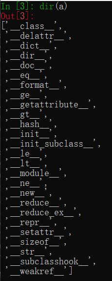

- **新式类**：以 `object` 为基类的类，**推荐使用**
- 经典类：不以 `object` 为基类的类，不推荐使用
- 在 `Python 3.x` 中定义类时，如果没有指定父类，会默认使用 `object` 作为该类的基类 -- `Python 3.x` 中定义的类都是新式类
- 在 `Python 2.x` 中定义的类，如果没有指定父类，则不会以 `object` 作为基类

>新式类和经典类在多继承时 -- 会影响到方法的搜索顺序

为了保证编写的代码能够同时在 `Python 2.x` 和 `Python 3.x` 运行，今后在定义类时，如果没有父类，建议统一继承自 `object`

```python
class 类名(object):
	pass
```

#python 2022/9/4

# 多态

## 目标

- 多态

**面向对象三大特性**

1. 封装：根据职责将属性和方法封装到一个抽象的类中
	- 定义类的准则
2. 继承：实现代码的重用，相同的代码不需要重复的编写
	- 设计类的技巧
	- 子类针对自己特有的需求，编写特定的代码
3. 多态：不同的子类对象调用相同的父类方法，产生不同的执行结果
	- 多态可以增加代码的灵活度
	- **以继承和重写父类方法为前提**
	- 是调用方法的技巧，不会影响到类的内部设计


## 多态案例演练

**需求**

1. 在 `Dog` 类中封装方法 `game`
	- 普通狗只是简单的玩耍
2. 定义 `XiaoTianQuan` 继承自 `Dog` ，并且重写 `game` 方法
	- 哮天犬需要在天上玩耍
3. 定义 `Person` 类，并且封装一个和狗玩的方法
	- 在方法内部，直接让狗对象调用 `game` 方法

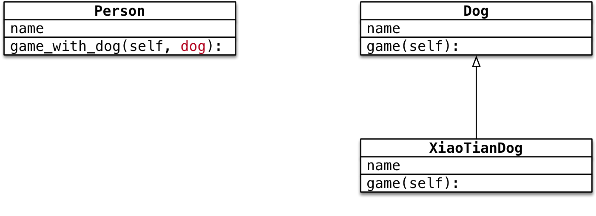

```python
class Dog(object):

    def __init__(self, name) -> None:
        self.name = name

    def game(self):
        print("%s 蹦蹦跳跳地玩耍..." % self.name)


class XiaoTianDog(Dog):

    def game(self):
        print("%s 飞到天上玩耍..." % self.name)


class Person(object):

    def __init__(self, name) -> None:
        self.name = name

    def game_with_dog(self, dog: Dog):
        print("%s 和 %s 快乐地玩耍..." % (self.name, dog.name))
        # 让狗玩耍
        dog.game()


# 1.创建 狗 对象
# wangcai = Dog("旺财")
wangcai = XiaoTianDog("飞天旺财")

# 2.创建一个 小明 对象
xiaoming = Person("小明")

# 3.让小明调用和狗玩的方法
xiaoming.game_with_dog(wangcai)
```

**案例小结**

- `Person` 类中只需要让狗对象调用 `game` 方法，而不关心具体是什么狗
	- `game` 方法是在 `Dog` 父类中定义的
- 在程序执行时，传入不同的狗对象实参，就会产生不同的执行效果

# 类属性

## 01.类的结构

### 1.1 术语 -- 实例

1. 使用面向对象开发，第1步是设计类
2. 使用 类名() 创建对象，创建对象的动作有两步
	1) 在内存中为对象**分配空间**
	2) 调用初始化方法 `__init__` 为**对象初始化**
3. 对象创建后，内存中就有了一个对象的实实在在的存在 -- 实例


因此，通常也会把：

1. 创建出来的对象叫作**类的实例**
2. 创建对象的当作叫作**实例化**
3. 对象的属性叫作**实例属性**
4. 对象调用的方法叫作**实例方法**

在程序执行时：

1. 对象各自拥有自己的实例属性
2. 调用对象方法，可以通过 `self.`
	- 访问自己的属性
	- 访问自己的方法

**结论**

- **每一个对象都有自己独立的内存空间，保存各自不同的属性**
- **多个对象的方法，在内存中只有一份，在调用方法时，需要把对象的引用传递到方法内部**

### 1.2 类是一个特殊的对象

>`Python` 中**一切皆对象**：
>	- `class AAA:` 定义的类属于类对象
>	- `obj1 = AAA()` 属于实例对象

- 在程序运行时，类同样会被加载到内存
- 在 `Python` 中，类是一个特殊的对象--类对象
- 在程序运行时，类对象在内存中只有一份，使用一个类可以创建很多个对象实例
- 除了封装实例的属性和方法外，类对象还可以拥有自己的属性和方法
	1. 类属性
	2. 类方法
- 通过 `类名.` 的方式可以访问类的属性或者调用类的方法


## 02.类属性和实例属性

### 2.1 概念和使用

- 类属性就是给类对象中定义的属性
- 通常**用来记录与这个类相关的特征**
- 类属性不会用于记录具体对象的特征

**示例需求**

- 定义一个根据类
- 每件工具都有自己的 `name`
- 需求 -- 知道使用这个类，创建了多少个工具对象？


```python
class Tool(object):

    # 使用赋值语句定义类属性，记录所有工具对象的数量
    count = 0

    def __init__(self, name) -> None:
        self.name = name

        # 每次创建对象都会调用初始化方法
        Tool.count += 1


# 1.创建工具对象
tool1 = Tool("斧头")
tool2 = Tool("锤子")
tool3 = Tool("水桶")

# 2.输出工具对象的数量
print(Tool.count)
```

### 2.2 属性的获取机制

- 在 `Python` 中属性的获取存在一个**向上查找机制**


- 因此，要访问类属性有两种方式“
	1. 类名.类属性
	2. 对象.类属性(不推荐)

**注意**

- 如果使用 `对象.类属性 = 值` 赋值语句，只会给对象添加一个实例属性，而不会影响到类属性的值

## 03.类方法和静态方法

### 3.1 类方法

- **类属性**就是针对**类对象**定义的属性
	- **使用赋值语句在 `class` 关键字下方可以定义类属性**
	- 类属性用于记录与这个类相关的特征
- 类方法就是针对类对象定义的方法
	- 在类方法内部可以直接访问类属性或者调用其他的类方法

**语法如下**

```python
@classmethod
def 类方法名(cls):
	pass
```

- 类方法需要用修饰器 `@classmethod` 来标识，告诉解释器这是一个类方法
- 类方法的第一个参数应该是 `cls`
	- 由哪一个类调用的方法，方法内的 `cls` 就是哪一个类的引用
	- 这个参数和实例方法的第一个参数是 `self` 类似
	- 提示：使用其他名称也可以，不过习惯使用 `cls`
- 通过`类名.` 调用类方法时，不需要传递 `cls` 参数
- 在方法内部
	- 可以通过 `cls.` 访问类的属性
	- 也可以通过 `cls.` 调用其他的类方法

**示例需求**

- 定义一个工具类
- 每件工具都有自己的 `name`
- 需求 -- 在类封装一个 `show_tool_count` 的类方法，输出使用当前这个类，创建的对象个数

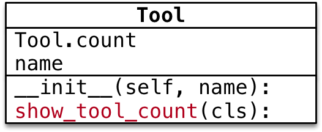

```python
class Tool(object):

    # 使用赋值语句定义类属性，记录所有工具对象的数量
    count = 0

    @classmethod
    def show_tool_count(cls):

        print("工具对象的数量 %d" % cls.count)

    def __init__(self, name) -> None:
        self.name = name

        # 每次创建对象都会调用初始化方法
        Tool.count += 1


# 创建工具对象
tool1 = Tool("锤子")
tool2 = Tool("榔头")

# 调用类方法
Tool.show_tool_count()
```

>在类方法内部，可以直接使用 `cls` **访问类属性或者调用类方法**

### 3.2 静态方法

- 在开发时，如果需要在类中封装一个方法，这个方法：
	- 既不需要访问实例属性或者调用实例方法
	- 也不需要访问类属性或者调用类方法
- 这个时候，可以把这个方法封装成一个静态方法

**语法如下**

```python
@staticmethod
def 静态方法名():
	pass
```

- **静态方法需要用修饰器 `@staticmethod` 来标识，告诉解释器这是一个静态方法**
- 通过 `类名.` 调用静态方法

```python
class Dog:

    @staticmethod
    def run():
        # 不访问实例属性/类属性
        print("小狗要跑...")

    def __init__(self, name) -> None:
        
        self.name = name

# 通过 类名. 调用静态方法 -- 不需要创建对象，就可以调用
Dog.run()
```

### 3.3 方法综合范例

1. 设计一个 `Game` 类
2. 属性：
	- 定义一个类属性 `top_score` 记录游戏的历史最高分
	- 定义一个实例属性 `player_name` 记录当前游戏的玩家姓名
3. 方法：
	- **静态方法**： `show_help` 显示游戏帮助信息
	- **类方法**： `show_top_score` 显示历史最高分
	- **实例方法**： `start_game` 开始当前玩家的游戏
4. 主程序步骤
	1) 查看帮助信息
	2) 查看历史最高分
	3) 创建游戏对象，开始游戏

![[img43.png]]

```python
class Game(object):

    # 历史最高分
    top_score = 0

    def __init__(self, player_name) -> None:
        self.player_name = player_name

    @staticmethod
    def show_help():
        print("帮助信息：让僵尸进入大门")
    
    @classmethod
    def show_top_score(cls):
        print("历史记录 %d" % cls.top_score)

    def start_game(self):
        print("%s 开始游戏" % self.player_name)


# 1.查看游戏的帮助信息
Game.show_help()

# 2.查看历史最高分
Game.show_top_score()

# 3.创建游戏对象
game = Game("小明")
game.start_game()
```

**案例小结**

1. **实例方法** -- 方法内部需要访问实例属性
	- 实例方法内部可以使用 `类名.` 访问类属性
2. **类方法** -- 方法内部**只**需要访问类属性
3. **静态方法** -- 方法内部，**不需要访问实例属性和类属性**

**提问**

如果方法内部既需要访问实例属性，右需要访问类属性，应该定义成什么方法？

>答案：
>- 应该定义 **实例方法**
>- 因为，类只有一个，在实例方法内部可以使用 `类名.` 访问类属性

#python 2022/9/4

# 单例

## 目标

- 单例设计模式
- `__new__` 方法
- Python 中的单例

## 01.单例设计模式

- 设计模式
	- **设计模式是前人工作的总结和提炼**，通常被人们广泛流传的设计模式都是针对某一特定问题的成熟的解决方案
	- 使用设计模式是为了可重用代码、让代码更容易被他人理解、保证代码可靠性
- 单例的设计模式
	- 目的 -- **让类创建的对象，在系统中只有唯一的一个实例**
	- 每一次执行 `类名()` 返回的对象，**内存地址是相同的**

**单例设计模式的应用场景**

- 音乐播放对象
- 回收站对象
- 打印机对象
- ...

## 02. `__new__` 方法

- 使用 `类名()` 创建对象时，Python的解释器首先会调用 `__new__` 方法为对象**分配空间**
- `__new__` 是一个由 `object` 基类提供的**内置的静态方法**，主要作用有两个：
	1) **在内存中为对象分配空间**
	2) **返回对象的引用**
- Python 的解释器获得对象的引用后，将引用作为第一个参数，传递给 `__init__` 方法

>重写 `__new__` 方法的海马非常固定!

- 重写 `__new__` 方法一定要 `return super().__new__(cls)`
- 否则 Python 的解释器**得不到**分配了空间的对象引用，就不会调用对象的初始化方法
- 注意：`__new__` 是一个静态方法，在调用时需要出动传递 `cls` 参数


```python
class MusicPlayer:

    def __new__(cls, *args, **kwargs):
        # 1.创建对象时，new方法会被自动调用
        print("创建对象，分配空间")

        # 2.为对象分配空间
        instance = super().__new__(cls)

        # 3.返回对象的引用
        return instance

    def __init__(self) -> None:
        print("播放器初始化")


# 创建播放器对象
player = MusicPlayer()

print(player)
```

## 03.Python 中的单例

- **单例 -- 让类创建的对象，在系统中只有唯一一个实例**
	1. 定义一个类属性，初始值为 `None` ，用于记录单例对象的引用
	2. 重写 `__new__` 方法
	3. 如果类属性 `is None` ，调用父类方法分配空间，并在类属性中记录结果
	4. 返回类属性中记录的对象引用

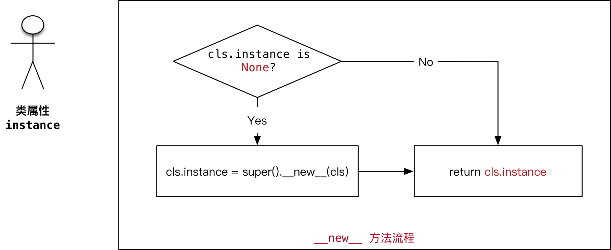

```python
class MusicPlayer(object):

    # 记录第一个被创建对象的引用
    instance = None

    def __new__(cls, *args, **kwargs):
        # 1.判断类属性是否是空对象
        if cls.instance is None:
            # 2.调用父类的方法，为第一个对象分配空间
            cls.instance = super().__new__(cls)

        # 3.返回类属性保存的对象引用
        return cls.instance
```

**只执行一次初始化工作**

- 在每次使用 `类名()` 创建对象时，Python 的解释器都会自动调用两个方法：
	1) `__new__` 分配空间
	2) `__init__` 对象初始化
- 上个例子中对 `__new__` 方法改造之后，每次得到**第一次被创建对象的引用**
- 但是，**初始化方法还会被再次调用**

**需求**

- 让初始化当作只被执行一次

**解决办法**

1. 定义一个类属性 `init_flag` 标记是否执行过初始化动作，初始化为 `False`
2. 在 `__init__` 方法中，判断 `init_flag` ，如果为 `False` 就执行初始化动作
3. 然后将 `init_flag` 设置为 `True`
4. 这样，再次自动调用 `__init__` 方法时，初始化动作就不会被再次执行了

```python
class MusicPlayer(object):

    # 记录第一个被创建对象的引用
    instance = None

    # 记录是否执行过初始化动作
    init_flag = False

    def __new__(cls, *args, **kwargs):
        # 1.判断类属性是否是空对象
        if cls.instance is None:
            # 2.调用父类的方法，为第一个对象分配空间
            cls.instance = super().__new__(cls)

        # 3.返回类属性保存的对象引用
        return cls.instance

    def __init__(self) -> None:
        # 1.判断是否执行过初始化动作
        if MusicPlayer.init_flag:
            return

        # 2.如果没有执行过，再执行初始化动作
        print("初始化播放器")

        # 3.修改类属性标记
        MusicPlayer.init_flag = True


# 创建多个对象
player1 = MusicPlayer()
print(player1)

player2 = MusicPlayer()
print(player2)
```

#python 2022/9/5

# 异常

## 目标

- 异常的概念
- 捕获异常
- 异常的传递
- 自定义异常

## 01.异常的概念

- 程序在运行时，如果 `Python 解释器` 遇到一个错误，**会停止程序的执行，并且提示一些错误信息**，这就是**异常**
- 程序停止执行并且提示错误信息这个动作，我们通常称之为：**抛出(raise)异常**

>程序开发时，很难将所有的特殊情况都处理的面面俱到，通过**异常捕获**可以针对突发事件做集中的处理，从而保证程序的稳定性和健壮性

## 02.捕获异常

### 2.1 简单的捕获异常语法

- 在程序开发中，如果对某些代码的执行不能确定是否正确，可以增加 `try(尝试)` 来捕获异常
- 捕获异常最简单的语法格式：

```python
try:
	尝试执行的代码
except:
	出现错误的处理
```

- `try` 尝试，下方编写要尝试的代码，不确定是否能够正常执行的代码
- `except` 如果不是，下方编写尝试失败的代码

**简单异常捕获演练 -- 眼球用户输入整数**

```python
try:
    # 不能确定正确执行的代码
    num = int(input("请输入一个整数："))
except:
    # 错误的处理代码
    print("请输入正确的整数格式")

print("-" * 50)
```

### 2.2 错误类型的捕获

- 在程序执行时，可能会遇到不同类型的异常，并且需要**针对不同类型的异常，做出不同的响应，这个时候，就需要捕获错误类型**
- 语法如下：

```python
try:
	# 尝试执行的代码
	pass
except 错误类型1:
	# 针对错误类型1，对应的代码处理
	pass
except (错误类型2, 错误类型3):
	# 针对错误类型2 和 3，对应的代码处理
	pass
except Exception as result:
	print("未知错误 %s " % result)
```

- 当 `Python` **解释器抛出异常时，最后一行错误信息的第一个单词，就是错误类型**

**需求**

1. 提示用户输入一个整数
2. 使用 `8` 除以用户输入的整数并且输出

```python
try:
    # 1. 提示用户输入一个整数
    num = int(input("输入一个整数："))

    # 2. 使用 `8` 除以用户输入的整数并且输出
    res = 8 / num

    print(res)
except ZeroDivisionError:
    print("除0错误")
except ValueError:
    print("请输入正确的整数")
```

**捕获未知错误**

- 在开发时，要预判到所有可能出现的错误，还是有一定难度的
- 如果希望程序无论出现任何错误，都不会因为 `Python` 解释器抛出异常而被终止，可以再增加一个 `except`
- 语法如下：

```python
except Exception as result:
	print("未知错误 %s" % result)
```

### 2.3 异常捕获完整语法

- 在实际开发中，为了能够处理复杂的异常情况，实际的异常语法如下：

>提示：
>- 有关完整语法的应用场景，在后续学习中，结合实际的案例会更好理解

```python
try:
	# 尝试执行的代码
	pass
except 错误类型1:
	# 针对错误类型1，对应的代码处理
	pass
except 错误类型2:
	# 针对错误类型2，对应的代码处理
	pass
except (错误类型3, 错误类型4):
	# 针对错误类型3 和 4，对应的d代码处理
	pass
except Exception as result:
	# 打印错误信息
	print(result)
else:
	# 没有异常才会执行的代码
	pass
finally:
	# 无论是否有异常，都会执行的代码
	print("无论是否有异常，都会执行的代码")
```

- `else` 只有在没有异常时才会执行的代码
- `finally` 无论是否有异常，都会执行的代码
- 之前一个演练的完整捕获异常代码如下：

```python
try:
    # 1. 提示用户输入一个整数
    num = int(input("输入一个整数："))

    # 2. 使用 `8` 除以用户输入的整数并且输出
    res = 8 / num

    print(res)
except ValueError:
    print("请输入正确的整数")
except Exception as result:
    print("未知错误 %s" % result)
else:
    print("尝试成功")
finally:
    print("无论是否出现异常都会执行的代码")

print("-" * 20)
```

## 03.异常的传递

- 异常的传递 -- 当函数/方法执行出现异常，会将异常传递给函数/方法的调用一方
- 如果传递到主程序，仍然没有异常处理，程序才会被终止
- 在开发中，可以在主函数中增加异常捕获
- 而在主函数中国调用的其他函数，只要出现异常，都会传递到主函数的异常捕获中
- 这样就不需要在代码中，增加大量的异常捕获，能够保证代码的整洁

**需求**

1. 定义函数 `demo1()` **提示用户输入一个函数并且返回**
2. 定义函数 `demo2()` 调用 `demo1()`
3. 在 主程序中调用 `demo2()`

```python
def demo1():
    return int(input("请输入整数："))


def demo2():
    return demo1()

# 利用异常的传递性，在主程序捕获异常
try:
    print(demo2())
except Exception as result:
    print("未知错误 %s" % result)
```

## 04.抛出 raise 异常

### 4.1 应用场景

- 在开发中，除了代码执行出错 `python` 解释器会抛出异常之外
- 还可以**根据应用程序特有的业务需求主动抛出异常**

**示例**

- 提示用户输入密码，如果长度少于8，抛出异常


**注意**

- 当前函数只负责提示用户输入密码，如果密码长度不正确，需要其他函数进行额外处理
- 因此可以抛出异常，由其他需要处理的函数捕获异常

```python

```

### 4.2 抛出异常

- 在 Python 中提供了一个 `Exception` 异常类
- 在开发时，如果满足特定业务需求时，希望抛出异常，可以：
	1. **创建一个 `Exception` 的对象**
	2. **使用 `raise` 关键字抛出异常对象**

**需求**

- 定义 `inpyt_password` 函数，提示用户输入密码
- 如果用户输入长度 <8，抛出异常
- 如果用户输入长度 >= 8，返回输入的密码

```python
def input_password():

    # 1.提示用户输入密码
    pwd = input("请输入密码：")
    # 2.判断密码长度 >= 8，返回用户输入的密码
    if len(pwd) >= 8:
        return pwd
    # 3.如果 < 8，主动抛出异常
    print("主动抛出异常")
    # 1>创建异常对象 - 可以使用错误信息字符串作为参数
    ex = Exception("密码长度不够")
    # 2>主动抛出异常
    raise ex


# 提示用户输入密码
try:
    print(input_password())
except Exception as result:
    print(result)
```

#python 2022/9/5

# 模块

## 目标

- 模块
- 包
- 模块的制作

## 01.模块

### 1.1 模块的概念

>模块是 Python 程序架构一个核心概念

- 每一个以扩展名 `.py` 结尾的 `Python` 源代码文件都是一个模块
- 模块名同样也是一个标识符，需要符合标识符的命名规则
- 在模块中 定义的全局变量、函数、类都是提供给外界直接使用的工具
- 模块就好比是工具包，要想使用这个工具包中工具，就需要先导入这个模块

### 1.2 模块的两种导入方式

1) **import 导入**

```python
import 模块名1
import 模块名2
```

>提示：在导入模块时，每个导入应该独占一行

- 导入之后
	- 通过 `模块名.` 使用模块提供的工具 -- 全局变量、函数、类

**使用 as 指定模块的别名**

>如果模块的名字太长，可以使用 `as` 指定模块的名称，以方便在代码中的使用

```python
import 模块1 as 模块别名
```

>注意：模块别名应该符合**大驼峰命名法**

```python
# ch_01_测试模块1.py
# 全局变量
title = "模块1"

# 函数
def say_hello():
    print("我是 %s" % title)


# 类
class Dog(object):
    pass

# ch_02_测试模块2.py
# 全局变量
title = "模块2"

# 函数
def say_hello():
    print("我是 %s" % title)


# 类
class Cat(object):
    pass

# import导入模块
import ch_01_测试模块1 as DogModule
import ch_02_测试模块2 as CatModule

DogModule.say_hello()
CatModule.say_hello()

dog = DogModule.Dog()
print(dog)

cat = CatModule.Cat()
print(cat)
```

2) **from ... import 导入**

- 如果希望从某一个模块中，导入部分工具，就可以使用 `from ... import` 的方式
- `import 模块名` 是一次性把模块中所有工具全部导入，并且通过 模块名/别名访问

```python
# 从模块 导入 某一个工具
from 模块1 import 工具名
```

- 导入之后
	- 不需要通过 `模块名.`
	- 可以直接使用**模块提供的工具 -- 全局变量、函数、类**

>注意：如果两个模块，存在同名的函数，那么后导入模块的函数，会覆盖掉先导入的函数

- 开发时 `import` 代码就应该统一写在代码的顶部，更容易及时发现冲突
- 一旦发现冲突，可以使用 `as` 关键字**给其中一个工具起一个别名**

- `from ... import *` 

```python
# 从模块导入所有故居
from 模块名1 import *
```

>这种方式不推荐使用，因为函数重名并没有任何的提示，出现问题不好排查

### 1.3 模块的搜索顺序

`Python` 的解释器在导入模块时，会：

1. 搜索当前目录指定模块名的文件，如果有就直接导入
2. 如果没有，再搜索系统目录

>在开发时，给文件起名，**不要和系统的模块文件重名**
>`Python` 中每一个模块都有一个内置属性 `__file__` 可以**查看导入模块的完整路径**

```python
import random

# 生成一个 0~10 的数字
rand = random.randint(0, 10)

print(rand)
```

>注意：如果当前目录下，存在一个 `random.py` 的文件按，程序就无法正常运行
>这个时候，`Python` 的解释器会加载当前目录下的 `random.py` 而不会加载系统的 `random` 模块

### 原则 -- 每一个文件都应该是可以被导入的

- 一个独立的 `Python` 文件就是一个模块
- **在导入文件时，文件中所有没有任何缩进的代码都会被执行一遍**！

**实际开发场景**

- 在实际开发中，每一个模块都是独立开发的，大多都有专人负责
- 开发人员通常会**在模块下发增加一些测试代码**
	- 仅在模块内部使用，而被导入到其他文件中不需要执行

**`__main__` 属性**

>- `__name__` 属性可以做到，测试模块的代码**只在测试情况下被运行，而在被导入时不会被执行**！

- **`__name__` 是 `Python` 的一个内置属性，记录着一个字符串**
- **如果是被其他文件导入，`__name__` 就是模块名**
- **如果是当前执行的程序，`__name__` 是 `__main__`**

在很多 `Python` 文件中都会看到以下格式的代码：

```python
# 导入模块
# 定义全局变量
# 定义类
# 定义函数

# 在代码的最下方
def mian():
	# ...
	pass

# 根据 __name__ 判断是否执行下方代码
if __name__ == "__main__":
	main()
```

## 02.包 (Package)

**概念**

- 包是一个**包含多个模块的特殊目录**
- 目录下有一个特殊的文件 `__init__.py`
- 包名的命名方式和变量名一致，小写字母 + `_`

**好处**

- 使用 `import 保名` 可以**一次性导入包中所有模块**

**案例演练**

1. 新建一个 `cm_message` 的包
2. 在目录下，新建两个文件 `send_message` 和 `receive_message`
3. 在 `send_message` 文件中定义一个 `send` 函数
4. 在 `receive_message` 文件中定义一个 `receive` 函数
5. 在外部直接导入 `hm_message` 的包

**`__init__.py`**

- 要在外界使用包中的模块，**需要在 `__init__.py` 中指定对外界提供的模块列表**

```python
# __init__.py
# 从 当前目录 导入 模块列表
from . import send_message
from . import receive_message


# ch_10_导入包.py
import ch_message

ch_message.send_message.send("hello")

txt = ch_message.receive_message.receive()
print(txt)
```

## 03.发布模块

- 如果希望自己开发的模块，分享给其他人，可以按照以下步骤操作

### 3.1 制作发布压缩包步骤

1) 创建 `setup.py`

```python
from distutils.core import setup

setup(name="ch_message",    # 包名
    version="1.0",          # 版本
    description="Charlie's 发送和接收消息模块",  # 描述信息
    long_description="完整的发送和接收消息模块",    # 完整的描述信息
    author="CharlieHon",     # 作者
    author_email="CharlieHon@charlie.com",
    url="https://github.com/CharlieHon/Python",   # 主页
    py_modules=["ch_message.send_message",
                "ch_message.receive_message"] # 以列表形式指定压缩包中包含的模块的名称
    )
```

[有关字典参数的详细信息，可以参考官方网站](https://docs.python.org/2/distutils/apiref.html)

2) **构建模块**

```python
$ python3 setup.py build
```

3) **生成发布压缩包**

```python
$ python3 setup.py sdist
```

>在Windows终端中执行命令相同，这是只需要到对应目录下执行即可

### 3.2 安装模块(到系统路径)

```python
$ tar -zxf ch_message-1.0.tar.gz

$ sudo python3 setup.py install
```

**卸载模块**

直接从安装目录下，把安装模块的目录删除即可，如下例：

```python
$ cd /usr/local/lib/python3.5/dist-package/
$ sudo rm -r ch_message
```

#python 2022/9/6

## 目标

- 文件的概念
- 文件的基本操作
- 文件/文件夹的常用操作
- 文本文件的编码方式

## 01.文件的概念

### 1.1 文件的概念和作用

- 计算机的文件，就是存储在某种长期存储设备上的一段数据
- 长期存储设备包括：硬盘、U盘、移动硬盘、光盘...

**文件的作用**

将数据长期保存下来，在需要的时候使用

| CPU | 内存 | 硬盘 |
| --- | ---- | ---- |
|  |      |      |

### 1.2 文件的存储方式

- 在计算机中，文件是以**二进制**的方式保存在磁盘上的

文本文件和二进制文件

- 文本文件
	- **可以使用文本编辑软件查看**
	- 本质上开始二进制文件
	- 例如：python 的源程序
- 二进制文件
	- 保存的内容不是给他人直接阅读的，而是**提供给其他软件使用的**
	- 例如：图片文件、音频文件、视频文件等等
	- 二进制文件不能使用文本编辑软件查看

## 02.文件的基本操作

### 2.1 操作文件的套路

在计算机中要操作的文件的套路非常固定，一共包含三个步骤：

1. 打开文件
2. 读、写文件
	- **读** 将文件内容读入内存
	- **写** 将内存内容写入文件
3. 关闭文件

### 2.2 操作文件的函数/方法

- 在 Python 中要操作文件需要记住 **1个函数 和 3个方法**

| 序号 | 函数/方法 | 说明                           |
| ---- | --------- | ------------------------------ |
| 01   | `open`    | 打开文件，并且返回文件操作对象 |
| 02   | `read`    | 将文件内容读取到内存           |
| 03   | `write`   | 将指定内容写入文件             |
| 04   | `close`   | 关闭文件                               |

- `open` 函数负责打开文件，并且返回文件对象
- `read/write/close` 三个方法都需要通过**文件对象**来调用

### 2.3 read 方法 -- 读取文件

- `open` 函数的第一个参数是要打开的文件名 (文件名区分大小写)
	- **如果文件存在，返回文件从操作对象**
	- **如果文件不存在，会抛出异常**
- `read` 方法可以一次性**读入并返回文件的所有内容**
- `close` 方法负责**关闭文件**
	- 如果**忘记关闭文件，会造成系统资源消耗，而且会影响到后续对文件的访问**
- 注意：**方法执行后，会把文件指针移动到文件的末尾**

```python
# 1.打开文件
file = open("README")

# 2.读取文件内容
text = file.read()
print(text)

# 3.关闭文件
file.close()
```

**提示**

- 在开发中，通常会先编写打开和关闭的代码，再编写中间针对文件的读/写操作！

**文件指针**

- **文件指针标记从哪个位置开始读取数据**
- **第一次打开文件**时，通常**文件指针会指向文件的开始位置**
- 当执行了 `read` 方法后，**文件指针会移动到读取内容的末尾**
	- 默认情况下移动到文件末尾

**思考**

- 如果执行了一次 `read` 方法，读取了所有内容，那么再次调用 `read` 方法，还能够获得到内容吗？
	- 不能
	- 第一次读取之后，文件指针移动到了文件末尾，再次调用不会读取到任何的内容

### 2.4 打开文件的方式

- `open` 函数默认以**只读模式**打开文件，并且返回文件对象

语法如下：

```python
f = open("文件名", "访问方式")
```

| 访问方式 | 说明                                                                                                     |
| -------- | -------------------------------------------------------------------------------------------------------- |
| `r`      | 以**只读**方式打开文件。文件的指针将会放在文件的开头，这是**默认模式**。如果文件不存在，抛出异常         |
| `w`      | 以**只写**方式打开文件。如果文件存在会被覆盖。如果文件不存在，创建新文件                                 |
| `a`      | 以**追加**方式打开文件。如果该文件已存在，文件指针将会放在文件的结尾。如果文件不存在，创建新文件进行写入 |
| `r+`     | 以**读写**方式打开文件。文件的指针将会放在文件的开头。如果文件不存在，抛出异常                           |
| `w+`     | 以**读写**方式打开文件。如果文件存在会被覆盖。如果文件不存在，创建新文件                                     |
| `a+`     | 以**读写**方式打开文件。如果该文件已存在，文件指针将会放在文件的结尾。如果文件不存在，创建新文件进行写入                                                                                                         |

**提示**

- 频繁的移动文件指针，会影响文件的读写效率，开发中更多的时候会以**只读、只写**的方式来操作文件

### 2.5 按行读取文件的内容

- `read` 方法默认会把文件的**所有内容一次性读取到内存**
- 如果文件太大，对内存的占用会非常严重

**readline 方法**

- `readline` 方法可以一次读取一行内容
- 方法执行后，**会把文件指针移动到下一行**，准备再次读取

**读取大文件的正确姿势**

```python
# 1.打开文件
file = open("README")

# 2.读取文件
while True:
    # 每次读取一行
    text = file.readline()
    
    # 判断是否读取到内容
    if not text:
        break
    print(text, end="")

# 关闭文件
file.close()
```

### 2.6 文件读写案例 -- 复制文件

**目标**

用代码的方式，来实现文件复制过程


**小文件复制**

- 打开一个已有文件，读取完整内容，并写入到另一个文件

```python
# 1.打开文件
file_read = open("README")
file_Write = open("README[复件]", "w")

# 2.读、写文件
text = file_read.read()
file_Write.write(text)

# 3.关闭文件
file_read.close()
file_Write.close()
```

**大文件复制**

- 打开一个已有文件，逐行读取内容，并顺序写入到另一个文件

```python
# 1.打开文件
file_read = open("README")
file_Write = open("README[复件]", "w")

# 2.读、写文件
while True:
    # 读取一行内容
    text = file_read.readline()

    # 判断是否读取到内容
    if not text:
        break
    file_Write.write(text)

# 3.关闭文件
file_read.close()
file_Write.close()
```

## 03.文件/目录的常用管理操作

- 在**终端/文件浏览器**中可以执行常规的**文件/目录**管理操作，例如：
	- 创建、重命名、删除、改变路径】查看目录内容、...
- 在 Python 中，如果希望通过程序实现上述功能，**需要导入 `os` 模块**

**文件操作**

| 序号 | 方法名   | 说明       | 示例                              |
| ---- | -------- | ---------- | --------------------------------- |
| 01   | `rename` | 重命名文件 | `os.rename(源文件名, 目标文件名)` |
| 02   | `remove` | 删除文件   | `os.remove(文件名)`                                  |

**目录操作**

| 序号 | 方法名       | 说明           | 示例               |
| ---- | ------------ | -------------- | ------------------ |
| 01   | `listdir`    | 目录列表       | `os.listdir(目录名)` |
| 02   | `mkdir`      | 创建目录       | `os.mkdir(目录名)`   |
| 03   | `rmdir`      | 删除目录       | `os.rmdir(目录名)`   |
| 04   | `getcwd`     | 获取当前目录   | `os.getcwd()`        |
| 05   | `chdir`      | 修改工作目录   | `os.chdir(目标目录)` |
| 06   | `path.isdir` | 判断是否是目录 | `os.path.isdir(文件路径)`                   |

>提示：文件或者目录操作都支持**相对路径和绝对路径**

## 04.文本文件的编码格式

- 文本文件存储的内容是基于**字符编码**的文件，常见的编码有 `ASCII`  编码，`UNICODE` 编码等

>Python 2.x 默认使用 `ASCII` 编码
>Python 3.x 默认使用 `UTF-8` 编码

### 4.1 ASCII 编码 和 UNICODE 编码

**ASCII 编码**

- 计算机中只有 `256` 个 `ASCII` 字符
- 一个 `ASCII` 在内存中占用 **1个字节** 的空间
	-  `8` 个 `0/1` 的排列组合方式一共有 `256` 种，也就是 `2^8`


**UTF-8 编码格式**

- 计算机中使用 **1-6个字节** 来标识一个 `UTF-8` 字符，**涵盖了地球上几乎所有地区的文字**
- 大多数汉字会使用**3个字节**表示
- `UTF-8` 是 `UNICODE` 编码的一种编码格式

### 4.2 Python 2.x 中如何使用中文

>Python 2.x 默认使用 `ASCII` 编码格式
>Python 3.x 默认使用 `UTF-8` 编码格式

- 在 Python 2.x 文件的第一行增加以下代码，解释器会以 `utf-8` 编码来处理 Python 文件

```python
# *-* cooding:utf8 *-*
```

- 也可以使用

```python
# coding=utf8
```

**unicode 字符串**

- 在 `Python 2.x` 中，即使指定了文件使用 `UTF-8` 的编码格式，但是在遍历字符串时，仍然会 **以字节为单位遍历** 字符串
- 要能够**正确地遍历字符串**，在定义字符串时，需要**在字符串地引号前，增加一个小写字母 `u`** ，告诉解释器这是一个 `unicode` 字符串(使用 `UTF-8` 编码格式的字符串)

#python 2022/9/6

## eval 函数

`eval()` 函数十分强大--**将字符串当成有效的表达式来求值并返回计算结果**

```python
# 基本的数学计算
In[1]: eval("1 + 1")
Out[1]: 2

# 字符串重复
In[2]: eval("'*' * 10")
Out[2]: '**********'

# 将字符串转换成列表
In[3]: type(eval("[1, 2, 3, 4, 5]"))
Out[3]: list

# 将字符串转换成字典
In[4]: type(eval("{'name':'xiaoming', 'age':18}"))
Out[4]: dict

```

## 案例-计算器

**需求**

1. 提示用户输入一个加减乘除混合运算
2. 返回计算结果

```python
input_str = input("请输入算术题：")
print(eval(input_str))
```

## 不要滥用 eval

>在开发时千万不要使用 `eval` 直接转换 `input` 的结果

```python
# 可以执行任何终端命令，不安全！
__import__('os').system('ls')
```

- 等价代码

```python
import os

os.system("终端命令")
```

- 执行成功，返回 0
- 执行失败，返回错误信息

#python 2022/9/7

# 项目实战 -- 飞机大战

## 目标

- 强化面向对象程序设计
- 体验使用 `pygame` 模块进行游戏开发

## 实战步骤

1. `pygame` 快速体验
2. 飞机大战实战

## 确认模块 -- pygame

- `pygame` 就是一个 Python 模块，专为电子游戏设计
- 官方网站：[pygame](https://www.pygame.org/)
	- 提示：要学习第三方模块，通常最好的参考资料就在官方网站

| 网站栏目       | 内容                   |
| -------------- | ---------------------- |
| GettingStarted | 在各平台安装模块的说明 |
| Docs           | pygame 模块所有类和子类的参考手册                       |

## 安装 pygame


## pygame 快速入门

### 目标

1. 项目预备
2. 使用 `pygame` 创建图形窗口
3. 理解图像并实现图像绘制
4. 理解游戏循环和游戏时钟
5. 理解精灵和精灵组

### 项目预备

1. 新建飞机大战项目
2. 新建一个 `ch_01_pygame入门`
3. 导入游戏素材图片

**游戏的第一印象**

- 把一些静止的图像绘制到游戏窗口中
- 根据用户的交互或其他情况，移动这些图像，产生动画效果
- 根据图像之间是否发生重叠，判断敌机是否被摧毁等其他情况

### 01.使用 pygame 创建图像窗口

**小节目标**

1. 游戏的初始化和退出
2. 理解游戏中的坐标系
3. 创建游戏主窗口
4. 简单的游戏循环

>可以将图片素材**绘制到游戏窗口**上，开发游戏之前需要知道**如何建立游戏窗口**

#### 1.1 游戏的初始化和退出

- 要使用 `pygame` 提供的所有功能之前，需要调用 `init` 方法
- 在游戏结束前需要调用以下 `quit` 方法

| 方法            | 说明                                                                 |
| --------------- | -------------------------------------------------------------------- |
| `pygame.init()` | 导入并初始化所有 pygame 模块，使用其他模块之前，必须先调用 init 方法 |
| `pygame.quit()` | 卸载所有 pygame 模块，在游戏结束之前调用                                                                     |

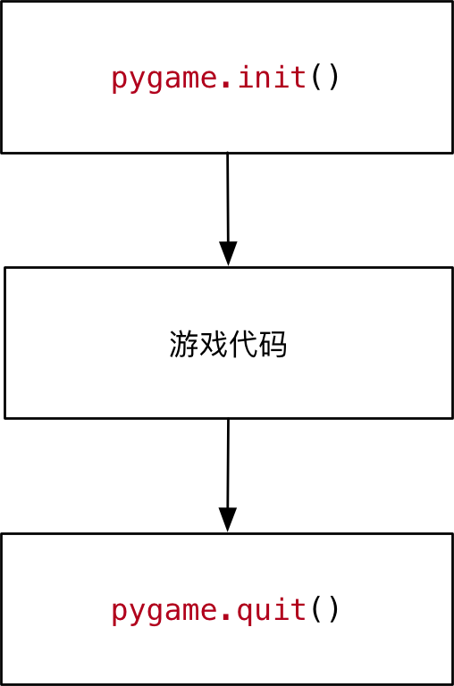

#### 1.2 理解游戏中的坐标系

- 坐标系
	- 远点在左上角 `(0, 0)`
	- x轴水平方向向右，逐渐增加
	- y轴垂直方向向下，逐渐增加


- 在游戏中，所有可见的元素都是以矩形区域来描述位置的
	- 要描述一个矩形区域有四个要素：`(x, y) (width, height)`
- `pygame` 专门提供了一个类 `pygame.Rect` 用于描述矩形区域

```python
Rect(x, y, width, height) -> Rect
```


**提示**

- `pygame.Rect` 是一个比较特殊的类，内部只封装了一些数字计算
- 不执行 `pygame.init()` 方法同样能够直接使用

**案例演练**

**需求**

1. 定义 `hero_rect` 矩形描述英雄的位置和大小
2. 输出英雄的坐标远点 `(X, y)`
3. 输出英雄的尺寸 (宽度和高度)

### 1.3 创建游戏主窗口

- `pygame` 专门提供了一个模块 `pygame.display` 用于创建、管理游戏窗口

| 方法                         | 说明               |
| ---------------------------- | ------------------ |
| `pygame.display.set_model()` | 初始化游戏显示窗口 |
| `pygame.display.update()`    | 刷新屏幕内容显示，稍后使用                   |

**`set_model` 方法**

```python
set_model(resolution=(0,0), flags=0, depth=0) -> Surface
```

- **作用** -- 创建游戏显示窗口
- **参数**
	- `resolution` 指定屏幕的 `宽` 和 `高` ，默认创建的窗口大小和屏幕大小一致
	- `flags` 参数指定屏幕的附加选项，例如是否全屏等等，默认不需要床底
	- `depth` 参数表示颜色的位置，默认自动匹配
- **返回值**
	- **暂时**可以理解为**游戏的屏幕，游戏的元素**都需要被绘制到游戏的屏幕上
- **注意**：必须使用变量记录 `set_mode` 方法的返回结果！因为：后续所有的图像绘制都基于这个返回结果

```python
# 创建游戏主窗口
screen = pygame.display.set_mode((480, 700))
```

#### 1.4 简单的游戏循环

- 为了做到游戏程序启动后，**不会立即退出**，通常会在游戏程序中增加一个**游戏循环**
- 所有游戏循环就是一个**无限循环**
- 在**创建游戏窗口**代码下方，增加一个无限循环
	- 注意：**游戏窗口不需要重复创建**

```python
# 创建游戏主窗口
screen = pygame.display.set_mode((480, 700))

# 游戏循环
while True:
	pass
```

### 02.理解图像并实现图像绘制

- 在游戏中，能够看到的**游戏元素大多都是图像**
	- **图像文件**初始是保存在**磁盘**上的，如果需要使用，**第一步就需要被加载到内存**
- 要在屏幕上看到某一个图像的内容，需要按照三个步骤：
	1. 使用 `pygame.image.load()` **加载图像的数据**
	2. 使用**游戏屏幕**对象，调用 `blit` 方法将图像绘制到指定位置
	3. 调用 `pygame.display.update()` 方法更新整个屏幕的显示

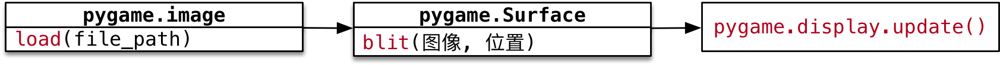

>提示：要想在屏幕上看到绘制的结果，就一定要调用 `pygame.display.update()` 方法

**代码演练 Ⅰ -- 绘制背景图像**

**需求**

1. 加载 `background.png` 创建背景
2. 将背景绘制在屏幕的 `(0, 0)` 位置
3. 调用屏幕更新显示背景图像

```python
import pygame

pygame.init()

# 创建游戏窗口 480 * 700
screen = pygame.display.set_mode((480, 700))

# 绘制背景图像
# 1>加载图像数据
bg = pygame.image.load("./飞机大战/images/background.png")
# 2>blit 绘制图像
screen.blit(bg, (0,0))
# 3>update 更新屏幕显示
pygame.display.update()

# while True:
#     pass

pygame.quit()
```

**代码演练 Ⅱ -- 绘制英雄图像**

**需求**

1. 加载 `me1.png` 创建英雄飞机
2. 将英雄飞机绘制在屏幕的 `(200,500)` 位置
3. 调用屏幕更新显示飞机图像

```python
# 1.绘制英雄的飞机
hero = pygame.image.load("./飞机大战/images/me1.png")
# 2.绘制在屏幕
screen.blit(hero, (200, 500))
# 3.更新显示
pygame.display.update()
```

**透明图像**

- `png` 格式的图像**支持透明的**
- 在绘制图像时，**透明区域不会显示任何内容**
- 但是如果**下方已经有内容，会透过透明区域显示出来**

#### 2.1 理解 update() 方法的作用

>可以在 `screen` 对象完成所有 `blit` 方法之后，统一调用一次 `display.update` 方法，同样可以在屏幕上看到最终的绘制结果

- 使用 `display.set_mode()` 创建的 `screen` 对象是一个**内存中的屏幕数据对象**
	- 可以理解成是油画的画布
- `screen.blit` 方法可以在画布上绘制很多图像
	- 例如：英雄、敌机、子弹...
	- 这些图像**有可能会彼此重叠或者覆盖**
- `display.update()` 会**将画布的最终结果绘制在屏幕上，这样可以提高屏幕绘制效率，增加游戏的流畅度**

### 03.理解游戏循环和游戏时钟

>现在英雄飞机已经被绘制到屏幕上，如何能够让飞机移动呢？

#### 3.1 游戏中的动画实现原理

- 跟电影的原理类似，游戏中的动画效果，本质上是快速的在屏幕上绘制图像
	- 电影是将多张**静止的电影胶片连续、快速的播放**，产生连贯的视觉效果
- 一般在电脑上**每秒绘制60次**，就能够达到非常**连续高品质**的动画效果
	- 每次绘制的结果被称为 **帧(Frame)**


#### 3.2 游戏循环

**游戏的两个组成部分**

>游戏循环的开始就意味着游戏的正式开始

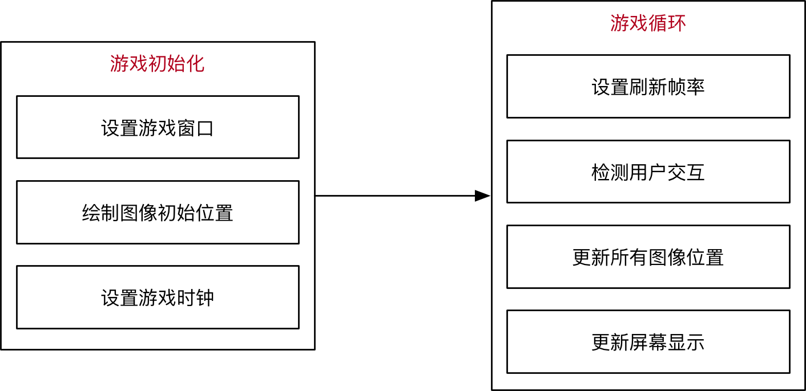

**游戏循环的作用**

1. **保证游戏不会直接退出**
2. **变化图像位置 -- 动画效果**
	- 每隔 `1/60 秒` 移动以下所有图像的位置
	- 调用 `pygame.display.update()` 更新屏幕显示
3. **检测用户交互** -- 按键、鼠标等...

#### 3.3 游戏时钟

- `pygame` 专门提供了一个类 `pygame.time.Clock` 可以非常方便的设置屏幕绘制速度 -- **刷新帧率**
- 要使用**时钟对象**需要两步：
	1) 在**游戏初始化中创建一个时钟对象**
	2) 在**游戏循环中让时钟对象调用 `tick(帧率)` 方法**
- `tick` 方法会**根据上次被调用的事件，自动设置游戏循环中的延时**

```python
# 创建时钟对象
clock = pygame.time.Clock()

# 游戏循环 -> 意味着游戏的正式开始
i = 0
while True:
    # tick()的参数指定循环体内部的代码执行的频率
    clock.tick(60)
    print(i)
    i += 1
```

#### 3.4 英雄的简单动画实现

**需求**

1. 在游戏初始化定义一个 `pygame.Rect` 的变量记录英雄的初始位置
2. 在游戏循环中每次让英雄的 `y-1` --向上移动
3. `y <= 0` 将英雄移动到屏幕的底部

>提示：
>- 每一次调用 `update()` 方法之前，需要**把所有的游戏图像都重新绘制一遍**
>- 而且应该**最先重新绘制背景图像**

```python
import pygame

# 游戏的初始化
pygame.init()

# 创建游戏窗口 480 * 700
screen = pygame.display.set_mode((480, 700))

# 绘制背景图像
bg = pygame.image.load("./飞机大战/images/background.png")
screen.blit(bg, (0,0))

# 绘制英雄飞机
hero = pygame.image.load("./飞机大战/images/me1.png")
screen.blit(hero, (200, 500))

# 更新屏幕显示，可以在所有绘制工作完成之后，统一调用 update 方法
pygame.display.update()

# 创建时钟对象
clock = pygame.time.Clock()

# 1.定义 rect记录飞机的初始位置
hero_rect = pygame.Rect(200, 500, 102, 126)

# 游戏循环 -> 意味着游戏的正式开始
while True:
    # tick()的参数指定循环体内部的代码执行的频率
    clock.tick(60)
    
    # 2.修改飞机的位置
    hero_rect.y -= 1
    if hero_rect.bottom <= 0:
        hero_rect.y = 700
    # 3.调用 blit 方法绘制图像
    screen.blit(bg, (0,0))
    screen.blit(hero, hero_rect)
    # 4.调用 update 方法更新显示
    pygame.display.update()

pygame.quit()
```

#### 3.5 在游戏循环中 监听 事件

**事件 event**

- 就是游戏启动后，**用户针对游戏所作的操作**
- 例如：**点击关闭按钮，点击鼠标，按下键盘...**

**监听**

- 在游戏循环中，判断用户**具体的操作**

>只有捕获到用户具体的操作，才能针对性的做出响应

**代码实现**

- `pygame` 中通过 `pygame.event.get()` 可以**获得用户当前所做动作的 事件列表**
	- 用户可以同一时间做很多事情
- 提示：**这段代码非常的固定**，几乎所有的 `pygame` 游戏都大同小异

```python
# 游戏循环
while True:

	# 设置屏幕刷新帧率
	clock.tick(60)

	# 事件监听
	for event in pygame.event.get():
		print("退出游戏...")

		pygame.quit()

		# 直接退出系统
		exit()
```

#python 2022/9/8

### 04.理解 精灵和精灵组

#### 4.1 精灵和精灵组

- 在刚刚完成的案例中，**图像加载、位置变化、绘制图像**都需要程序员编写代码分别处理
- 为了简化开发步骤，`pygame` 提供了两个类
	- `pygame.sprite.Sprite` -- 存储图像数据 image 和位置 rect 的对象
	- `pygame.sprite.Group`


### 4.2 派生精灵子类

1. 新建 `plane_sprites.py` 文件
2. 定义 `GameSprite` 继承自 `pygame.sprite.Sprite`

注意

- 如果一个类的父类不是 `object`
- 在重写初始化方法时，一定要先 `super()` 一下父类的 `__init__` 方法
- **保证父类中实现的 `__init__` 代码能够被正常执行**

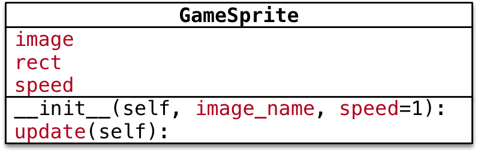

**属性**

- `image` 精灵图像，使用 `image_name` 加载
- `rect` 精灵大小，默认使用图像大小
- `speed` 精灵移动速度，默认为 `1`

**方法**

- `update` 每次更新屏幕时在游戏循环内调用
	- 让精灵的 `self.rect.y += self.speed`

**提示**

- `image` 的 `get_rect()` 方法，可以返回 `pygame.Rect(0, 0, 图像宽， 图像高)` 的对象

```python
from email.mime import image
import pygame

class GameSprite(pygame.sprite.Sprite):
    """飞机大战游戏精灵"""

    def __init__(self, image_name, speed=1) -> None:
        
        # 调用父类的初始化方法
        super().__init__()

        # 定义对象的属性
        self.image = pygame.image.load(image_name)
        self.rect = self.image.get_rect()
        self.speed = speed
        
    def update(self):

        # 在屏幕的垂直方向移动
        self.rect.y += self.speed
```

### 4.3 使用游戏精灵和精灵组创建敌机

**需求**

- 使用刚刚派生的 游戏精灵 和 精灵组 创建敌机并且实现敌机动画

**步骤**

1. 使用 `from` 导入 `plane_sprites` 模块
	- `from` 导入的模块可以直接使用
	- `import` 导入的模块需要通过 `模块名.` 来使用
1. 在游戏初始化创建精灵对象和精灵组对象
2. 在游戏循环中让精灵组分别调用 `update()` 和 `draw(screen)` 方法

**职责**

- 精灵
	- 封装 **图像image、位置rect 和 速度speed**
	- 提供 `update()` 方法，根据游戏需求，更新位置rect
- 精灵组
	- 包含**多个精灵对象**
	- `update` 方法，让精灵组中的所有精灵调用 `update` 方法更新位置
	- `draw(screen)` 方法，在 `screen` 上绘制精灵组中的所有精灵

#python 2022/9/8

# 游戏框架搭建

目标 -- 使用面向对象设计飞机大战游戏类

## 目标

- 明确主程序职责
- 实现主程序类
- 准备游戏精灵类

## 01.明确主程序职责

- 回顾快速入门案例，一个游戏主程序的职责可以分为两个部分：
	- 游戏初始化
	- 游戏训话
- 根据明确的职责，设计 `PlaneGame` 类如下：


>提示根据职责封装私有方法，可以避免某一个方法的代码写得太过冗长，如果某一个方法编写的太长，既不好阅读，也不好维护！

- **游戏初始化** -- `__init__()` 会调用以下方法

| 方法                     | 职责                                   |
| ------------------------ | -------------------------------------- |
| `__event_handler(self)`  | 事件监听                               |
| `__checkcollide(self)`   | 碰撞检测 -- 子弹销毁敌机、敌机撞毁英雄 |
| `__update_sprites(self)` | 精灵组更新和绘制                       |
| `__game_over()`          | 游戏结束                                       |

## 03.实现飞机大战主游戏类

### 2.1 明确文件职责


- `plane_main`
	1. 封装 主游戏类
	2. 创建 游戏对象
	3. 启动游戏
- `plane_sprites`
	1. 封装游戏中所有需要使用的精灵子类
	2. 提供游戏的相关根据

**代码实现**

- 新建 `plane_main.py` 文件，并且设置为可执行
- 编写基础代码

```python
import pygame
from plane_sprites import *


class PlaneGame(object):
    """飞机大战主游戏类"""

    def __init__(self) -> None:
        print("游戏初始化")

        # 1.创建游戏的窗口
        self.screen = pygame.display.set_mode((480, 700))
        # 2.创建游戏的时钟
        self.clock = pygame.time.Clock()
        # 3.调用私有方法，精灵和精灵组的创建
        self.__create_sprites()

    def __create_sprites(self):
        pass

    def start_game(self):
        print("游戏开始...")

    

if __name__ == "__main__":

    # 创建游戏对象
    game = PlaneGame()

    # 启动游戏
    game.start_game()
```

**使用常量代替固定的数值**

>- 常量 -- 不变化的量
>- 变量 -- 可以变化的量

**应用场景**

- 在开发时，可能会需要使用固定的数值，例如 屏幕的高度是 `700`
- 这个时候，建议不要直接使用固定数值，而应该使用**常量**
- 在开发时，为了保证代码的可维护性，尽量不要使用 **魔法数字**

**常量的定义**

- 定义常量和定义变量的语法完全一样，都是使用赋值语句
- **常量的命名**应该**所有字母都使用大写，单词与单词之间使用下划线连接**

>提示：Python 中并没有真正意义的常量，只是通过命名的约定 -- 所有字母都是大写的就是常量，开发时不要轻易修改！

**代码调整**

- 在 `plane_sprites.py` 中增加常量定义

```python
# 屏幕大小的常量
SCREEN_RECT = pygame.Rect(0, 0, 480, 700)
# 屏幕刷新率
FRAME_PER_SEC = 60
```

```python
# coding=utf8
from logging import PlaceHolder
import pygame
from plane_sprites import *


class PlaneGame(object):
    """飞机大战主游戏类"""

    def __init__(self) -> None:
        print("游戏初始化")

        # 1.创建游戏的窗口
        self.screen = pygame.display.set_mode(SCREEN_RECT.size)
        # 2.创建游戏的时钟
        self.clock = pygame.time.Clock()
        # 3.调用私有方法，精灵和精灵组的创建
        self.__create_sprites()

    def __create_sprites(self):
        pass

    def start_game(self):
        print("游戏开始...")

        while True:
            # 1.设置刷新帧率
            self.clock.tick(FRAME_PER_SEC)
            # 2.事件监听
            self.__event_handler()
            # 3.碰撞检测
            self.__check_collider()
            # 4.更新/绘制精灵组
            self.__update_sprites()
            # 5.更新显示
            pygame.display.update()

    def __event_handler(self):
        for event in pygame.event.get():
            # 判断是否退出游戏
            if event.type == pygame.QUIT:
                PlaneGame.__game_over()

    def __check_collider(self):
        pass

    def __update_sprites(self):
        pass

    @staticmethod
    def __game_over():
        print("游戏结束...")
        pygame.quit()
        exit()
    

if __name__ == "__main__":

    # 创建游戏对象
    game = PlaneGame()

    # 启动游戏
    game.start_game()
```

#python 2022/9/9

# 游戏背景

## 目标

- 背景交替滚动的思路确定
- 显示游戏背景

## 01.背景交替滚动的思路确定

- 游戏启动后，背景图像会连续不断地向下方移动
- 在视觉上产生英雄地飞机不断向上方飞行的错觉 -- 在很多跑酷类游戏中常用的套路
	- 游戏的背景不断变化
	- 游戏的主角位置保持不变

### 1.1 实现思路分析


**解决方法**

1. 创建两张背景图像精灵
	- 第 1 张 完全和屏幕重合
	- 第 2 张 在屏幕的正上方
2. 两张图像一起向下方运动
	- `self.rect.y += self.speed`
3. 当任意背景精灵的 `recy.y >= 屏幕高度` 说明已经移动到屏幕下方
4. 将移动到屏幕下方的这张图像设置屏幕的正下方
	- `rect.y = -rect.height`

### 1.2 设计背景类

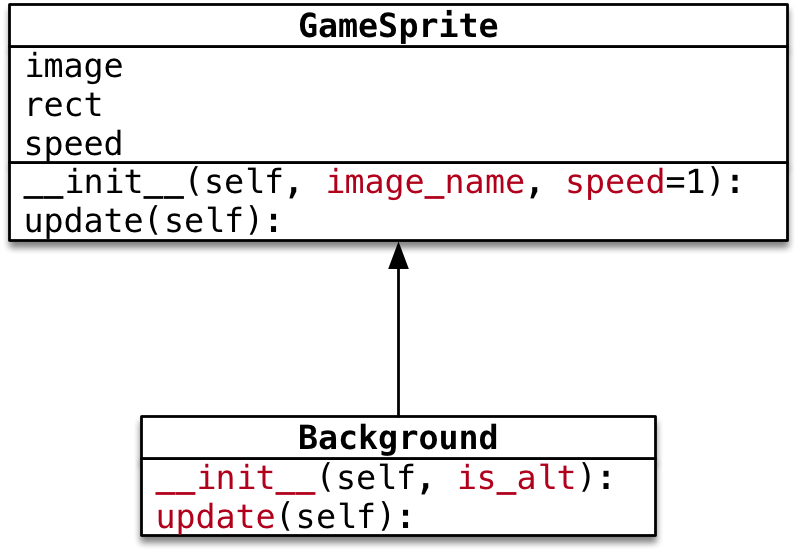

- **初始化方法**
	- 直接指定背景图片
	- `is_alt` 判断是否另一张图像
		- `False` 表示第一张图像，需要与屏幕重合
		- `True` 表示另一张图像，在屏幕的正上方
- `update()` 方法
	- 判断是否移动出屏幕，如果是，将图像设置到屏幕正上方，从而实现交替滚动

>**继承** 如果父类提供的方法，不能满足子类的需求：
>- 派生一个子类
>- 在子类中针对特有的需求，重写父类方法，并且进行扩展

## 02.显示游戏背景

### 2.1 背景精灵的基本实现

- 在 `plane_sprites` 新建 `Background` 继承自 `GameSprite`

```python
class Background(GameSprite):
    """游戏背景精灵"""

    def update(self):
        # 1.调用父类的方法实现
        super().update()
        # 2.判断是否移出屏幕，如果移出普，将图像设置到屏幕的正上方
        if self.rect.y >= SCREEN_RECT.height:
            self.rect.y = -self.rect.height
```

### 2.2 在 plane_main.py 中显示背景精灵

1. 在 `__crete_sprites` 方法中创建精灵和精灵组
2. 在 `__update_sprites` 方法中，让精灵组调用 `update()` 和 `draw()` 方法

>`__crete_sprites` 方法

```python
    def __create_sprites(self):

        # 创建背景精灵和精灵组
        bg1 = Background("./飞机大战/images/background.png")
        bg2 = Background("./飞机大战/images/background.png")
        bg2.rect.y = -bg2.rect.height

        self.back_group = pygame.sprite.Group(bg1, bg2)
```

>`__update_sprites` 方法

```python
    def __update_sprites(self):

        self.back_group.update()
        self.back_group.draw(self.screen)
```

### 2.3 利用初始化方法，简化背景精灵创建

>思考--上一小结完成的代码存在什么样的问题？能否简化？

- 主程序中，创建的两个背景精灵，传入了相同的文件路径
- 创建第二个背景精灵时，在主程序中，设置背景精灵的图像向位置

>思考 -- 精灵初始位置的设置，应该由主程序负责？还是由精灵自己负责？

**答案 -- 由精灵自己负责**

- 根据面向对象设计原则，应该将对象的职责，封装到类的代码内部
- 尽量简化程序调用一方的代码调用


- **初始化方法**
	- 直接指定背景图片
	- `is_alt` 判断是否是另一张图像
		- `False` 表示第一张图像，需要与屏幕重合
		- `True` 表示另一张图像，在屏幕的正上方

在 `plane_sprites.py` 中实现 `Background` 的初始化方法

```python
    def __init__(self, is_alt=False) -> None:
        
        # 1.调用父类方法实现精灵创建(images/rect/speed)
        super().__init__("./飞机大战/images/background.png")
        # 2.判断是否是交替图像，如果是，需要设置初始设置
        if is_alt:
            self.rect.y = -self.rect.height
```

# 敌机出场

## 目标

- 使用定时器添加敌机
- 设计 `Enemy` 类

## 01.使用定时器添加敌机

1. 游戏启动时，每隔1秒会出现一架敌机
2. 每架敌机向屏幕下方飞行，飞行速度各不相同
3. 每家敌机出现的水平位置也不尽相同
4. 当敌机从屏幕下方飞出，不会再非回到屏幕中

### 1.1 定时器

- 在 `pygame` 中可以使用 `pygame.time.set_timer()` 来添加定时器
- 所谓定时器，就是每隔一段事件，去执行一些动作

```python
set_timer(eventid, milliseconds) -> None
```

- `set_timer` 可以创建一个事件
- 可以在游戏循环的事件监听方法中捕获到该事件
- 第1个参数 **事件代码** 需要基于常量 `pygame.USEREVENT` 来指定
	- `USEREVENT` 是一个整数，再增加的事件可以使用 `USEREVENT + 1` 指定，一次类推...
- 第2个参数是事件**触发间隔的毫秒值**

**定时器事件的监听**

- 通过 `pygame.event.get()` 可以获取当前时刻所有的**事件列表**
- 遍历列表并且判断 `event.type` 是否等于 `eventid` ，如果相等，表示 定时器事件发生

### 1.2 定义并监听创建敌机事件

`pygame` 的定时器使用套路非常固定：

1. 定义**定时器常量** -- `eventid`
2. 在初始化方法中，调用 `set_timer` 方法，**设置定时器事件**
3. 在游戏循环中，监听定时器事件

1) **定义事件**

- 在 `plane_sprites.py` 的顶部定义**事件常量**

```python
# 敌机出现事件
CREATE_ENEMY_EVENT = pygame.USEREVENT
```

## 02.设计 Enemy 类

1. 游戏启动后，每隔1秒会出现一架敌机
2. 每架敌机向屏幕下方飞行，飞行速度各不相同
3. 每架敌机出现的水平位置也不尽相同
4. 当敌机从屏幕下方废除，不会再飞回到屏幕中


- **初始化方法**
	- 指定敌机图片
	- **随机** 敌机的初始位置和速度
- 重写 `update()` 方法
	- 判断是否飞出屏幕，如果是，从精灵组删除

### 2.1 敌机类的准备

```python
class Enemy(GameSprite):
    """敌机精灵"""

    def __init__(self) -> None:
        
        # 1.调用父类方法，创建敌机精灵，同时指定敌机图片
        super().__init__("./飞机大战/images/enemy1.png")
        # 2指定敌机的初始随机速度

        # 3.指定敌机的初始随机位置
        
        pass

    def update(self):
        
        # 1.调用父类方法，保持垂直方向的飞行
        super().update()
        # 2.判断是否飞出屏幕，如果是，需要从精灵组删除敌机
        if self.rect.y >= SCREEN_RECT.height:
            print("飞出怕没有，需要从精灵组删除...")
        pass
```

### 2.2 创建敌机

**演练步骤**

1. 在 `__create_sprites` ，添加敌机精灵组
	- 敌机是**定时被创建的**，因此在初始化方法中，不需要创建敌机
2. 在 `__event_handler` ，创建敌机，并且添加到精灵组
	- 调用精灵组的 `add` 方法可以**向精灵组添加精灵**
3. 在 `__update_sprites` ，让敌机精灵组调用 `update` 和 `draw` 方法


**代码演练**

- 创建敌机的精灵组

```python
# 创建敌机的精灵组
self.enemy_group = pygame.sprite.Group()
```

- 修改 `plane_main` 的 `__update_sprites` 方法

```python
self.enemy_group.update()
self.enemy_group.draw(self.screen)
```

- 定时出现敌机

```python
elif event.type == CREATE_ENEMY_EVENT:
	# print("敌机出场...")
	# 创建敌机精灵
	enemy = Enemy()
	# 将敌机精灵添加到敌机精灵组
	self.enemy_group.add(enemy)
```

### 2.3 随机敌机位置和速度

1) 导入模块

- 在导入模块时，建议按照以下顺序导入

```
1. 官方标准模块导入
2. 第三方模块导入
3. 应用程序模块导入
```

- 修改 `plane_sprites.py` 增加 `random` 的导入

```python
import random
```

2) **随机位置**

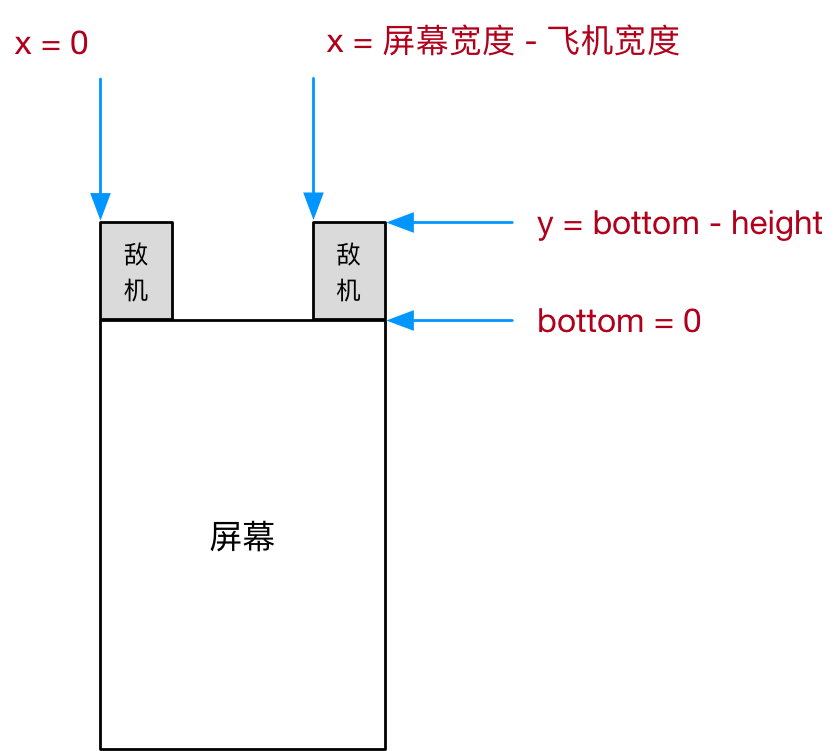

使用 `pygame.Rect` 提供的 `bottom` 属性，在指定敌机初始位置时，会比较方便

- `bottom = y + height`
- `y = bottom - height`

3) **代码实现**

- 修改初始化方法，随机敌机出现速度和位置

```python
def __init__(self) -> None:
	
	# 1.调用父类方法，创建敌机精灵，同时指定敌机图片
	super().__init__("./飞机大战/images/enemy1.png")
	
	# 2指定敌机的初始随机速度
	self.speed = random.randint(1, 3)
	# 3.指定敌机的初始随机位置
	self.rect.bottom = 0
	# 水平随机位置
	max_x = SCREEN_RECT.width - self.rect.width
	self.rect.x = random.randint(0, max_x)
```

### 2.4 移出欧姆销毁敌机

- 敌机移出屏幕之后，如果没有撞到英雄，敌机的历史使命终结
- 需要从敌机组删除，否则会造成内存浪费

**检测敌机被销毁**

- `__del__` 内置方法会在对象被销毁前调用，在开发中，可以用于**判断对象是否被销毁**

```python
def __del__(self):
	print("敌机挂了 %s" % self.rect)
```

**代码实现**


- 判断敌机是否飞出屏幕，如果是，调用 `kill()` 方法从所有组中删除

```python
def update(self):
	
	# 1.调用父类方法，保持垂直方向的飞行
	super().update()
	# 2.判断是否飞出屏幕，如果是，需要从精灵组删除敌机
	if self.rect.y >= SCREEN_RECT.height:
		print("飞出屏幕，从精灵组删除...")
		# kill方法可以将精灵从所有精灵组中移出，精灵就会被自动销毁
		self.kill()	
```

# 英雄登场

## 目标

- 设计英雄和子弹类
- 使用 `pygame.key.get_pressed()` 移动英雄
- 发射子弹

## 01.设计英雄和子弹类

### 1.1 英雄需求

1. 游戏启动后，英雄出现在屏幕的水平中间位置，距离屏幕底部 `120` 像素
2. 英雄每隔 `0.5s` 发射一次子弹，每次连发三枚子弹
3. 英雄默认不会移动，需要通过 左/右 方向键，控制英雄在水平方向移动


```python
class Hero(GameSprite):
    """英雄精灵"""

    def __init__(self) -> None:
        
        # 1.调用父类方法，设置 image, speed
        super().__init__("./飞机大战/images/me1.png", 0)
        # 2.设置英雄的初始位置
        self.rect.centerx = SCREEN_RECT.centerx
        self.rect.bottom = SCREEN_RECT.bottom - 120
        pass
```

### 1.2 子弹需求

1. 子弹从英雄的正上方发射沿直线向上方飞行
2. 飞出屏幕后，需要从精灵组中删除


### 1.3 Hero -- 英雄

- **初始化方法**
	- 指定**英雄图片**
	- **初始速度 = 0** -- 英雄默认静止不动
	- 定义 `bullets` **子弹精灵组**保存子弹精灵
- 重写 `update()` 方法
	- 英雄需要**水平移动**
	- 并且需要保证不能**移出屏幕**
- 增加 `bullets` 属性，记录所有**子弹精灵**
- 增加 `fire` 方法，用于发射子弹

## 02.创建英雄

### 2.1 准备英雄类

- 在 `plane_sprites` 新建 `Hero` 类
- 重写初始化方法，直接指定图片名称，并且将初始速度设置为 `0`
- 设置英雄的初始位置


- `centerx = x + 0.5 * width`
- `centery = y + 0.5 * height`
- `bottom = y + height`

### 2.2 绘制英雄

1. 在 `__create_sprites`， 添加英雄精灵和英雄精灵组
	- 后续要针对英雄左碰撞检测以及发射子弹
	- 所有英雄需要单独定义成属性
2. 在 `__update_sprites`， 让英雄精灵组调用 `update` 和 `draw` 方法

**代码实现**

- 修改 `__create_sprites` 方法如下：

```python
# 创建英雄的精灵和精灵组
self.hero = Hero()
self.hero_group = pygame.sprite.Group(self.hero)
```

- 修改 `__update_sprites` 方法如下：

```python
self.hero_group.update()
self.hero_group.draw(self.screen)
```

## 0.3移动英雄位置

>在 pygame 中针对硬盘按键的捕获，有两种方式

- 第一种方式，判断 `event.type = pygame.KEYDOWN`
- 第二种方式
	1. 首先使用 `pygame.key.get_pressed()` 返回**所有按键元组**
	2. 通过**按键常量**，判断元组中**某一个键是否被按下** -- 如果被按下，对应数值为 `1`

>思考：这两种方式之间有什么区别呢？

- 第一种方式

```python
elif event.type == pygame.KEYDOWN and event.key == pygame.K_RIGHT:
	print("向右移动")
```

- 第二种方式

```python
# 使用键盘提供的方法获取键盘按键 - 按键元组
keys_pressed = pygame.key.get_pressed()
# 判断元组中对应的按键索引值 1
if keys_pressed[pygame.K_RIGHT]:
	print("向右移动...")
```

**结论**

- 第一种方式 `event.type` 用户**必须要抬起按键才算一次按键事件，操作灵活性会大打折扣**
- 第二种方式，用户可以按住方向键不放，就能够实现持续向某一个方向移动，操作灵活性更好

### 3.1 移动英雄位置

**演练步骤**

1. 在 `Hero` 类中重写 `update` 方法
	- 用速度 `speed` 和英雄 `rect.x` 进行叠加
	- **不需要调用父类方法** -- 父类方法只是实现了单纯的垂直运动
2. 在 `__event_handler` 方法中根据**左右方向键**设置英雄的速度
	- 向右 => `speed = 2`
	- 向左 => `speed = -2`
	- 其他 => `speed = 0`

**代码演练**

- 在 `Hero` 类，重写 `update()` 方法，根据速度水平移动英雄的飞机


### 3.2 控制英雄运动边界

- 在 `Hero` 类的 `update()` 方法判断英雄是否超出屏幕边界


- `right = x + width` 利用 `right` 属性可以非常任意的针对右侧设置精灵位置


## 04.发射子弹

需求回顾 -- 英雄需求

1. 游戏启动后，英雄出现在屏幕的水平之间位置，距离屏幕底部 `120` 像素
2. 英雄每隔 `0.5` 秒发射一次子弹，每次连发三枚子弹
3. 英雄默认不会移动，需要通过 左/右 方向键，控制英雄在水平方向移动

### 4.1 添加发射子弹事件

`pygame` 的定时器使用套路非常固定：

1. 定义定时器常量 -- `eventid`
2. 在初始化方法中，调用 `self.timer` 方法**设置定时器事件**
3. 在游戏循环中，监听定时器事件

**代码实现**

- 在 `Hero` 中定义 `fire` 方法

```python
def fire(self):
	print("放射子弹...")
```

### 4.2 定义子弹

**需求回顾 -- 子弹需求**

1. 子弹从英雄的正上方发射沿直线向上方飞行
2. 飞出屏幕后，需要从精灵族中删除

**Bullet -- 子弹**

- 初始化方法
	- 指定子弹图片
	- **初始速度 = -2** -- 子弹需要向上方飞行
- 重写 `update()` 方法
	- 判断是否飞出屏幕，如果是，从精灵组删除

**定义子弹类**

- 在 `plane_sprites` 新建 `Bullet` 继承自 `GameSprite`
- 重写 初始化方法，直接指定图片名称，并且设置初始速度
- 重写 `update()` 方法，判断子弹**飞出屏幕从精灵组删除**

### 4.3 发射子弹

演练步骤

1. 在 `Hero` 的初始化方法中创建子弹精灵组属性
2. 修改 `plane_main.py` 的 `__update_sprites` 方法，让子弹精灵组调用 `update` 和 `draw` 方法
3. 实现 `fire()` 方法
	- 创建子弹精灵
	- 设置初始位置 -- 在英雄的正上方
	- 将子弹添加到精灵组

**代码实现**

- 初始化方法

```python
# 3.创建子弹的精灵组
self.bullets = pygame.sprite.Group()
```

- 修改 `fire()` 方法

```python
def fire(self):
	print("发射子弹...")
	# 1.创建子弹精灵
	bullet = Bullet()
	# 2.设置精灵的位置
	bullet.rect.bottom = self.rect.y - 20
	bullet.rect.centerx = self.rect.centerx
	# 3.将精灵添加到精灵组
	self.bullets.add(bullet)
```

**一次发射三枚子弹**


- 修改 `fire()` 方法，一次发射三枚子弹

# 碰撞检测

## 目标

- 了解碰撞检测方法
- 碰撞实现

## 01.了解碰撞检测方法

- `pygame` 提供了两个非常方便的方法可以实现碰撞检测：

**pygame.sprite.groupcollide()**

- 两个精灵组中所有精灵的碰撞检测

```python
groupcollide(group1, group2, dokill1, dokill2, collided=None) -> Sprite_dict
```

- 如果将 `dokill` 设置为 `True` ，则**发生碰撞的精灵将被自动删除**
- `collided` 参数是用来**计算碰撞的回调函数**
	- 如果没有指定，则每隔精灵必须有一个 `rect` 属性

**pygame.sprite.spritecollide()**

- 判断某个精灵和指定精灵组中的精灵的碰撞

```python
spritecollide(sprite, group, dokill, collided=None) -> Sprite_list
```

- 如果将 `dokill` 设置为 `True` ，则指定精灵组中发生碰撞的精灵将被自动移除
- `collided` 参数是用于 计算碰撞的回调函数
	- 如果没有指定，则每隔精灵必须有一个 `rect` 属性
- 返回精灵组中跟精灵发生碰撞的**精灵列表**

## 02.碰撞实现

```python
def __check_collide(self):
	# 1.子弹摧毁敌机
	pygame.sprite.groupcollide(self.hero.bullets, self.enemy_group, True, True)

	# 2.敌机撞毁英雄
	enemies = pygame.sprite.spritecollide(self.hero, self.enemy_group, True)
	
	# 3.判断列表是否有内容
	if len(enemies) > 0:
		# 让英雄牺牲
		self.hero.kill()
		# 结束游戏
		PlaneGame.__game_over()
```

#python 2022/9/12

# vi -- 终端中的编辑器

## 目标

- `vi` 简介
- 打开和新建文件
- 三种工作模式
- 常用命令
- 分屏命令
- 常用命令速查图

## 01.vi 简介

### 1.1 学习 vi 的目的

- 在工作中，要对**服务器**上的文件进行简单的修改，可以使用 `ssh` 远程登陆到服务器上，并且使用 `vi` 进行快速的编辑即可
- 常见需要修改的文件包括
	- 源程序
	- 配置文件，例如 `ssh` 的配置文件 `~/.ssh/config`

>- 在没有图形界面的环境下，要编辑文件，`vi` 是最佳选择！
>- 每一个要使用 Linux 的程序员，都应该或多或少地学习一点 `vi` 地常用命令

### 1.2 vi 和 vim

- 在很多 `Linux` 发行版中，直接把 `vi` 做成 `vim` 地软链接

**vi**

- `vi` 是 `visual interface` 的简称，是 Linux 中最经典的文本编辑器
- `vi` 的核心设计思想 -- 让程序员的手指始终保持在键盘的核心区域，就能完成所有的编辑操作
- `vi` 的特带你：
	- **没有图形界面**的功能强大的**编辑器**
	- 只能是编辑**文本内容**，不能对字体、段落进行排版
	- **不支持鼠标操作**
	- **没有菜单**
	- **只有命令**
- `vi` 编辑器在**系统管理、服务器管理**编辑文件时，其功能永远不是图形界面的编辑器能比拟的

**vim**

- `vim` = `vi improved`
- `vim` 是从 `vi` 发展出来的一个文本编辑器，支持**代码补全、编译及错误跳转**等方便编程的功能特别丰富，在程序员中被广泛使用，被称为**编辑器之神**

```bash
# 查找 vi 的运行文件

$ which vi
$ ls -l /usr/bin/vi
$ ls -l /etc/alternatives/vi
$ ls -l /usr/bin/vim.basic

# 查找 vim 的运行文件
$ which vim
$ ls -l /usr/bin/vim
$ ls -l /etc/alternatives/vim
$ ls -l /usr/bin/vim.basic 
```

## 02.打开和新建文件

- 在终端中输入 `vi` 在**后面你更上文件名**即可

```bash
$ vi 文件名
```

- 如果文件已经存在，会直接打开该文件
- 如果文件不存在，会新建一个文件

### 2.1 打开文件并且定位行

- 在日常工作中，有可能会遇到**打开一个文件，并定位到指定行**的情况
- 例如：在开发时，知道某一行代码有错误，可以快速定位到出错代码的位置
- 这个时候，可以使用一下命令打开文件

```bash
$ vi 文件名 +行数
```

>提示：如果只带上 `+` 而不指定行号，会直接定位到文件末尾

### 2.2 异常处理

- 如果 `vi` 异常退出，在磁盘上可能会保存有**交换文件**
- 下次再使用 `vi` 编辑该文件时，会看到以下屏幕信息，按下字母 `d` 可以**删除交换文件** 即可

>提示：按下键盘时，注意关闭输入法


## 03.三种工作模式

- `vi` 有三种基本工作模式：
	1. **命令模式**
		- 打开文件首先进入命令模式，是使用 `vi` 的入口
		- 通过命令对文件进行常规编辑，例如：**定位、翻页、赋值、粘贴、删除...**
		- 在其他图形编辑器下，通过**快捷键或者鼠标**实现的操作，都在**命令模式**下实现
	2. **末行模式**
		- 要退出 `vi` 返回到控制台，需要在末行模式下输入命令
		- **末行模式是 `vi` 的出口**
	3. **编辑模式**--正常的编辑文字


>提示：在 `Touch Bar` 的Mac电脑上，按 `Esc` 不方便，可以使用 `Ctrl+[` 替代

### 3.1 末行模式

| 命令 | 英文           | 功能                           |
| ---- | -------------- | ------------------------------ |
| `w`  | `write`        | 保存                           |
| `q`  | `quit`         | 退出，如果没有保存，不允许退出 |
| `q!` | `quit`         | 强行退出，不保存退出           |
| `wq` | `write & quit` | 保存并退出                     |
| `x`  |                | 保存并退出，与 `wq` 等价                               |

## 04.常用命令

### 4.1 命令线路图

1. 重复次数
	- 在命令模式下，**先输入一个数字，再跟上一个命令，可以让命令重复执行指定次数**
2. **移动和选择**
	- `vi` 之所以快，关键在于**能够快速定位到要编辑的代码行**
	- **移动命令**能够和**编辑操作命令组合使用**
3. 编辑操作
	- **删除、复制、粘贴、替换、缩排**
4. 撤销和重复
5. 查找替换
6. 编辑

>学习提示：
>	1. `vi` 的命令较多，不要期望一下子全部记住，个别命令忘记了，只是会影响编辑速度而已
>	2. 在使用 `vi` 命令时，注意**关闭中文输入法**

### 4.2 移动(基本)

- 要熟悉使用 `vi` ，首先应该学会怎么在**命令模式**下快速移动光标
编辑操作命令，能够和移动命令结合在一起使用

1) **上、下、左、右**

| 命令 | 功能 | 手指 |
| ---- | ---- | ---- |
| `h`  | 向左 | 食指 |
| `j`  | 向下 | 食指 |
| `k`  | 向上 | 中指 |
| `l`  | 向右 | 无名指     |


2) **行内移动**

| 命令 | 英文   | 功能                           |
| ---- | ------ | ------------------------------ |
| `w`  | `word` | 向后移动一个单词               |
| `b`  | `back` | 向前移动一个单词               |
| `0`  |        | 行首                           |
| `^`  |        | 行首，第一个不是空白字符的位置 |
| `$`  |        | 行尾                               |

3) **行数移动**

| 命令     | 英文 | 功能               |
| -------- | ---- | ------------------ |
| `gg`     | `go` | 文件顶部           |
| `G`      | `go` | 文件末尾           |
| `数字gg` | `go` | 移动到数字对应行数 |
| `数字G`  | `go` | 移动到数字对应行数 |
| `:数字`  |      | 移动到数字对应行数                   |

4) **屏幕移动**

| 命令       | 英文      | 功能     |
| ---------- | --------- | -------- |
| `Ctrl + b` | `back`    | 向上翻页 |
| `Ctrl + f` | `forward` | 向下翻页 |
| `H`        | `Head`    | 屏幕顶部 |
| `M`        | `Middle`  | 屏幕中间 |
| `L`        | `Low`     | 屏幕底部         |

### 4.3 移动

1) **段落移动**

- `vi` 中使用 空行 来区分段落
- 在程序开发时，通常一段**功能相关的代码会写在一起**--之间没有空行

| 命令 | 功能   |
| ---- | ------ |
| `{`  | 上一段 |
| `}`  | 下一段       |

2) **括号切换**

- 在程序世界中，`()` 、 `[]` 、`{}` 使用频率很高，而且**都是成对出现的**

| 命令 | 功能 |
| ---- | ---- |
| `%`  | 括号匹配及切换     |

3) **标记**

- 在开发时，某一块代码可能**需要稍后处理**，例如：编辑、查看
- 此时先使用 `m` 增加一个标记，这样可以**在需要时快速地跳转回来**或者**执行其他编辑操作**
- 标记名称可以是 `a~z` 或者 `A~Z` 之间的任意一个字母
- 添加了标记的**行如果被删除，标记同时被删除**
- 如果**在其他行添加了相同名称的标记，之前添加的标记也会被替换掉**

| 命令 | 英文   | 功能                                       |
| ---- | ------ | ------------------------------------------ |
| `mx` | `mark` | 添加标记 x,x是a~z或者A~Z之间的任意一个字母 |
| `'x` |        | 直接定位到x所在的位置                                           |

### 4.3 选中文本

- 学习 `复制` 命令前，应该**学会怎么样选中要复制的代码**
- 在 `vi` 中要选择文本，需要使用 `Visual` 命令切换到**可视模式**
- `vi` 中提供了**三种可视模式**，可以方便程序员选择**选中文本的方式**
- 按 `Esc` 可以放弃选中，返回**命令模式**

| 命令       | 模式       | 功能                               |
| ---------- | ---------- | ---------------------------------- |
| `v`        | 可视模式   | 从光标位置开始按照正常模式选择文本 |
| `V`        | 可视行模式 | 选中光标经过的完整行               |
| `Ctrl + v` | 可视块模式 | 垂直方向选中文本                                   |

- 可视模式下，可以和移动命令连用，例如 `ggVG` 能够**选中所有内容**

### 4.4 撤销和恢复撤销

- 在学习编辑命令之前，先要知道怎样撤销之前一次错误的编辑动作！

| 命令       | 英文   | 功能         |
| ---------- | ------ | ------------ |
| `u`        | `undo` | 撤销上次命令 |
| `Ctrl + r` | `redo` | 恢复撤销的命令             |

### 4.5 删除文本

| 命令          | 英文     | 功能                                |
| ------------- | -------- | ----------------------------------- |
| `x`           | `cut`    | 删除光标所在字符，或者选中文本      |
| `d(移动命令)` | `delete` | 删除移动命令对应的内容              |
| `dd`          | `delete` | 删除光标所在行，可以 `ndd` 复制多行 |
| `D`           | `delete` | 删除至行尾                                    |

>提示：如果使用**可视模式**已经选择了一段文本，那么无论使用 `d` 还是 `x` ，都可以删除选中文本

- 删除命令可以和移动命令连用，以下是常见的组合命令：

```
* dw        # 从光标位置删除的到单词末尾
* d0        # 从光标位置删除到一行的起始位置
* d}        # 从光标位置删除到段落结尾
* ndd       # 从光标位置向下连续删除 n 行
* d代码行G   # 从光标所在行 删除到 指定代码行 之间的所有代码
* d'a       # 从光标所在行 删除到 标记a 之间的所有代码
```

### 4.6 复制、粘贴

- `vi` 中提供有一个**被复制文件的缓冲区**
	- **复制**命令会将选中的文字保存在缓冲区
	- **删除**命令删除的文字会被保存在缓冲区
	- 在需要的位置，使用粘贴命令可以将缓冲区的文字插入到光标所在位置

| 命令          | 英文    | 功能                          |
| ------------- | ------- | ----------------------------- |
| `y(移动命令)` | `copy`  | 复制                          |
| `yy`          | `copy`  | 复制一行，可以 `nyy` 复制多行 |
| `p`           | `paste` | 粘贴                              |

**提示**

- 命令 `d` 、`x` 类似于图形界面的 **剪切操作** -- `Ctrl + X`
- 命令 `y` 类似于图形界面的 **复制操作** -- `Ctrl + C`
- 命令 `p` 类似于图形界面的 **粘贴操作** -- `Ctrl + V`
- `vi` 中的 **文本缓冲区同样只有一个，如果后续做过复制、剪切操作，之前缓冲区中的内容会被替换**

**注意**

- `vi` 中的**文本缓冲区**和系统的**剪切板**不是同一个
- 所以在其他软件中使用 `Ctrl + C` 复制的内容，不能在 `vi` 中通过 `P` 命令粘贴
- 可以在**编辑模式**下使用**鼠标右键粘贴**

### 4.7 替换

| 命令 | 英文      | 功能                 | 工作模式 |
| ---- | --------- | -------------------- | -------- |
| `r`  | `replace` | 替换当前字符         | 命令模式 |
| `R`  | `replace` | 替换当前光标后的字符 | 替换模式         |

- `R` 命令可以进入替换模式，替换完成后，按下 `Esc` 可以回到**命令模式**
- **替换命令**的作用就是不用进入**编辑模式**，对文件进行**轻量级的修改**

### 4.8 缩排和重复执行

| 命令 | 功能         |
| ---- | ------------ |
| `>>` | 向右增加缩进 |
| `<<` | 向左减少缩进 |
| `.`  | 重复上次命令             |

- 缩排命令在开发程序时，统一增加代码的缩进比较有用！
	- 一次性在选中代码前增加4个空格，就叫做增加缩进
	- 一次性在选中代码前删除4个空格，就叫做减少缩进
- 在**可视模式**下，缩排命令只需要使用一个 `>` 或者 `<`

>在程序中，**缩进**通常用来表示代码的归属关系
>	- 前面空格越少，代码的级别越高
>	- 前面空格越多，代码的级别越低

### 4.9 查找

**常规查找**

| 命令   | 功能 |
| ------ | ---- |
| `/str` | 查找 `str`     |

- 查找到指定内容之后，使用 `Next` 查找下一个出现的位置：
	- `n` 查找下一个
	- `N` 查找上一个
- 如果不想看到高亮显示，可以随便查找一个文件中不存在的内容即可

**单词快速匹配**

| 命令 | 功能                     |
| ---- | ------------------------ |
| `*`  | 向后查找当前光标所在单词 |
| `#`  | 向前查找当前光标所在单词                         |

- 在开发中，通过单词快速匹配，可以快速看到这个单词在其他什么位置使用过

### 4.10 查找并替换

- 在 `vi` 中查找和替换命令需要在**末行模式**下执行
- 记忆命令格式

```vi
:%s///g
```

1) **全局替换**

- 一次性替换文件中所有出现的旧文本
- 命令格式如下：

```vi
:%s/旧文本/新文本/g
```

2) **可视区域替换**

- **先选中要替换文字的范围**
- 命令格式如下：

```vi
:s/旧文本/新文本/g
```

3) **确认替换**

- 如果把末尾的 `g` 改成 `gc` 在替换的时候，会有提示！**推荐使用**

```vi
:%s/旧文本/新文本/gc
```

1. `y` - `yes` 替换
2. `n` - `no` 不替换
3. `a` - `all` 替换所有
4. `q` - `quit` 退出替换
5. `l` - `last` 最后一个，并把光标移动到行首
6. `^E` 向下滚屏
7. `^Y` 向上滚屏

### 4.11 插入命令

- 在 `vi` 中除了常用的 `i` ，进入**编辑模式**，还提供了以下命令同样可以进入编辑模式：

| 命令 | 英文     | 功能                   | 常用 |
| ---- | -------- | ---------------------- | ---- |
| `i`  | `insert` | 在当前字符前插入文本   | 常用 |
| `I`  | `insert` | 在行首插入文本         | 较常用     |
| `a`  | `append` | 在当前字符后面添加文本 |      |
| `A`  | `append` | 在行末添加文本         |较常用      |
| `o`  |          | 在当前行后面插入一空行 |    常用  |
| `O`  |          | 在当前行前面插入一空行 |    常用  |


**演练 1 -- 编辑命令和数字连用**

- 在开发中，可能会遇到连续输入 `N` 个同样的字符

>在 `Python` 中有简单的方法，但是其他语言中通常需要自己输入

- 例如：`**********` 连续10个星号

要实现这个效果可以在命令模式下

1. 输入 `10` ，表示要重复 10次
2. 输入 `i` 进入**编辑模式**
3. 输入 `*` 也就是重复的文字
4. 按下 `Esc` 返回到命令模式，返回之后 `vi` 就会把第 `2,3` 两步的操作重复 `10` 次

>提示：正常开发时，在**进入编辑模式之前，不要按数字**

**演练 2 -- 利用可视块给多行代码增加注释**

- 在开发中，可能会遇到一次性给多行代码增加注释的情况

>在 `Python` 中，要给代码增加注释，可以在代码前增加一个 `#`

要实现这个效果可以在命令模式下

1. 移动到要添加注释的第1行代码，按 `^` 来到行首
2. 按 `Ctrl + V` 进入**可视块**模式
3. 使用 `j` 向下连续选中要添加的代码行
4. 输入 `I` 进入编辑模式，并在行首插入，注意：一定要使用 `I`
5. 输入 `#` 也就是注释符号
6. 按下 `Esc` 返回到命令模式，返回之后 `vi` 会在之前选中的每一行diamagnetic前插入 `#`

## 05.分屏命令

- 属于 `vi` 的高级命令 -- 可以**同时编辑和查看多个文件**

### 5.1 末行命令扩展

末行命令主要是针对文件进行操作的：**保存、退出、保存&退出、搜索&替换、另存、新建、浏览文件**

| 命令        | 英文    | 功能                                         |
| ----------- | ------- | -------------------------------------------- |
| `:e.`       | `write` | 会打开内置的文件浏览器，浏览当前目录下的文件 |
| `:n 文件名` | `new`   | 新建文件                                     |
| `:w 文件名` | `write` | 另存为，但是仍然编辑当前文件，并不会切换文件                                             |

>提示：切换文件之前，必须保证当前这个文件已经被保存！

- 已经学过的**末行命令**：

| 命令       | 英文           | 功能                           |
| ---------- | -------------- | ------------------------------ |
| `:w`       | `write`        | 保存                           |
| `:q`       | `quit`         | 退出，如果没有保存，不允许退出 |
| `:q!`      | `quit`         | 强行退出，不保存退出           |
| `:wq`      | `write & quit` | 保存并退出                     |
| `:x`       |                | 保存并退出                     |
| `:%s///gc` |                | 确认搜索并替换                               |

>在实际开发中，可以使用 `w` 命令 **阶段性的备份代码**

### 5.2 分屏命令

- 使用分屏命令，可以提示**编辑和查看多个文件**

| 命令           | 英文             | 功能 |
| -------------- | ---------------- | ---- |
| `:sp [文件名]` | `split`          | 横向增加分屏     |
| `:vsp []`      | `vertical split` | 纵向增加分屏     |
 
1) 切换分屏窗口

>分屏窗口都是基于 `Ctrl + W` 这个快捷键的，`w` 对应的英文单词是 `window`

| 命令 | 英文      | 功能                                          |
| ---- | --------- | --------------------------------------------- |
| `w`  | `window`  | 切换到下一个窗口                              |
| `r`  | `reverse` | 互换窗口                                      |
| `c`  | `close`   | 关闭当前窗口，但是不能关闭最后一个窗口        |
| `q`  | `quit`    | 退出当前窗口，如果是最后一个窗口，则关闭 `vi` |
| `o`  | `other`   | 关闭其他窗口                                              |
